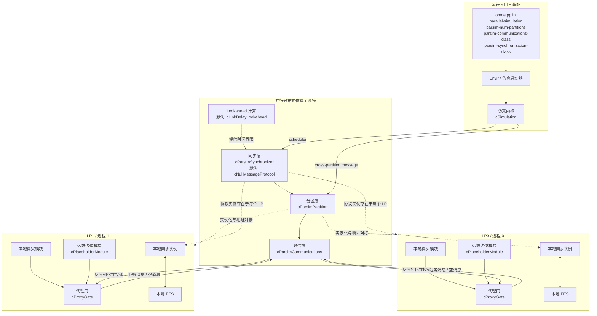

# OMNeT++ 分布式部署设计说明

## 1. 文档目的

本文档用于单独说明 OMNeT++ 的分布式部署设计。这里的“分布式部署”主要指 OMNeT++ 的并行分布式仿真能力，即将一个仿真模型划分为多个逻辑进程，在多核主机或多台机器上协同推进仿真。该能力在 OMNeT++ 的文档和源码中通常对应 PDES，Parallel Distributed Simulation。

需要特别区分两类能力：

1. 并行分布式仿真：把一次仿真切分为多个分区并同时执行。
2. Akaroa 多次重复试验并行：把多次独立重复实验分发执行，以统计精度控制结束条件。

本文重点讨论第一类，即 OMNeT++ 的分区式并行分布式仿真架构。

## 2. 设计目标

OMNeT++ 的分布式部署设计围绕以下目标展开：

1. 尽量不修改模型代码。模型并不需要为了并行运行而进行专门改写，分区、同步和通信主要通过配置完成。
2. 保持模型与实验配置分离。模型描述系统结构，部署方案和运行策略放在配置文件中。
3. 支持多种通信机制。既支持适合集群环境的 MPI，也支持适合本地实验的命名管道和文件通信。
4. 支持多种同步协议。现有实现以保守同步为主，同时保留同步协议扩展能力。
5. 对研究友好。整个并行子系统采用分层架构，便于替换通信后端、同步算法和 lookahead 计算策略。

## 3. 总体架构

OMNeT++ 的并行分布式仿真采用三层结构：

1. 通信层，Communications Layer
2. 分区层，Partitioning Layer
3. 同步层，Synchronization Layer

这三层由 Envir 在运行时装配到仿真内核中。相关配置项包括：

1. parallel-simulation
2. parsim-num-partitions
3. parsim-communications-class
4. parsim-synchronization-class

当 parallel-simulation 启用后，Envir 会创建通信组件、分区组件和同步组件，并将同步组件注册为仿真调度器。这样，仿真内核在“取下一个事件”时，实际就进入了并行同步协议控制的调度流程。

从整体运行形态上看，OMNeT++ 不是“一个中心服务协调多个 worker”的强主从架构，而是“同一个仿真程序启动多个实例”，每个实例承担一个逻辑进程，简称 LP，Logical Process。各 LP 拥有自己的本地事件队列、本地仿真时间和本地模块实例，并通过通信层交换跨分区消息。

### 3.1 架构总览图



## 4. 运行时核心概念

### 4.1 LP，逻辑进程

每个 LP 表示一次仿真的一个分区执行单元。一个 LP 通常对应一个操作系统进程。在 MPI 模式下，LP 通常与一个 MPI rank 一一对应。

### 4.2 分区，Partition

分区是把模型中的模块映射到不同 LP 的结果。配置时通过 partition-id 将模块或模块子树分配给指定 LP。一个好的分区需要尽量减少跨分区消息，同时保证跨分区链路存在足够的 lookahead。

### 4.3 FES，Future Event Set

每个 LP 都有自己的未来事件集。并行仿真的关键问题不是本地如何调度事件，而是如何保证在处理本地最早事件时，不会遗漏一个更早到达的远端事件，从而破坏事件因果顺序。

### 4.4 Lookahead

Lookahead 是保守同步能否发挥作用的基础。它表示某个 LP 至少到什么时候之前，不会收到来自另一个 LP 的更早事件。OMNeT++ 当前默认使用跨分区链路时延作为 lookahead 的主要来源。

## 5. 三层架构详解

### 5.1 通信层设计

通信层的职责是为上层提供最基本的跨进程消息传输能力。它对上暴露统一抽象，对下封装具体通信实现。

通信层接口能力主要包括：

1. 初始化通信环境
2. 获取总分区数和当前分区编号
3. 创建和回收通信缓冲区
4. 发送消息
5. 广播消息
6. 阻塞接收消息
7. 非阻塞接收消息

在这个抽象下，OMNeT++ 把发送对象统一序列化到通信缓冲区中，再由具体实现完成底层传输。

#### 5.1.1 MPI 通信

MPI 是 OMNeT++ 分布式部署的主力方案，适用于多机集群和高性能并行环境。它的特点是：

1. 能够跨主机部署
2. 能与标准 HPC 运行环境对接
3. 具有较低通信延迟和成熟的消息传递语义
4. 适合生产级并行仿真

在 MPI 模式下，OMNeT++ 使用 cMPICommunications 作为通信层实现，procId 与 MPI rank 对应。部署时通常通过 mpiexec 或 mpirun 拉起多个进程实例。

#### 5.1.2 命名管道通信

命名管道方案主要面向单机多进程实验。它的优点是使用门槛低，不依赖 MPI 安装；缺点是局限于共享本地环境，不适合真正多机部署。此方式常用于本地调试和教学演示。

#### 5.1.3 文件通信

文件通信通过共享目录中的文件交换消息。它非常慢，但对理解并行协议、查看消息流和排查问题很有帮助。它并不是面向性能的通信方案，而是偏调试与可观测性设计。

### 5.2 分区层设计

分区层是 OMNeT++ 并行设计中最有辨识度的一层。它解决两个问题：

1. 模型在各个 LP 上如何实例化
2. 跨分区消息如何在不改模型代码的前提下完成转发

OMNeT++ 的核心方法是 placeholder module 和 proxy gate。

#### 5.2.1 Placeholder Module

当某个模块实际被部署在远端 LP 上时，本地不会完全看不见它，而是创建一个占位模块，即 placeholder module。这样，在本地看来，兄弟模块关系仍然存在，只是其中一部分模块是“真实模块”，另一部分是“占位模块”。

这种设计带来的直接价值是：

1. 很多依赖兄弟模块可见性的模型逻辑无需为并行运行重写
2. 拓扑发现逻辑仍能工作
3. 某些直接发送消息的场景可以保持原有表达方式

但 placeholder module 本身没有真实内部结构，因此它无法提供远端子模块的完整本地视图。

#### 5.2.2 Proxy Gate

如果一条连接跨越两个分区，那么在本地对应的远端门会被表示为 proxy gate。proxy gate 内部保存一个远端地址三元组：

1. 远端分区号
2. 远端模块号
3. 远端 gate 号

当消息送到 proxy gate 时，它不会像普通 gate 一样把消息直接交给本地模块，而是转交给分区层，由分区层把该消息发送到目标 LP。远端 LP 收到后，再根据目标模块号和 gate 号把消息注入正确的本地模块输入门。

#### 5.2.3 远端 gate 地址发现

在仿真启动阶段，分区层会做一次远端 gate 地址对接：

1. 每个 LP 广播本地真实输入 gate 的可达信息
2. 每个 LP 接收其他 LP 的广播
3. 本地查找与之对应的 proxy gate
4. 把 proxy gate 的远端地址填充完整

完成这一步后，跨分区路径就在运行时透明可达了。

#### 5.2.4 对模型透明的原因

模型之所以能在不大改的情况下并行运行，是因为 OMNeT++ 把“跨分区路由”从模型代码里剥离出来，由 placeholder 和 proxy gate 在连接层做了兼容。对模型作者来说，消息还是沿 gate 发送，只是其中某些 gate 实际上代表远端目标。

### 5.3 同步层设计

同步层负责并行仿真的核心问题，即因果一致性。它决定“当前 LP 是否可以安全处理本地最早事件”。

OMNeT++ 当前主力支持的是保守同步，即避免出现因果错误，而不是出现错误后再回滚修复。

#### 5.3.1 为什么需要同步

设想 LP-A 发出一个时间戳较早的消息给 LP-B，但 LP-B 此时已经处理到了更晚的本地事件。如果没有同步保护，那么 LP-B 会在逻辑时间上“回头”，造成事件因果违背。

同步层的目标就是防止这种情况。

#### 5.3.2 Null Message Algorithm

OMNeT++ 默认采用 Null Message Algorithm，即经典 Chandy-Misra-Bryant 保守同步算法。

它的核心思想是：

1. 不仅发送真实业务消息，也发送空消息
2. 空消息并不携带业务载荷，而是携带关于“直到某时刻之前不会有更早消息到达”的时间信息
3. 接收方利用这些时间边界判断本地事件是否安全

在实现上，OMNeT++ 维护与 EIT 和 EOT 相关的内部事件。

1. EIT 可以理解为从某个远端分区已知的最早可能输入时间界限
2. EOT 可以理解为本地已知的对外最早输出时间界限

如果当前 FES 中最早事件实际上是一个“阻塞边界事件”，同步层就不会放行真正业务事件，而是等待新的远端信息到来。

#### 5.3.3 Piggyback 策略

为减少额外通信开销，OMNeT++ 会把空消息信息尽量附加在真实业务消息上。如果一段时间没有外发业务消息，则会按 laziness 参数安排下一次空消息发送。这种做法平衡了安全性与通信开销。

#### 5.3.4 Lookahead 计算

默认 lookahead 由链路时延推导。对跨分区链路来说，如果最小传播延迟足够大，那么接收方就能更大胆地推进本地时间，减少阻塞等待。

OMNeT++ 把 lookahead 计算独立为可替换对象，这说明它不仅考虑了当前方案，也为更复杂的 lookahead 推导策略留下了扩展口。

## 6. 运行时消息流

一次跨分区消息的典型路径如下：

1. 模型中的模块在本地发送消息
2. 消息到达 proxy gate
3. proxy gate 把消息交给分区层
4. 分区层将消息转给同步层处理
5. 同步层决定发送方式，并可能附带空消息信息
6. 通信层把序列化后的消息发往目标 LP
7. 目标 LP 的通信层收到消息并交给同步层
8. 同步层先处理协议信息，再还原真实消息
9. 分区层根据目标模块和目标 gate 把消息注入本地模型

这个过程把“模型行为”“并行协议”“进程间通信”三类逻辑解耦开来，是整个设计最重要的工程价值之一。

## 7. 配置与部署方式

### 7.1 基本配置项

要启用并行分布式仿真，通常需要在 omnetpp.ini 中设置：

```ini
[General]
parallel-simulation = true
parsim-num-partitions = 3
parsim-communications-class = "cMPICommunications"
parsim-synchronization-class = "cNullMessageProtocol"
```

然后按模块粒度指定分区归属，例如：

```ini
*.tandemQueue[0]**.partition-id = 0
*.tandemQueue[1]**.partition-id = 1
*.tandemQueue[2]**.partition-id = 2
```

### 7.2 MPI 多机或多进程部署

MPI 部署是 OMNeT++ 最典型的分布式部署方式。基本运行形态是：

```bash
mpiexec -n 3 ./your-sim --parallel-simulation=true --parsim-communications-class=cMPICommunications
```

要求：

1. 进程数要和 parsim-num-partitions 一致
2. 各节点能够访问模型所需资源
3. 通信环境正确安装和初始化

这类部署适合真正的多机并行，以及希望降低单机内存和 CPU 压力的场景。

### 7.3 单机多进程部署

如果只是本地验证并行行为，可以使用命名管道通信。它不依赖 MPI，配置和启动更简单，但本质上仍是多个进程共同执行一个被分区的模型。

### 7.4 共享目录环境注意事项

若多个进程在共享目录中写结果文件，则需要避免文件覆盖。推荐启用：

```ini
fname-append-host = true
```

该选项会在输出文件名中附加主机信息，防止不同分区把结果写到同一个文件路径上。

### 7.5 示例：基于 CQN 的三分区部署

OMNeT++ 自带的 CQN，Closed Queueing Network，并行样例非常适合说明分布式部署的基本方法。该样例位于 samples/cqn/parsim，设计思路是把多个 tandem queue 分配到不同 LP 上运行，每个 LP 负责一个串联队列子系统。

一个最小可运行配置可以理解为三部分：全局参数、分区映射、启动方式。

第一部分是全局参数。样例中的核心配置如下：

```ini
[General]
network = ClosedQueueingNetB
*.numTandems = 3
parsim-num-partitions = 3

*.tandemQueue[*].queue[*].numInitialJobs = 2
*.tandemQueue[*].queue[*].serviceTime = exponential(10s)
*.tandemQueue[*].qDelay = 1s

[LargeLookahead]
*.tandemQueue[*].numQueues = 50
*.sDelay = 100s
```

这里最重要的点有两个。

1. parsim-num-partitions = 3 表示要启动 3 个并行进程。
2. sDelay 提供了跨分区链路的 lookahead，值越大，保守同步越容易获得性能收益。

第二部分是分区映射。样例把每个 tandem queue 放到不同处理进程上，例如：

```ini
*.tandemQueue[0]**.partition-id = 0
*.tandemQueue[1]**.partition-id = 1
*.tandemQueue[2]**.partition-id = 2
```

这三行的含义非常直接：

1. 第一个 tandem queue 在 LP0 中实例化。
2. 第二个 tandem queue 在 LP1 中实例化。
3. 第三个 tandem queue 在 LP2 中实例化。

对其余 LP 来说，不属于本地的模块会以 placeholder module 的形式出现，而跨分区连接会通过 proxy gate 转发。

第三部分是启动方式。若使用 MPI，多进程启动命令可以写成：

```bash
mpiexec -n 3 ./cqn --parallel-simulation=true --parsim-communications-class=cMPICommunications -c LargeLookahead
```

若只在单机上做本地验证，则可以改用命名管道通信，思路如下：

```bash
./cqn -p0,3 --parallel-simulation=true --parsim-communications-class=cNamedPipeCommunications -c LargeLookahead
./cqn -p1,3 --parallel-simulation=true --parsim-communications-class=cNamedPipeCommunications -c LargeLookahead
./cqn -p2,3 --parallel-simulation=true --parsim-communications-class=cNamedPipeCommunications -c LargeLookahead
```

其中，-p0,3、-p1,3、-p2,3 分别表示当前进程是第 0、1、2 号分区，总分区数为 3。

这个例子能很好体现 OMNeT++ 分布式部署设计的几个关键点：

1. 模型本身没有为了并行执行而进行结构性改写。
2. 部署方案主要通过 ini 配置给出，而不是写死在模型代码中。
3. 通信实现可以在 MPI 和命名管道之间切换。
4. 性能是否提升，很大程度取决于 lookahead 是否足够大。

如果把样例从 LargeLookahead 切换到 SmallLookahead，即把 sDelay 从 100s 改成 1s，那么虽然部署方式不变，但同步等待会明显增加，并行效率通常会显著下降。这正说明 OMNeT++ 的分布式部署并不是“分区之后天然加速”，而是依赖模型耦合结构与时间特性的工程能力。

## 8. 模型适配约束

OMNeT++ 虽然尽量做到模型无感，但并行分布式仿真仍然对模型有明确要求。

### 8.1 必须遵守的约束

1. 跨分区模块之间应仅通过消息通信，不应依赖直接方法调用或共享内部状态。
2. 不应依赖进程级全局变量来表达跨分区共享状态。
3. 跨分区 direct sending 受到结构边界限制，尤其不能依赖向远端兄弟模块的子模块直接发送。
4. 必须存在足够的 lookahead，最常见的是跨分区链路上具有非零传播时延。
5. 当前设计主要面向静态拓扑，动态拓扑支持能力有限。

### 8.2 为什么这些约束存在

并行部署后，各 LP 之间没有共享内存，也没有统一的单线程执行顺序。凡是依赖“直接访问另一侧对象”“假设所有对象在同一地址空间”“默认全局状态一致”的设计，在分布式执行中都会失效。

## 9. 性能设计与可扩展性判断

并行分布式仿真并不保证一定加速。是否能获得性能收益，主要取决于模型的耦合强度、事件密度、链路 lookahead 和通信延迟。

手册中给出了一个重要经验量：

```text
lambda = (L * E) / (tau * P)
```

其中：

1. L 是 lookahead
2. E 是事件密度
3. tau 是分区间通信延迟
4. P 是单机事件处理性能

经验上：

1. lambda 明显小于 1 时，并行效果通常很差
2. lambda 大于 1 但不高时，可能只有有限收益
3. lambda 落在 10 到 100 量级时，更有机会获得可接受的加速

因此，OMNeT++ 的分布式部署设计更适合以下模型：

1. 分区边界清晰
2. 跨分区通信相对较少
3. 跨分区链路时延较长
4. 单事件计算开销较高

相反，如果模型跨分区交互过于频繁，或者 lookahead 非常小，那么同步开销和通信开销会吞掉并行收益。

## 10. 可扩展设计

OMNeT++ 的并行分布式仿真设计不是硬编码在一个固定流程里，而是通过抽象类和运行时装配完成，这使它具备较强扩展性。

### 10.1 可扩展通信层

只要实现 cParsimCommunications 风格的抽象接口，就可以新增新的传输后端，例如：

1. 自定义共享内存实现
2. 针对特定 HPC 网络的通信实现
3. 面向调试的可追踪通信实现

### 10.2 可扩展同步层

同步协议通过 cParsimSynchronizer 接口抽象。当前已有 Null Message Protocol、Ideal Simulation Protocol 和 NoSynchronization 等实现。理论上，这个抽象也允许实现更复杂的并行同步策略。

### 10.3 可扩展 lookahead 计算

lookahead 计算已被独立成单独对象，这意味着未来可以替换为更高级的估算方法，而不需要改动整个同步框架。

## 11. 与 Akaroa 的关系与区别

OMNeT++ 还支持 Akaroa 控制下的“多次独立重复试验并行”。这套能力与 PDES 不同。

两者区别如下：

1. PDES 是把一次仿真拆成多个分区并共同推进同一个逻辑时间轴。
2. Akaroa 是把多次独立试验分散执行，再把统计结果汇总。
3. PDES 的核心问题是事件因果与同步。
4. Akaroa 的核心问题是统计精度与重复次数控制。

因此，如果讨论“OMNeT++ 的分布式部署设计”，主线应当是 parsim 子系统，而不是 Akaroa。

## 12. 设计优点与局限

### 12.1 设计优点

1. 模型侵入性低，很多模型可以通过配置直接并行化。
2. 架构分层清晰，通信、分区、同步职责分明。
3. 具备研究与工程双重价值，既能运行真实并行仿真，也适合做协议实验。
4. placeholder 和 proxy gate 机制让模型保持较高透明性。
5. 配置驱动部署，便于在不同实验方案之间切换。

### 12.2 设计局限

1. 当前主力方案仍是保守同步，对 lookahead 依赖明显。
2. 动态拓扑支持有限。
3. 模型若存在大量跨分区紧耦合交互，并行收益会很差。
4. 某些看似合法的对象访问方式在分布式场景下并不成立。
5. 对使用者来说，分区策略设计本身是一项需要经验的工作。

## 13. 适用于项目设计说明书的结论

如果从软件设计角度概括，OMNeT++ 的分布式部署设计可以表述为：

OMNeT++ 通过在仿真内核外围引入“通信层、分区层、同步层”三层并行子系统，使单一仿真模型能够以多进程方式运行在多核或多机环境中。系统通过 partition-id 配置完成模型到逻辑进程的映射，通过 placeholder module 与 proxy gate 机制保持模型结构可见性，通过可插拔的通信后端实现跨进程消息传输，并通过以 Null Message Algorithm 为核心的保守同步协议保证事件因果一致性。该设计在最大程度保持模型代码不变的同时，为并行仿真提供了工程可用性与研究扩展能力，但其性能效果高度依赖模型分区质量、lookahead 大小与底层通信延迟。

## 14. 参考实现位置

以下源码和文档是本说明的主要依据：

1. doc/src/manual/ch-parallel-exec.tex
2. src/envir/envirbase.cc
3. include/omnetpp/cparsimcomm.h
4. src/sim/parsim/cparsimpartition.h
5. src/sim/parsim/cparsimpartition.cc
6. src/sim/parsim/cparsimsynchr.h
7. src/sim/parsim/cnullmessageprot.h
8. src/sim/parsim/cnullmessageprot.cc
9. src/sim/parsim/clinkdelaylookahead.h
10. src/sim/parsim/cplaceholdermod.h
11. src/sim/parsim/cproxygate.h
12. src/sim/parsim/cmpicomm.h
13. src/sim/parsim/cnamedpipecomm.h
14. src/sim/parsim/cfilecomm.h
15. samples/cqn/parsim
16. samples/routing/parsim/omnetpp.ini
