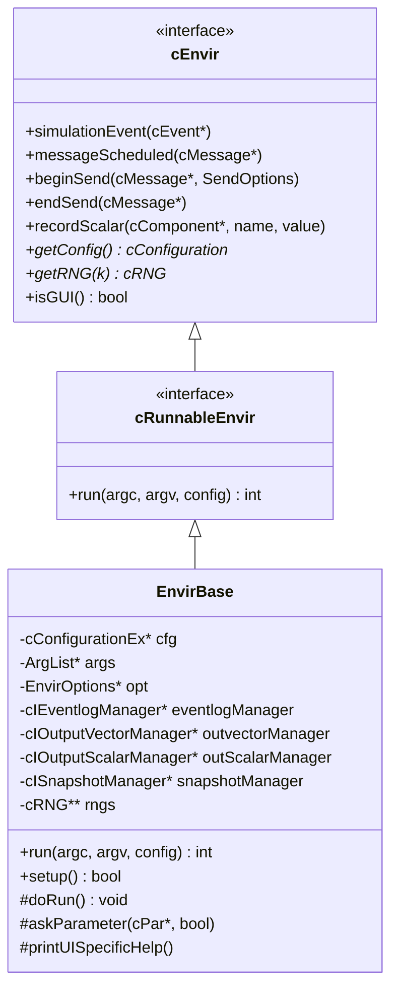
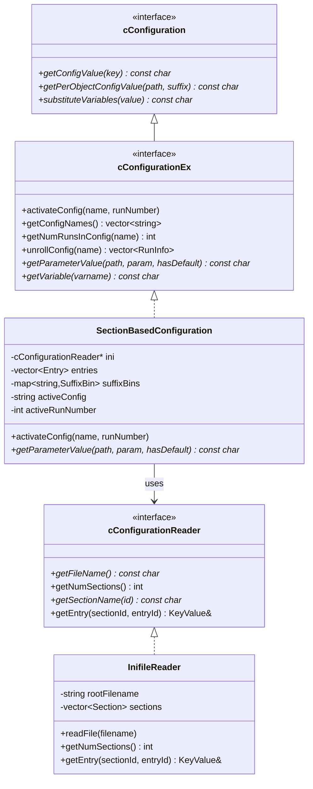
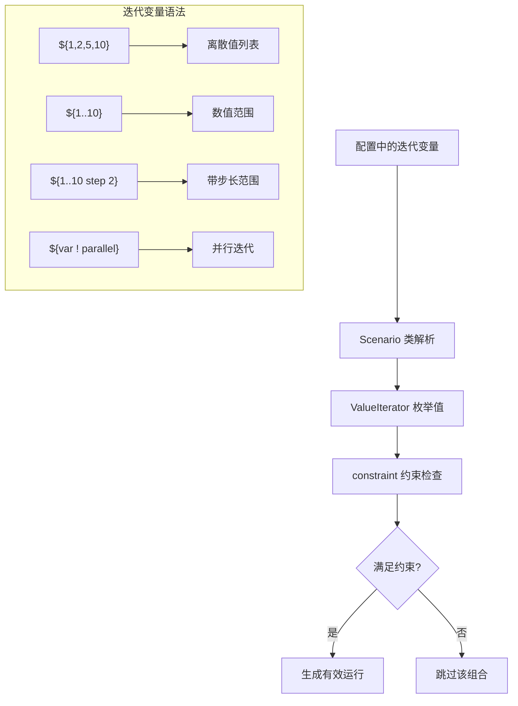
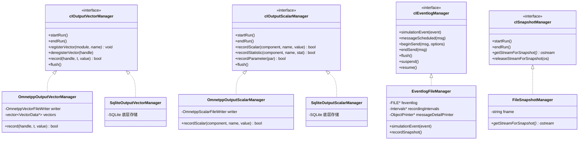
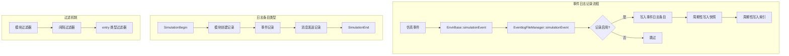
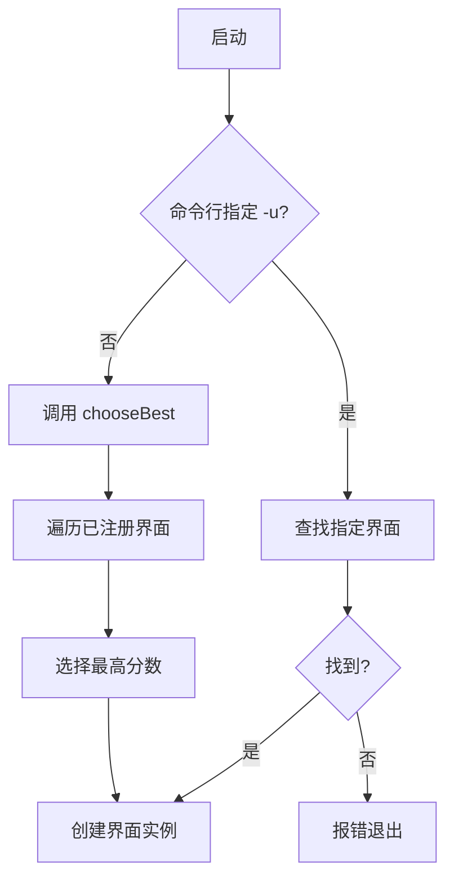
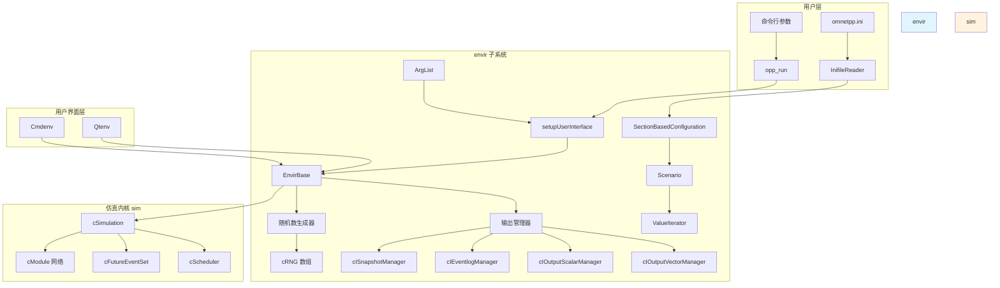

# OMNeT++ envir 子系统分析文档

## 1. 概述

`envir` 是 OMNeT++ 仿真框架的运行环境管理层，作为仿真内核 (`sim`) 与用户界面层 (`cmdenv`、`qtenv`) 之间的桥梁。该子系统负责：

- **配置管理**：解析 INI 文件，管理配置选项和参数
- **仿真启动**：处理命令行参数，初始化仿真环境
- **输出管理**：记录仿真结果（标量、向量、事件日志）
- **插件机制**：支持自定义配置读取器、输出管理器等扩展

### 1.1 文件结构

| 文件 | 功能 |
|------|------|
| `main.cc` | 程序入口点，调用 `evMain()` |
| `evmain.cc` | 仿真主函数，调用 `setupUserInterface()` |
| `startup.cc` | 启动流程实现，加载库、创建 UI |
| `envirbase.cc/h` | 环境基类 `EnvirBase` 实现 |
| `sectionbasedconfig.cc/h` | 基于分节的配置系统 |
| `inifilereader.cc/h` | INI 文件读取器 |
| `scenario.cc/h` | 参数扫描场景管理 |
| `valueiterator.cc/h` | 迭代变量值解析 |
| `eventlogfilemgr.cc/h` | 事件日志文件管理 |
| `omnetppoutvectormgr.cc/h` | 向量输出管理（OMNeT++ 格式） |
| `omnetppoutscalarmgr.cc/h` | 标量输出管理（OMNeT++ 格式） |
| `sqliteoutvectormgr.cc/h` | 向量输出管理（SQLite 格式） |
| `sqliteoutscalarmgr.cc/h` | 标量输出管理（SQLite 格式） |
| `filesnapshotmgr.cc/h` | 快照文件管理 |
| `appreg.cc/h` | 用户界面注册机制 |
| `args.cc/h` | 命令行参数解析 |
| `xmldoccache.cc/h` | XML 文档缓存 |
| `logformatter.cc/h` | 日志格式化 |
| `objectprinter.cc/h` | 对象打印输出 |
| `intervals.cc/h` | 时间间隔管理 |
| `stopwatch.cc/h` | 计时器 |

---

## 2. 核心类架构

### 2.1 类层次结构



### 2.2 配置系统类图



---

## 3. 启动流程详解

### 3.1 启动流程图

```mermaid
flowchart TD
    A[main.cc: main()] --> B[evmain.cc: evMain]
    B --> C[startup.cc: setupUserInterface]
    
    subgraph "初始化阶段"
        C --> D[解析命令行参数 ArgList]
        D --> E[创建 InifileReader]
        E --> F[读取 INI 文件]
        F --> G[创建 SectionBasedConfiguration]
        G --> H[设置命令行配置选项]
        H --> I[加载扩展库 -l 选项]
        I --> J{自定义配置类?}
        J -->|是| K[创建自定义 cConfigurationEx]
        J -->|否| L[使用 SectionBasedConfiguration]
        K --> M[验证配置 validate]
        L --> M
    end
    
    subgraph "UI 选择阶段"
        M --> N{用户界面已指定?}
        N -->|是| O[查找指定的 UI]
        N -->|否| P[选择最佳 UI: chooseBest]
        O --> Q[创建 cRunnableEnvir 实例]
        P --> Q
    end
    
    subgraph "运行阶段"
        Q --> R[创建 cSimulation 对象]
        R --> S[设置为活动仿真]
        S --> T[app->run 调用]
        T --> U[EnvirBase::run]
        U --> V[simulationRequired? 检查]
        V -->|需要仿真| W[setup 初始化]
        W --> X[doRun 执行仿真]
        X --> Y[shutdown 清理]
    end
    
    subgraph "清理阶段"
        Y --> Z[删除 cSimulation]
        Z --> AA[执行 SHUTDOWN 代码片段]
        AA --> AB[返回退出码]
    end
```

### 3.2 关键启动步骤

**步骤 1：程序入口 (`main.cc`)**
```cpp
int main(int argc, char *argv[]) {
    return omnetpp::envir::evMain(argc, argv);
}
```

**步骤 2：仿真主函数 (`evmain.cc`)**
```cpp
int evMain(int argc, char *argv[]) {
    cStaticFlag dummy;  // 静态标志，确保正确初始化/清理顺序
    int exitCode = setupUserInterface(argc, argv);
    return exitCode;
}
```

**步骤 3：设置用户界面 (`startup.cc`)**

核心流程：
1. **解析参数**：`ArgList::parse(argc, argv, ARGSPEC)`
2. **读取配置**：`InifileReader::readFile()` 加载 `omnetpp.ini`
3. **创建配置对象**：`SectionBasedConfiguration` 包装配置读取器
4. **加载库**：根据 `load-libs` 选项加载动态库
5. **选择 UI**：通过 `cOmnetAppRegistration::chooseBest()` 自动选择
6. **运行**：创建 `cSimulation` 并调用 `app->run()`

---

## 4. 配置系统详解

### 4.1 配置层次结构

```mermaid
flowchart LR
    subgraph "INI 文件结构"
        A["[General]"] --> B["[Config A]"]
        A --> C["[Config B]"]
        B --> D["extends = General"]
        C --> E["extends = A"]
    end
    
    subgraph "配置解析流程"
        F[InifileReader] --> G[SectionBasedConfiguration]
        G --> H[activateConfig]
        H --> I[解析 extends 链]
        I --> J[变量替换 ${var}]
        J --> K[激活配置]
    end
    
    subgraph "参数查找链"
        L[Config B] --> M[Config A]
        M --> N[General]
    end
```

### 4.2 SectionBasedConfiguration 核心机制

**分节继承机制：**
- 配置可通过 `extends` 关键字继承其他配置
- 查找参数时按照继承链从具体到一般搜索
- `[General]` 是所有配置的隐式基类

**参数匹配优化：**
```cpp
// 使用后缀分桶优化参数查找
struct SuffixBin {
    std::vector<MatchableEntry> entries;
};

std::map<std::string, SuffixBin> suffixBins;  // 按参数名后缀分桶
SuffixBin wildcardSuffixBin;                   // 通配符条目桶
```

**变量替换：**
- 预定义变量：`${configname}`, `${runnumber}`, `${datetime}`, `${repetition}` 等
- 迭代变量：`${varname}` 从参数扫描中获取值
- 替换时机：`activateConfig()` 时进行变量替换

### 4.3 迭代变量与参数扫描



**Scenario 类职责：**
- 解析迭代变量定义
- 计算运行总数 `getNumRuns()`
- 处理约束表达式 `constraint=`
- 管理嵌套顺序 `iteration-nesting-order=`

---

## 5. 输出管理系统

### 5.1 输出管理器类图



### 5.2 输出文件格式选择

| 配置选项 | 默认值 | 说明 |
|---------|--------|------|
| `outputvectormanager-class` | `OmnetppOutputVectorManager` | 向量输出管理器类 |
| `outputscalarmanager-class` | `OmnetppOutputScalarManager` | 标量输出管理器类 |
| `output-vector-file` | `${resultdir}/${configname}-${iterationvarsf}#${repetition}.vec` | 向量文件名模板 |
| `output-scalar-file` | `${resultdir}/${configname}-${iterationvarsf}#${repetition}.sca` | 标量文件名模板 |

**SQLite 格式优势：**
- 更高效的存储和查询
- 支持事务操作
- 更好的数据完整性

---

## 6. 事件日志管理

### 6.1 事件日志架构



### 6.2 EventlogFileManager 核心功能

**配置选项：**
- `record-eventlog`：启用/禁用事件日志记录
- `eventlog-file`：事件日志文件名
- `eventlog-max-size`：最大文件大小
- `eventlog-snapshot-frequency`：快照频率

**关键方法：**
```cpp
// 记录仿真事件
void simulationEvent(cEvent *event) override;

// 记录消息发送序列
void beginSend(cMessage *msg, const SendOptions& options) override;
void messageSendDirect(cMessage *msg, cGate *toGate, const ChannelResult& result) override;
void messageSendHop(cMessage *msg, cGate *srcGate) override;
void endSend(cMessage *msg) override;

// 暂停/恢复记录
void suspend() override;
void resume() override;
```

---

## 7. 用户界面注册机制

### 7.1 注册宏

```cpp
#define Register_OmnetApp(UINAME, CLASSNAME, SCORE, DESCR) \
    static cRunnableEnvir *__FILEUNIQUENAME__() {return new CLASSNAME();} \
    EXECUTE_ON_STARTUP(omnetapps.getInstance()->add( \
        new cOmnetAppRegistration(UINAME, SCORE, DESCR, __FILEUNIQUENAME__)))
```

**参数说明：**
- `UINAME`：界面名称（如 "Cmdenv"、"Qtenv"）
- `CLASSNAME`：界面实现类名
- `SCORE`：优先级分数（高分数优先被选择）
- `DESCR`：界面描述

### 7.2 界面选择流程



---

## 8. 插件扩展机制

### 8.1 可扩展组件

| 扩展点 | 基类 | 配置选项 |
|--------|------|----------|
| 配置读取器 | `cConfigurationReader` | `sectionbasedconfig-configreader-class` |
| 配置对象 | `cConfigurationEx` | `configuration-class` |
| 调度器 | `cScheduler` | `scheduler-class` |
| 随机数生成器 | `cRNG` | `rng-class` |
| 向量输出管理器 | `cIOutputVectorManager` | `outputvectormanager-class` |
| 标量输出管理器 | `cIOutputScalarManager` | `outputscalarmanager-class` |
| 事件日志管理器 | `cIEventlogManager` | `eventlogmanager-class` |
| 快照管理器 | `cISnapshotManager` | `snapshotmanager-class` |
| 未来事件集 | `cFutureEventSet` | `futureeventset-class` |

### 8.2 扩展示例

```cpp
// 1. 定义自定义类
class MyOutputScalarManager : public cIOutputScalarManager {
    // 实现接口方法...
};

// 2. 注册类
Register_Class(MyOutputScalarManager);

// 3. 在 omnetpp.ini 中配置
[General]
outputscalarmanager-class = "MyOutputScalarManager"
```

---

## 9. 关键配置选项

### 9.1 全局配置选项

| 选项 | 类型 | 默认值 | 说明 |
|------|------|--------|------|
| `network` | string | - | 要仿真的网络名称 |
| `sim-time-limit` | time | - | 仿真时间限制 |
| `cpu-time-limit` | time | - | CPU 时间限制 |
| `real-time-limit` | time | - | 实时限制 |
| `warmup-period` | time | 0s | 预热期 |
| `num-rngs` | int | 1 | 随机数生成器数量 |
| `rng-class` | string | `cMersenneTwister` | RNG 类名 |
| `seed-set` | int | `${runnumber}` | 种子集编号 |
| `result-dir` | string | results | 结果目录 |
| `record-eventlog` | bool | false | 记录事件日志 |
| `ned-path` | path | - | NED 文件搜索路径 |
| `load-libs` | filenames | - | 启动时加载的库 |

### 9.2 输出配置选项

| 选项 | 说明 |
|------|------|
| `output-vector-file` | 向量输出文件名 |
| `output-scalar-file` | 标量输出文件名 |
| `output-vector-precision` | 向量精度（位数） |
| `output-scalar-precision` | 标量精度（位数） |
| `vector-recording-intervals` | 向量记录时间区间 |

---

## 10. 架构总览



---

## 11. 总结

`envir` 子系统是 OMNeT++ 仿真框架的核心基础设施层，承担了仿真运行的环境管理职责：

1. **启动管理**：从命令行参数解析到用户界面选择，实现了灵活的启动流程
2. **配置系统**：基于 INI 文件的分节配置，支持继承、变量替换和参数扫描
3. **输出管理**：插件化的输出管理器架构，支持多种存储格式
4. **扩展机制**：通过配置选项可替换几乎所有核心组件

该子系统的设计遵循了"依赖注入"和"策略模式"等设计模式，使得框架具有良好的可扩展性和可配置性。