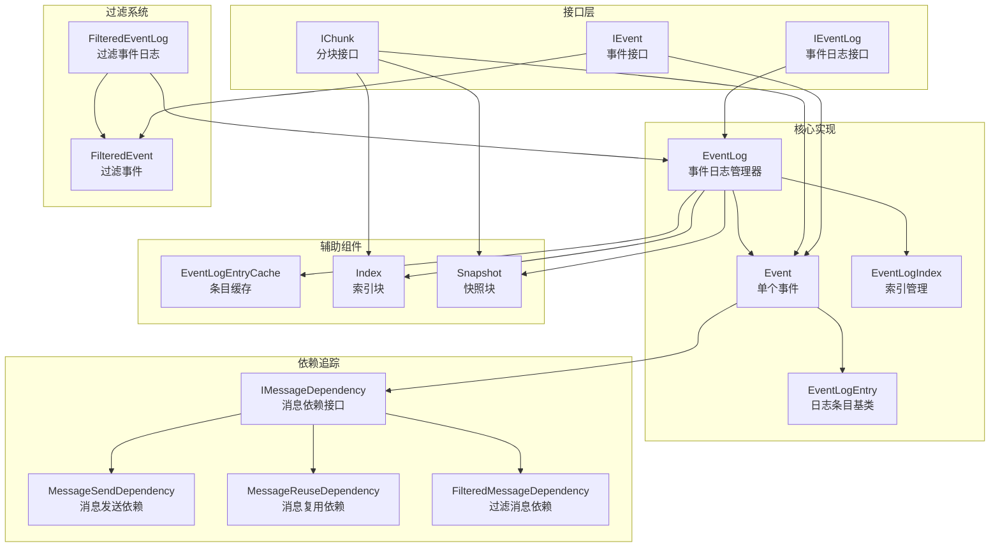
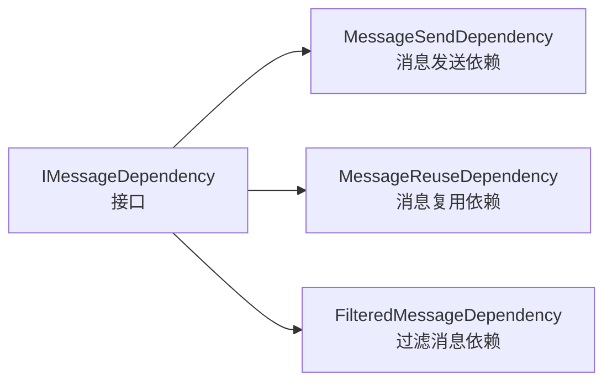
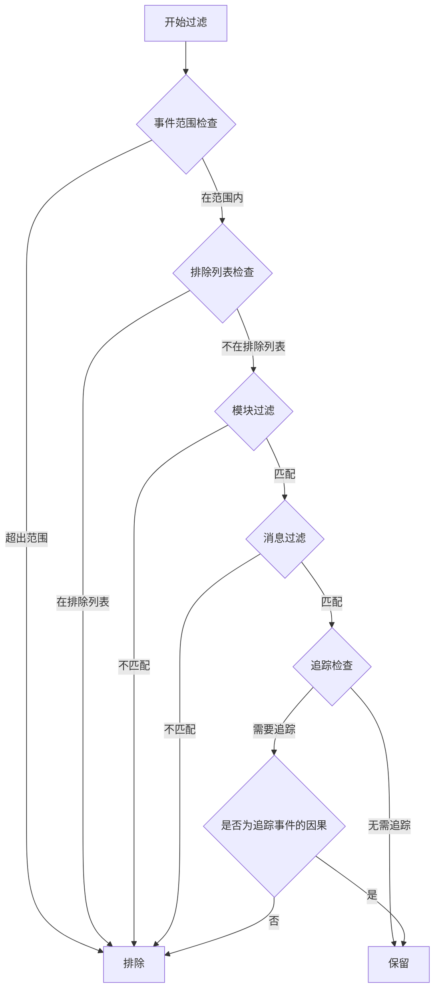
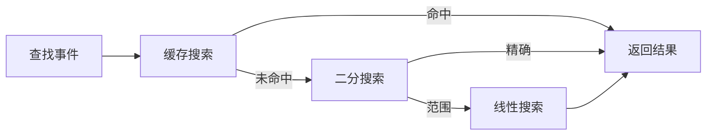
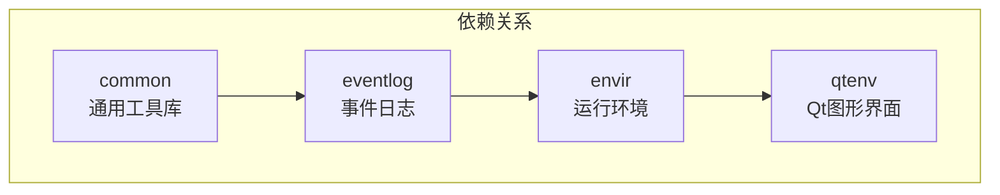

# OMNeT++ EventLog 子系统架构分析

## 1. 概述

EventLog 子系统是 OMNeT++ 仿真框架中负责事件日志记录、解析和回放的核心组件。该子系统提供了对仿真过程中产生的事件日志文件的完整管理能力，包括：

- 事件日志文件的解析和内存表示
- 高效的随机访问索引机制
- 消息依赖关系追踪
- 灵活的事件过滤功能

**代码规模**: 16 个 `.cc` 文件，17 个 `.h` 文件，约 420KB 库文件

## 2. 核心架构



## 3. 关键类详解

### 3.1 IEventLog / EventLog — 事件日志管理器

**位置**: `ieventlog.h` / `eventlog.h` / `eventlog.cc`

`EventLog` 是事件日志子系统的核心类，负责管理整个事件日志文件。它继承自 `IEventLog` 接口和 `EventLogIndex` 索引类。

**主要职责**:
- 解析和管理事件日志文件
- 缓存已解析的事件
- 提供事件随机访问能力
- 管理索引和快照

**核心数据结构**:

```cpp
class EventLog : public IEventLog, public EventLogIndex {
    eventnumber_t numParsedEvents;          // 已解析事件数
    Event *firstEvent;                       // 第一个事件
    Event *lastEvent;                        // 最后一个事件
    EventLogEntryCache eventLogEntryCache;   // 条目缓存
    
    EventNumberToEventMap eventNumberToEventMap;      // 事件号→事件映射
    EventNumberToIndexMap eventNumberToIndexMap;      // 事件号→索引映射
    EventNumberToSnapshotMap eventNumberToSnapshotMap; // 事件号→快照映射
};
```

**关键方法**:
- `getEventForEventNumber()` — 根据事件号获取事件
- `getEventForSimulationTime()` — 根据仿真时间获取事件
- `synchronize()` — 同步文件变更（追加/覆盖）
- `parseIndex()` — 解析索引信息

### 3.2 IEvent / Event — 事件表示

**位置**: `ievent.h` / `event.h` / `event.cc`

`Event` 类表示日志文件中的单个事件，包含该事件的所有日志条目。

**主要职责**:
- 存储事件的基本信息（事件号、仿真时间、模块ID、消息ID）
- 管理事件相关的日志条目列表
- 追踪事件间的因果关系

**核心数据结构**:

```cpp
class Event : public IEvent {
    EventLog *eventLog;                      // 所属事件日志
    file_offset_t beginOffset;               // 文件起始偏移
    file_offset_t endOffset;                 // 文件结束偏移
    EventEntry *eventEntry;                  // "E" 行条目
    EventLogEntryList eventLogEntries;       // 所有日志条目
    
    MessageSendDependency *cause;            // 原因依赖
    IMessageDependencyList *causes;          // 所有原因
    IMessageDependencyList *consequences;    // 所有后果
};
```

**关键方法**:
- `parse()` — 解析事件
- `getCauses()` — 获取导致此事件的所有消息依赖
- `getConsequences()` — 获取此事件产生的所有消息依赖
- `getCauseEvent()` — 获取发送当前处理消息的事件

### 3.3 EventLogIndex — 索引机制

**位置**: `eventlogindex.h` / `eventlogindex.cc`

`EventLogIndex` 提供了对事件日志文件的随机访问能力，支持按事件号或仿真时间快速定位。

**索引策略**:
1. **缓存搜索** — 首先查找内存缓存
2. **二分搜索** — 在文件中进行二分查找
3. **线性搜索** — 在小范围内线性扫描

**核心数据结构**:

```cpp
class EventLogIndex {
    FileReader *reader;                      // 文件读取器
    LineTokenizer *tokenizer;                // 行分词器
    
    // 缓存条目：存储事件号/仿真时间与文件偏移的映射
    EventNumberToCacheEntryMap eventNumberToCacheEntryMap;
    SimulationTimeToCacheEntryMap simulationTimeToCacheEntryMap;
};
```

**CacheEntry 结构**:

```cpp
class CacheEntry {
    simtime_t simulationTime;                // 仿真时间
    eventnumber_t beginEventNumber;          // 起始事件号
    eventnumber_t endEventNumber;            // 结束事件号
    file_offset_t beginOffset;               // 起始偏移
    file_offset_t endOffset;                 // 结束偏移
};
```

**关键方法**:
- `getOffsetForEventNumber()` — 获取事件号对应的文件偏移
- `getOffsetForSimulationTime()` — 获取仿真时间对应的文件偏移
- `searchForOffset()` — 模板方法，执行三级搜索

### 3.4 IMessageDependency — 消息依赖追踪

**位置**: `messagedependency.h` / `messagedependency.cc`

消息依赖系统用于追踪仿真中消息的传递路径，是事件因果关系分析的基础。

**依赖类型**:



**MessageSendDependency** — 消息发送依赖:
- 表示消息从一个事件发送到另一个事件
- `cause` = 发送事件，`consequence` = 接收事件
- 通过 `BeginSendEntry` 记录发送信息

**MessageReuseDependency** — 消息复用依赖:
- 表示消息在一个事件被接收后，在另一个事件被重新发送
- `cause` = 上次处理该消息的事件，`consequence` = 再次发送该消息的事件
- 通过 `previousEventNumber` 追踪

**FilteredMessageDependency** — 过滤消息依赖:
- 表示过滤视图中跨越多个中间事件的依赖链
- 包含 `beginMessageDependency` 和 `endMessageDependency`
- Kind: `SENDS`, `REUSES`, `MIXED`

### 3.5 FilteredEventLog — 过滤功能

**位置**: `filteredeventlog.h` / `filteredeventlog.cc`

`FilteredEventLog` 提供事件日志的过滤视图，支持按多种条件筛选事件。

**过滤条件**:

```cpp
class FilteredEventLog : public IEventLog {
    // 事件范围过滤
    eventnumber_t firstConsideredEventNumber;  // 起始事件号
    eventnumber_t lastConsideredEventNumber;   // 结束事件号
    std::set<eventnumber_t> excludedEventNumbers; // 排除的事件

    // 模块过滤
    bool enableModuleFilter;
    MatchExpression moduleExpression;
    std::vector<PatternMatcher> moduleNames;
    std::vector<PatternMatcher> moduleClassNames;
    std::vector<int> moduleIds;

    // 消息过滤
    bool enableMessageFilter;
    MatchExpression messageExpression;
    std::vector<PatternMatcher> messageNames;
    std::vector<PatternMatcher> messageClassNames;
    std::vector<msgid_t> messageIds;

    // 追踪过滤
    eventnumber_t tracedEventNumber;        // 追踪的事件号
    bool traceCauses;                        // 追踪原因
    bool traceConsequences;                  // 追踪后果
};
```

**过滤流程**:



### 3.6 EventLogEntry — 日志条目

**位置**: `eventlogentry.h` / `eventlogentries.h`

`EventLogEntry` 是日志文件中每一行的抽象表示。

**条目类型层次**:

```
EventLogEntry (基类)
├── EventLogTokenBasedEntry (基于Token的条目)
│   ├── SimulationBeginEntry (SB) - 仿真开始
│   ├── SimulationEndEntry (SE) - 仿真结束
│   ├── EventEntry (E) - 事件
│   ├── SnapshotEntry (S) - 快照
│   ├── IndexEntry (I) - 索引
│   ├── ModuleDescriptionEntry - 模块描述
│   │   ├── ModuleCreatedEntry (MC)
│   │   └── ModuleDeletedEntry (MD)
│   ├── GateDescriptionEntry - 门描述
│   ├── ConnectionDescriptionEntry - 连接描述
│   ├── MessageDescriptionEntry - 消息描述
│   │   ├── CreateMessageEntry (CM)
│   │   ├── CloneMessageEntry (CL)
│   │   ├── DeleteMessageEntry (DM)
│   │   ├── BeginSendEntry (BS)
│   │   └── EndSendEntry (ES)
│   └── ...
└── EventLogMessageEntry - 日志消息
```

### 3.7 Index / Snapshot — 索引块和快照块

**Index** (`index.h`):
- 管理索引条目（"I" 行）
- 存储引用的增删记录
- 支持增量式日志解析

**Snapshot** (`snapshot.h`):
- 管理快照条目（"S" 行）
- 记录仿真某时刻的完整状态
- 支持快速恢复到特定状态

## 4. 文件格式

事件日志文件采用文本格式，每行一个条目：

```
SB omnetppversion 6 eventlogversion 4 runId "..."
E # 0 t 0.0 m 1 ce -1 msg 1
BS id 1 name "msg" ...
ES
E # 1 t 0.1 m 2 ce 0 msg 1
...
I fileoffset 12345 previndex 6789 prevsnapshot 0 # 100 t 10.0
S fileoffset 23456 # 200 t 20.0
...
SE
```

**关键行类型**:
- `SB` — 仿真开始
- `E` — 事件条目
- `BS` — 消息发送开始
- `ES` — 消息发送结束
- `I` — 索引条目
- `S` — 快照条目
- `SE` — 仿真结束

## 5. 性能优化机制

### 5.1 懒加载

- 事件按需解析，不一次性加载整个文件
- Index 和 Snapshot 延迟解析（`ensureParsed()`）
- 大文件只解析首尾各 1MB，其余按需加载

### 5.2 缓存机制

- `eventNumberToEventMap` — 事件号到事件的映射
- `EventLogEntryCache` — 模块、门、连接、消息的描述缓存
- 索引缓存 — 加速随机访问

### 5.3 三级搜索



## 6. 与其他子系统的关系



**依赖方向**:
- `eventlog` 依赖 `common`（文件读取、字符串工具、表达式解析）
- `envir` 依赖 `eventlog`（事件日志记录）
- `qtenv` 通过 `envir` 间接使用事件日志功能

## 7. 关键设计模式

### 7.1 委托模式

`FilteredEventLog` 和 `FilteredEvent` 使用委托模式，将大部分操作委托给底层的 `EventLog` 和 `Event`：

```cpp
class FilteredEventLog : public IEventLog {
    IEventLog *eventLog;  // 委托对象
    // 多个 FilteredEventLog 可共享同一个 EventLog
};
```

### 7.2 双向链表

事件通过双向链表连接，支持高效的前后遍历：

```cpp
class IEvent {
    IEvent *previousEvent;
    IEvent *nextEvent;
    static void linkEvents(IEvent *prev, IEvent *next);
};
```

### 7.3 观察者模式

`ProgressMonitor` 用于长时间运行操作的进度通知：

```cpp
class ProgressMonitor {
    typedef void (*MonitorFunction)(IEventLog *, void *);
    MonitorFunction monitorFunction;
    void *data;
};
```

## 8. 总结

EventLog 子系统是 OMNeT++ 仿真框架中处理事件日志的核心组件，其设计特点包括：

1. **高效解析** — 三级搜索策略，懒加载机制
2. **灵活过滤** — 多维度过滤条件，追踪功能
3. **依赖追踪** — 完整的消息依赖链分析能力
4. **增量支持** — 索引和快照机制支持增量式日志

该子系统为仿真结果分析、调试和可视化提供了坚实的数据基础。