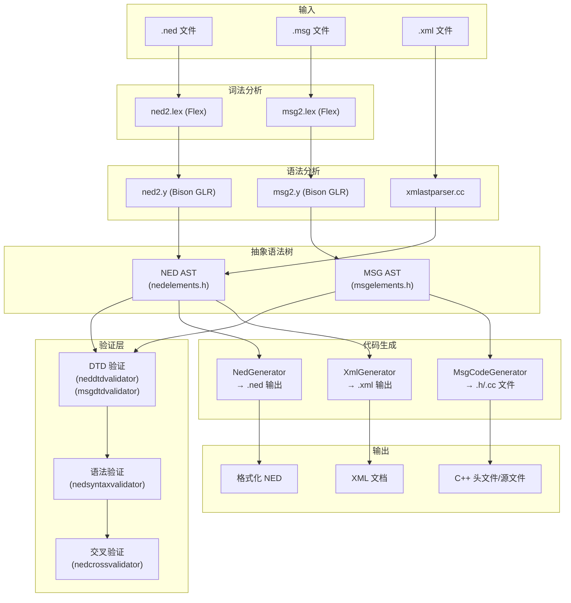
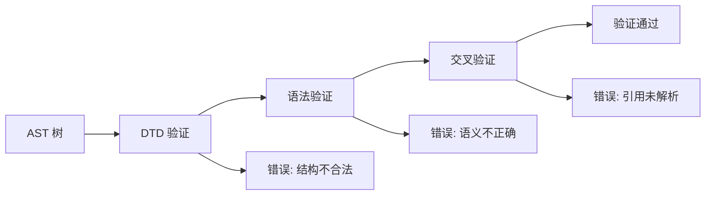
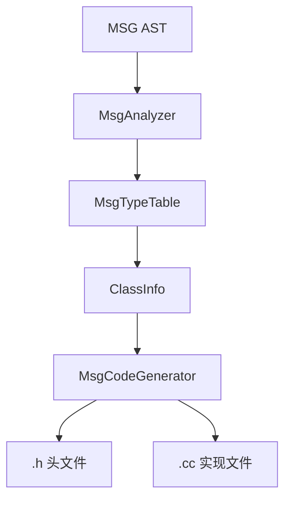

# OMNeT++ nedxml 子系统架构分析

## 概述

`nedxml` 子系统是 OMNeT++ 的 NED/MSG 文件编译器，负责解析、验证和代码生成。该子系统位于 `src/nedxml/` 目录，编译生成 `liboppnedxml.so` 库文件（约 944KB）。

**核心职责：**
- NED 文件解析与验证（模块/信道定义）
- MSG 文件解析与验证（消息/包定义）
- C++ 代码生成（从 MSG 文件）
- XML 序列化/反序列化
- 类型系统管理与跨引用解析

## 编译器流程图



## 模块架构

### 1. 解析器模块

#### 1.1 NED 解析器

| 文件 | 职责 |
|------|------|
| `nedparser.cc/h` | NED 解析器前端，提供 `parseNedFile()` / `parseNedText()` API |
| `ned2.y` | Bison GLR 语法文件，定义 NED-2 语法（1785 行） |
| `ned2.lex` | Flex 词法分析器（生成 `ned2.lex.cc`） |
| `nedyyutil.cc` | 解析器辅助函数 |

**关键特性：**
- 使用 GLR（Generalized LR）解析器处理歧义语法
- 预期 9 个 shift-reduce 冲突
- 支持 NED 表达式解析（`isValidNedExpression()`）
- 内置类型声明（`getBuiltInDeclarations()`）

#### 1.2 MSG 解析器

| 文件 | 职责 |
|------|------|
| `msgparser.cc/h` | MSG 解析器前端，提供 `parseMsgFile()` / `parseMsgText()` API |
| `msg2.y` | Bison GLR 语法文件，定义 MSG-2 语法（773 行） |
| `msg2.lex` | Flex 词法分析器（生成 `msg2.lex.cc`） |
| `msgyyutil.cc` | 解析器辅助函数 |

**关键特性：**
- 无 shift-reduce 冲突（`%expect 0`）
- 支持 namespace、cplusplus 块
- 支持 message/packet/class/struct/enum 定义

#### 1.3 XML 解析器

| 文件 | 职责 |
|------|------|
| `xmlastparser.cc/h` | XML 到 AST 的解析前端 |
| `astbuilder.cc/h` | SAX 解析器回调，构建 AST |
| `astnode.cc/h` | AST 节点基类 |

### 2. AST 结构

#### 2.1 基类 ASTNode

`astnode.h` 定义了 AST 节点的基类，提供：

```cpp
class ASTNode {
    // 树结构
    ASTNode *parent, *firstChild, *lastChild;
    ASTNode *prevSibling, *nextSibling;
    
    // 源码位置
    FileLine srcLoc;           // 文件:行号
    SourceRegion srcRegion;    // 起止行列
    
    // 泛型属性访问
    virtual const char *getAttribute(const char *name) const;
    virtual void setAttribute(const char *name, const char *value);
    
    // 节点类型
    virtual const char *getTagName() const = 0;
    virtual int getTagCode() const = 0;
};
```

**设计特点：**
- DOM 风格的树结构
- 双向链表连接子节点
- 泛型属性访问 + 类型化访问
- 源码位置追踪（用于错误报告）

#### 2.2 NED 元素类型

`nedelements.h` 由 `dtdclassgen.pl` 从 `ned2.dtd` 自动生成，包含 **28 种元素类型**：

| 类别 | 元素类型 |
|------|----------|
| 文件结构 | `FilesElement`, `NedFileElement`, `CommentElement` |
| 包/导入 | `PackageElement`, `ImportElement` |
| 模块定义 | `SimpleModuleElement`, `CompoundModuleElement`, `ModuleInterfaceElement` |
| 信道定义 | `ChannelElement`, `ChannelInterfaceElement` |
| 参数/门 | `ParametersElement`, `ParamElement`, `GatesElement`, `GateElement` |
| 属性 | `PropertyElement`, `PropertyKeyElement`, `PropertyDeclElement` |
| 子模块 | `SubmodulesElement`, `SubmoduleElement` |
| 连接 | `ConnectionsElement`, `ConnectionElement`, `ConnectionGroupElement` |
| 控制流 | `LoopElement`, `ConditionElement` |
| 其他 | `TypesElement`, `ExtendsElement`, `InterfaceNameElement`, `LiteralElement` |

#### 2.3 MSG 元素类型

`msgelements.h` 包含 **21 种元素类型**：

| 类别 | 元素类型 |
|------|----------|
| 文件结构 | `MsgFileElement`, `CommentElement` |
| 命名空间 | `NamespaceElement`, `ImportElement` |
| 前向声明 | `StructDeclElement`, `ClassDeclElement`, `MessageDeclElement`, `PacketDeclElement`, `EnumDeclElement` |
| 类型定义 | `MessageElement`, `PacketElement`, `ClassElement`, `StructElement`, `EnumElement` |
| 成员 | `FieldElement`, `EnumFieldElement` |
| 内联代码 | `CplusplusElement` |
| 属性 | `PropertyElement`, `PropertyKeyElement`, `LiteralElement` |

### 3. 验证器模块

验证器采用分层架构，按验证阶段组织：



#### 3.1 DTD 验证器

| 文件 | 职责 |
|------|------|
| `neddtdvalidator.cc/h` | 验证 NED AST 符合 DTD 结构 |
| `msgdtdvalidator.cc/h` | 验证 MSG AST 符合 DTD 结构 |
| `dtdvalidationutils.cc/h` | DTD 验证工具类 |

**验证内容：**
- 子元素顺序和数量
- 必需/可选属性
- 属性值类型

#### 3.2 语法验证器

| 文件 | 职责 |
|------|------|
| `nedsyntaxvalidator.cc/h` | NED 语法语义验证 |
| `msgvalidator.cc/h` | MSG 验证器基类 |

**验证内容：**
- 表达式属性语法正确性
- 枚举属性值合法性
- 标识符合法性（属性名、属性索引）
- 模块/信道结构完整性

#### 3.3 交叉验证器

| 文件 | 职责 |
|------|------|
| `nedcrossvalidator.cc/h` | 跨文件引用验证 |

**验证内容：**
- 模块类型引用解析
- 信道类型引用解析
- 接口实现检查
- 门连接有效性

**注意：** 代码注释表明该验证器当前未使用（`*** CURRENTLY NOT IN USE ***`）。

### 4. 代码生成模块

#### 4.1 MSG 编译器



| 文件 | 职责 |
|------|------|
| `msgcompiler.cc/h` | MSG 编译器主类，协调分析和代码生成 |
| `msganalyzer.cc/h` | AST 分析，提取类/字段信息到 `ClassInfo` |
| `msgtypetable.cc/h` | 类型表，存储已定义的类/枚举信息 |
| `msgcodegenerator.cc/h` | C++ 代码生成器（~1800 行） |
| `msgcompileroptions.h` | 编译选项配置 |

**生成内容：**
- 类/结构体定义
- getter/setter 方法
- 序列化/反序列化方法
- 字段描述符类
- 枚举定义

#### 4.2 NED 生成器

| 文件 | 职责 |
|------|------|
| `nedgenerator.cc/h` | 从 AST 生成 NED 源码 |
| `xmlgenerator.cc/h` | 从 AST 生成 XML 输出 |

**用途：**
- NED 文件格式化/美化
- NED ↔ XML 格式转换
- IDE 支持（预览生成）

### 5. 资源管理模块

| 文件 | 职责 |
|------|------|
| `nedresourcecache.cc/h` | NED 文件缓存，管理已加载的类型 |
| `nedtypeinfo.cc/h` | NED 类型信息存储 |

**功能：**
- 加载 NED 源文件夹
- 管理包层次结构
- 类型查找与解析
- 导入处理

```cpp
class NedResourceCache {
    // 加载方法
    int loadNedSourceFolder(const char *foldername, const char *excludedPackages);
    void loadNedFile(const char *nedfname, const char *expectedPackage, bool isXML);
    void loadNedText(const char *name, const char *nedtext, const char *expectedPackage, bool isXML);
    
    // 类型查询
    NedTypeInfo *lookup(const char *qname) const;
    std::string lookupNedType(const NedLookupContext& context, const char *nedTypeName);
};
```

### 6. 辅助模块

| 文件 | 职责 |
|------|------|
| `errorstore.cc/h` | 错误/警告存储，支持多种严重级别 |
| `exception.cc/h` | 异常类定义 |
| `sourcedocument.cc/h` | 源文件表示，支持源码片段提取 |
| `yyutil.cc/h` | 解析器通用工具 |
| `nedutil.cc/h` | NED 工具函数 |
| `nedtools.cc/h` | NED 工具集合 |

## 工具列表

### opp_nedtool

**位置：** `src/nedxml/opp_nedtool.cc`

**命令：**
| 命令 | 功能 |
|------|------|
| `help` | 显示帮助 |
| `convert` | NED ↔ XML 格式转换 |
| `prettyprint` | 格式化 NED 文件 |
| `validate` | 验证 NED 文件 |
| `generatecpp` | 生成 C++ 代码（实验性） |

### opp_msgtool

**位置：** `src/nedxml/opp_msgtool.cc`

**命令：**
| 命令 | 功能 |
|------|------|
| `help` | 显示帮助 |
| `convert` | MSG ↔ XML 格式转换 |
| `prettyprint` | 格式化 MSG 文件 |
| `validate` | 验证 MSG 文件 |
| `generatecpp` | 生成 C++ 头文件/源文件 |

## 代码生成属性系统

MSG 编译器支持丰富的属性（properties）控制代码生成：

| 属性 | 用途 |
|------|------|
| `@owned` | 指针字段所有权管理 |
| `@byValue` | 值传递（非引用） |
| `@getter` / `@setter` | 自定义访问器名称 |
| `@enum` | 关联枚举类型 |
| `@custom` | 自定义字段实现 |
| `@customize` | 允许子类化 |
| `@descriptor` | 生成字段描述符 |
| `@implements` | 实现多个基类 |
| `@abstract` | 抽象类/字段 |

## 文件统计

| 类型 | 数量 |
|------|------|
| C++ 头文件 (.h) | 41 |
| C++ 实现文件 (.cc) | 38 |
| Bison 语法文件 (.y) | 2 |
| 生成的词法文件 (.lex.cc) | 2 |
| **总计** | **93 文件** |

## 技术债

根据 `AGENTS.md`，`nedcrossvalidator.cc` 包含 29 个 TODO 项，是代码库中 TODO 最多的文件。

## 依赖关系

```
oppcommon (common)
    └── oppnedxml
            ↓
        oppsim (使用 NED 类型信息)
```

## API 设计原则

1. **自动生成代码：** `nedelements.h` / `msgelements.h` 由 DTD 生成，确保结构一致性
2. **泛型 + 类型化访问：** ASTNode 提供泛型接口，子类提供类型化便捷方法
3. **错误积累模式：** `ErrorStore` 收集所有错误而非首次失败
4. **源码位置追踪：** 每个 AST 节点记录源码位置，支持精确错误报告
5. **验证分层：** DTD → 语法 → 交叉验证，逐层深入

## 与其他子系统的交互

- **sim/**: 使用 `NedResourceCache` 获取模块类型信息，动态构建网络
- **envir/**: 加载 NED 文件，解析配置
- **qtenv/**: 使用 NED/MSG 解析器支持 IDE 功能
- **utils/**: `opp_nedtool` / `opp_msgtool` 作为独立工具