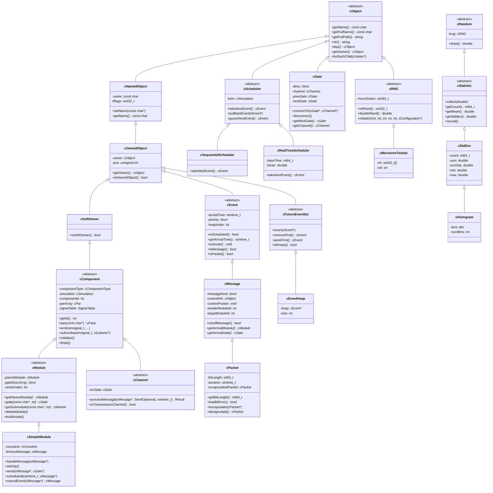
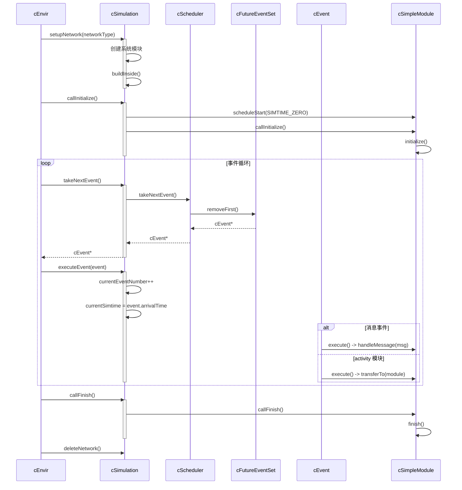
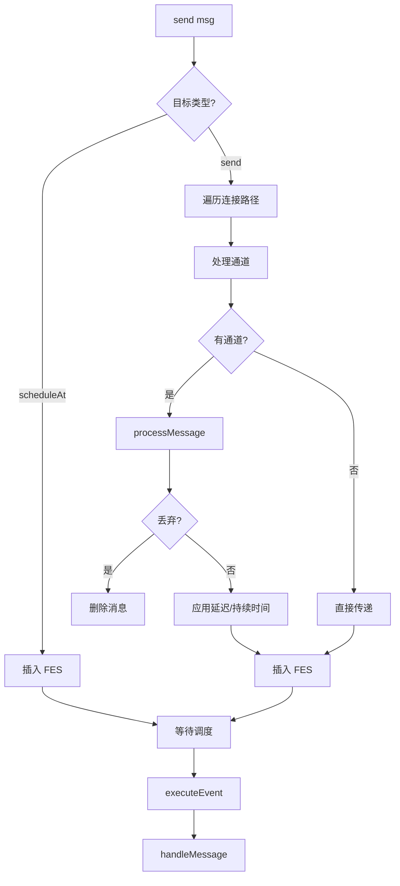
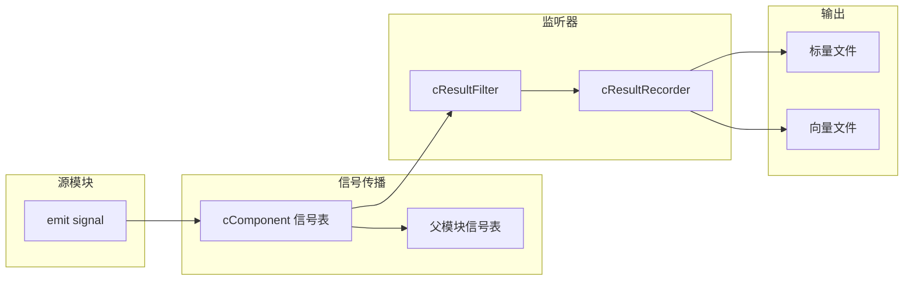
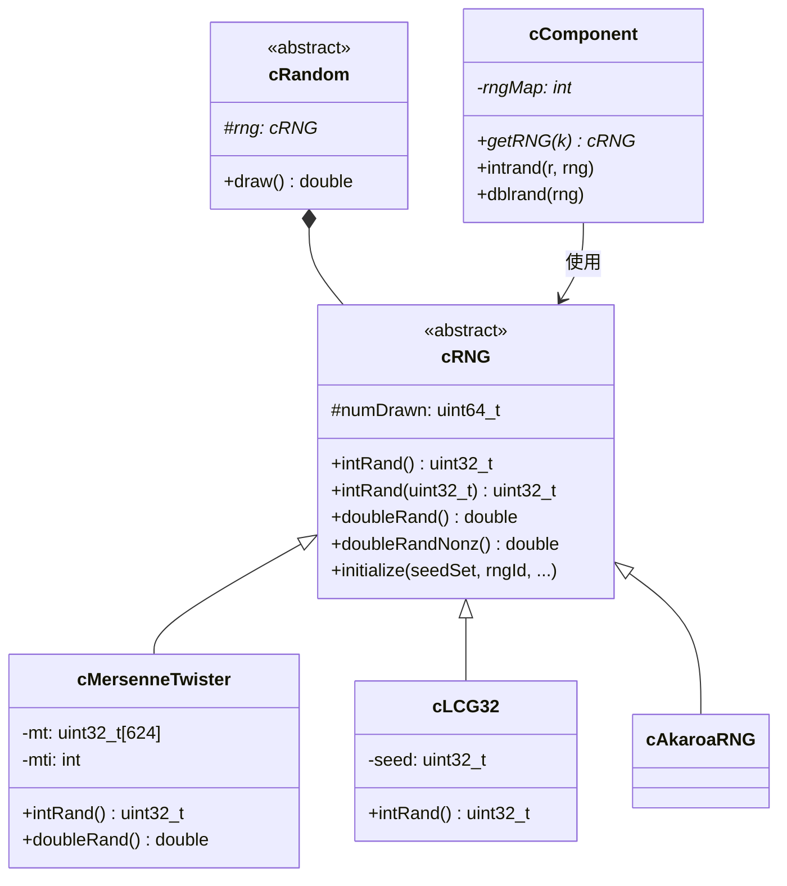
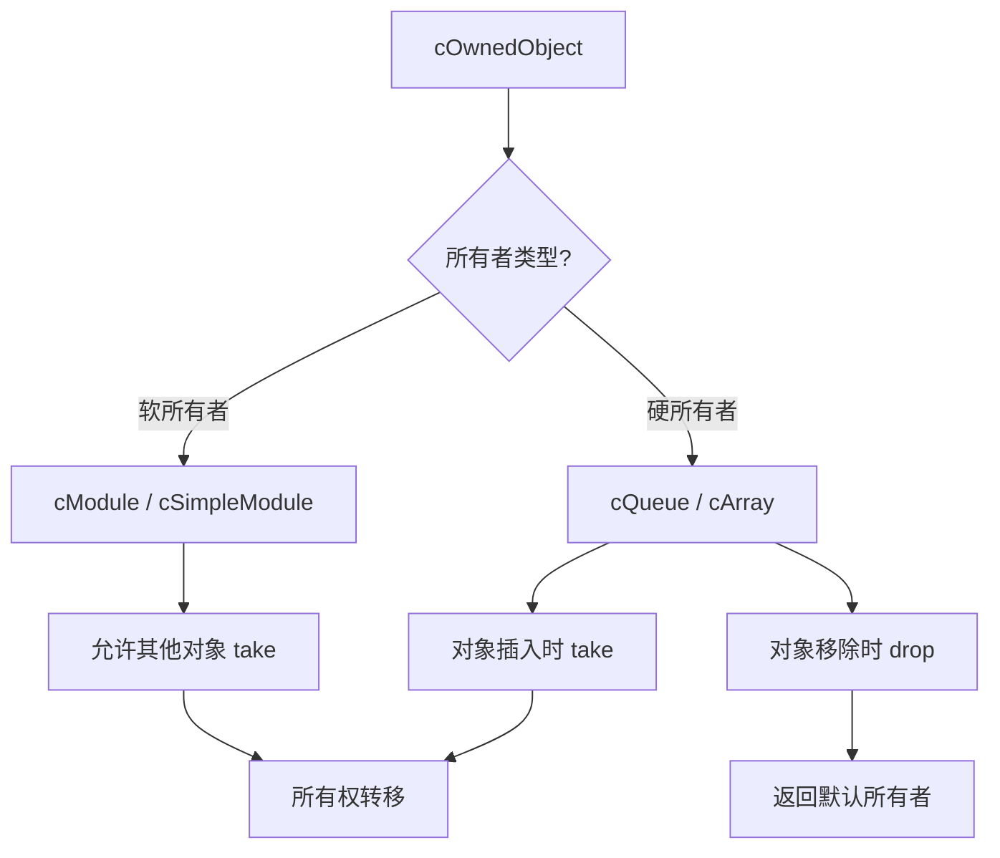

# OMNeT++ src/sim/ 子系统分析文档

## 1. 概述

`src/sim/` 是 OMNeT++ 仿真内核的核心子系统，包含约 133 个源文件，实现了离散事件仿真的全部基础功能。该子系统是整个框架的基石，所有其他组件（envir、cmdenv、qtenv）都依赖于它。

### 1.1 目录结构

```
src/sim/
├── 核心类 (csimulation.cc, cmodule.cc, csimplemodule.cc, cmessage.cc 等)
├── 事件调度 (cfutureeventset.cc, ceventheap.cc, cscheduler.cc)
├── 消息系统 (cmessage.cc, cpacket.cc, cevent.cc)
├── 模块组件 (cmodule.cc, csimplemodule.cc, cgate.cc, cchannel.cc)
├── 统计设施 (cstatistic.cc, cstddev.cc, chistogram.cc, resultfilters.cc, resultrecorders.cc)
├── 随机数生成 (crng.cc, cmersennetwister.cc, clcg32.cc, crandom.cc)
├── 参数系统 (cpar.cc, cparimpl.cc, c*parimpl.cc)
├── 辅助工具 (cqueue.cc, carray.cc, cvisitor.cc, cexception.cc 等)
├── netbuilder/  - 动态 NED 加载
└── parsim/      - 并行仿真（39 文件，本文档不详述）
```

### 1.2 依赖关系

- **依赖**：`common/`、`nedxml/`
- **被依赖**：`envir/`，间接被 `cmdenv/`、`qtenv/` 依赖

## 2. 核心类层次结构

### 2.1 类继承关系图



### 2.2 关键类列表

| 类名 | 文件 | 职责 |
|------|------|------|
| `cSimulation` | csimulation.cc/h | 仿真管理器，事件循环，模块注册 |
| `cModule` | cmodule.cc/h | 模块基类，门管理，子模块管理 |
| `cSimpleModule` | csimplemodule.cc/h | 简单模块基类，消息处理，事件调度 |
| `cMessage` | cmessage.cc/h | 消息/事件基类 |
| `cPacket` | cpacket.cc/h | 数据包类，封装支持 |
| `cEvent` | cevent.cc/h | 事件抽象基类 |
| `cFutureEventSet` | cfutureeventset.cc/h | 未来事件集抽象接口 |
| `cEventHeap` | ceventheap.cc | FES 的二叉堆实现 |
| `cScheduler` | cscheduler.cc/h | 事件调度器抽象基类 |
| `cGate` | cgate.cc/h | 模块门，连接管理 |
| `cChannel` | cchannel.cc/h | 通道基类，消息传输建模 |
| `cDatarateChannel` | cdataratechannel.cc/h | 数据率通道 |
| `cComponent` | ccomponent.cc/h | 模块和通道的公共基类 |
| `cRNG` | crng.cc/h | 随机数生成器抽象接口 |
| `cMersenneTwister` | cmersennetwister.cc/h | Mersenne Twister RNG 实现 |
| `cStatistic` | cstatistic.cc/h | 统计量基类 |
| `cStdDev` | cstddev.cc/h | 标准差统计 |
| `cHistogram` | chistogram.cc/h | 直方图统计 |
| `cIListener` | clistener.cc/h | 信号监听器接口 |
| `cResultFilter` | resultfilters.cc/h | 结果过滤器 |
| `cResultRecorder` | resultrecorders.cc/h | 结果记录器 |
| `cPar` | cpar.cc/h | 模块参数 |
| `cObject` | cobject.cc/h | 对象层次根类 |
| `cOwnedObject` | cownedobject.cc/h | 带所有权的对象 |

## 3. 事件循环流程

### 3.1 仿真执行主循环



### 3.2 核心流程代码解析

**事件执行** (`csimulation.cc`):

```cpp
void cSimulation::executeEvent(cEvent *event)
{
    // 1. 增加事件计数
    currentEventNumber++;
    
    // 2. 推进仿真时间
    currentSimtime = event->getArrivalTime();
    
    // 3. 通知环境（写入事件日志等）
    EVCB.simulationEvent(event);
    
    // 4. 执行事件
    event->execute();
}
```

**消息执行** (`cmessage.cc`):

```cpp
void cMessage::execute()
{
    // 获取目标模块
    cSimpleModule *module = check_and_cast<cSimpleModule *>(
        getSimulation()->getModule(targetModuleId));
    
    // 调用模块的消息处理
    module->doMessageEvent(this);
}
```

**模块消息处理** (`csimplemodule.cc`):

```cpp
void cSimpleModule::doMessageEvent(cMessage *msg)
{
    if (usesActivity()) {
        // activity() 风格：切换到协程
        msgForActivity = msg;
        getSimulation()->transferTo(this);
    } else {
        // handleMessage() 风格：直接调用
        handleMessage(msg);
    }
}
```

## 4. 模块生命周期

### 4.1 生命周期状态图

```mermaid
stateDiagram-v2
    [*] --> 创建: cModuleType::create()
    创建 --> 参数化: finalizeParameters()
    参数化 --> 构建: buildInside()
    构建 --> 初始化: callInitialize()
    
    初始化 --> 运行: initialize() 完成
    运行 --> 运行: handleMessage() / activity()
    
    运行 --> 结束: callFinish()
    结束 --> 清理: deleteModule()
    清理 --> [*]
    
    note right of 创建
        分配模块 ID
        设置名称和索引
    end note
    
    note right of 参数化
        读取配置参数
        创建门
    end note
    
    note right of 构建
        创建子模块
        建立内部连接
    end note
    
    note right of 初始化
        多阶段初始化
        initialize(stage)
    end note
    
    note right of 运行
        处理消息
        调度事件
        发送消息
    end note
    
    note right of 结束
        记录统计结果
        清理资源
    end note
```

### 4.2 模块创建序列

```cpp
// 1. 创建模块
cModule *mod = moduleType->create("name", parentModule);

// 2. 参数化
mod->finalizeParameters();  // 读取参数，创建门

// 3. 连接门（可选）
mod->gate("out")->connectTo(otherModule->gate("in"));

// 4. 构建内部结构
mod->buildInside();  // 对于复合模块，创建子模块和连接

// 5. 初始化
mod->callInitialize();  // 调用 initialize()
```

### 4.3 模块删除流程

```cpp
void cModule::deleteModule()
{
    // 1. 递归调用 preDelete()
    callPreDelete(this);
    
    // 2. 删除子模块
    for (auto submodule : submodules)
        submodule->deleteModule();
    
    // 3. 删除门和连接
    clearGates();
    
    // 4. 从父模块移除
    if (parentModule)
        parentModule->removeSubmodule(this);
    
    // 5. 从仿真注销
    simulation->deregisterComponent(this);
    
    // 6. 删除对象
    delete this;
}
```

## 5. 消息/事件系统

### 5.1 消息发送流程



### 5.2 消息属性

```cpp
class cMessage {
    // 基本信息
    const char *name;           // 消息名称
    short kind;                 // 消息类型（用户定义）
    
    // 发送信息
    int senderModuleId;         // 发送模块 ID
    int senderGateId;           // 发送门 ID
    int targetModuleId;         // 目标模块 ID
    int targetGateId;           // 目标门 ID（-1 表示自消息）
    
    // 时间信息
    simtime_t creationTime;     // 创建时间
    simtime_t sendTime;         // 发送时间
    simtime_t timestamp;        // 用户时间戳
    
    // 辅助
    void *contextPointer;       // 上下文指针（用于定时器）
    cObject *controlInfo;       // 控制信息（协议层间通信）
};
```

### 5.3 数据包扩展

```cpp
class cPacket : public cMessage {
    int64_t bitLength;          // 比特长度
    simtime_t duration;         // 传输持续时间
    bool bitError;              // 比特错误标志
    
    cPacket *encapsulatedPacket; // 封装的数据包
    
    // 封装/解封装
    void encapsulate(cPacket *pkt);
    cPacket *decapsulate();
};
```

## 6. 统计基础设施

### 6.1 信号机制



### 6.2 @statistic 工作流程

1. NED 文件中声明 `@statistic` 属性
2. `cStatisticBuilder` 解析属性创建过滤器/记录器链
3. 模块调用 `emit(signalID, value)` 发射信号
4. 信号经过过滤器链处理
5. 记录器将结果写入输出文件

### 6.3 统计类层次

```cpp
// 基础统计
class cStdDev : public cStatistic {
    int64_t count;              // 计数
    double min, max;            // 最小/最大值
    double sum, sumSqr;         // 和/平方和
};

// 直方图
class cHistogram : public cStdDev {
    Bin *bins;                  // 区间数组
    int numBins;                // 区间数量
};

// 结果记录器
class cResultRecorder : public cResultListener {
    virtual void receiveSignal(...) = 0;
    virtual void finish() { record(); }
};

// 具体记录器
class cScalarRecorder;          // 记录标量
class cVectorRecorder;          // 记录向量
class cHistogramRecorder;       // 记录直方图
```

## 7. 随机数生成系统

### 7.1 RNG 架构



### 7.2 随机变量生成

`cComponent` 提供了丰富的随机变量生成方法：

```cpp
// 连续分布
double uniform(a, b);
double exponential(mean);
double normal(mean, stddev);
double gamma_d(alpha, theta);
double beta(alpha1, alpha2);
double weibull(a, b);

// 离散分布
int intuniform(a, b);
int bernoulli(p);
int binomial(n, p);
int poisson(lambda);
int geometric(p);
```

### 7.3 RNG 配置

```ini
[General]
# RNG 类
rng-class = "cMersenneTwister"

# RNG 数量
num-rngs = 3

# 种子设置
seed-set = ${runnumber}

# 模块 RNG 映射
**.rng-0 = 0
**.rng-1 = 1
```

## 8. 所有权机制

### 8.1 所有权模型

OMNeT++ 实现了一个严格的 Ownership 机制来防止常见的编程错误：



### 8.2 所有权规则

```cpp
// 规则 1：插入容器时所有权转移
cQueue queue;
queue.insert(msg);  // queue 成为 msg 的所有者

// 规则 2：从容器移除时返回软所有者
cMessage *msg = queue.pop();  // 当前模块成为所有者

// 规则 3：删除前需要正确所有权
delete msg;  // 必须是当前模块的所有物，否则抛出异常

// 规则 4：软所有者允许转移
mod->send(msg, "out");  // 模块（软所有者）允许消息转移
```

## 9. 设计模式与约定

### 9.1 命名约定

- **类名**：小写 `c` 前缀（`cModule`, `cMessage`）
- **方法名**：camelCase（`handleMessage`, `scheduleAt`）
- **C 函数**：`opp_` 前缀（`opp_isempty`, `opp_streq`）
- **宏**：首字母大写（`Define_Module`, `Register_Class`）

### 9.2 注册机制

```cpp
// 模块注册
Define_Module(MyModule);

// 类注册
Register_Class(MyClass);

// 配置选项注册
Register_PerObjectConfigOption(CFGID_MY_OPTION, ...);

// 信号注册
simsignal_t mySignal = cComponent::registerSignal("mySignal");
```

### 9.3 多阶段初始化

```cpp
class MyModule : public cSimpleModule {
  protected:
    virtual int numInitStages() const override { return 3; }
    
    virtual void initialize(int stage) override {
        switch (stage) {
            case 0: initPhase1(); break;
            case 1: initPhase2(); break;
            case 2: initPhase3(); break;
        }
    }
};
```

## 10. 与其他子系统的交互

### 10.1 与 envir 的交互

- `cEnvir` 提供环境抽象（日志、配置、输出）
- `cSimulation` 持有 `cEnvir` 实例
- 事件日志、快照等功能委托给 envir

### 10.2 与 nedxml 的交互

- NED 文件加载通过 `cNedLoader`（netbuilder）
- `cModuleType`、`cChannelType` 封装 NED 类型信息
- 参数类型和默认值从 NED 解析

### 10.3 与 common 的交互

- 字符串工具（`opp_isempty`, `opp_streq`）
- 表达式解析器
- 文件 I/O 工具

## 11. 并行仿真（简述）

`parsim/` 子目录包含并行仿真的完整实现：

- **通信层**：MPI、命名管道、文件
- **分区管理**：`cParsimPartition`
- **消息传递**：跨分区消息交换
- **同步机制**：保守/乐观同步

并行仿真需要深入了解，建议参考专门文档。

## 12. 总结

`src/sim/` 子系统是 OMNeT++ 的核心，实现了：

1. **离散事件仿真引擎**：事件循环、FES、调度器
2. **模块系统**：层次化模块、门、通道
3. **消息系统**：消息、数据包、封装
4. **统计系统**：信号、监听器、过滤器、记录器
5. **随机数系统**：可插拔 RNG、丰富的分布函数
6. **所有权机制**：防止内存管理错误

该子系统设计精良，接口清晰，是理解 OMNeT++ 运行机制的关键。