# 仿真产品设计文档

## 第一部分 - 仿真概览

### 1.1 GS-S 仿真完整生命周期

**仿真全流程概览**：


**生命周期各阶段职责**：

| 阶段 | 用户职责 | 系统职责 |
|------|---------|---------|
| **场景搭建** | 描述仿真场景需求、定义拓扑结构 | 提供场景描述语言、验证场景合法性 |
| **对象建模** | 定义仿真对象类型、实现行为逻辑 | 提供模块框架、编译和加载机制 |
| **引擎加载** | 配置仿真参数、选择运行模式 | 解析配置、创建模块实例、初始化网络 |
| **推演仿真** | 监控仿真进度、调整运行速度 | 执行事件循环/时间步进、更新状态 |
| **记录数据** | 定义统计指标、分析结果 | 收集数据、输出文件、提供分析工具 |

**示例：卫星网络仿真场景各阶段工作**

| 阶段 | 具体工作内容 |
|------|-------------|
| **场景搭建** | 定义卫星星座拓扑（轨道参数、卫星数量、地面站位置）<br/>配置星间链路参数（带宽、延迟）<br/>定义地面网络拓扑（数据中心、用户终端） |
| **对象建模** | 实现"卫星节点"模块（轨道计算、链路管理、路由转发）<br/>实现"地面站"模块（天线跟踪、数据收发）<br/>实现"数据包"消息类型（协议头、负载） |
| **引擎加载** | 配置仿真时长（如24小时）<br/>选择推进模式（混合模式：轨道更新用时间驱动，数据传输用事件驱动）<br/>设置初始条件（卫星初始位置、业务流量模型） |
| **推演仿真** | 监控仿真进度（当前仿真时间、事件数量）<br/>调整运行速度（加速查看长期趋势，减速观察关键时刻）<br/>动态注入事件（模拟故障、调整流量） |
| **记录数据** | 收集端到端延迟统计<br/>记录星间链路利用率<br/>输出轨道快照序列<br/>生成拓扑演化动画 |

---

### 1.2 什么是时间驱动仿真

**核心概念**：时间驱动仿真按固定时间步长推进，每个时间步检查所有实体状态并更新。

**执行流程**：
```
初始化 → 循环{ 步进时间 → 更新所有实体状态 → 检查终止条件 } → 结束
```

**关键特性**：
- **固定步长**：时间以固定间隔推进（如每1ms、每100ms）
- **周期更新**：每个时间步对所有实体进行状态检查和更新
- **实时控制**：支持加速、减速、暂停、恢复等操作

**适用场景**：
- 卫星轨道计算（需要连续更新位置）
- 物理过程仿真（如传播模型）
- 实时可视化（需要固定帧率更新）

---

### 1.3 什么是离散事件仿真

**核心概念**：离散事件仿真（DES）中，系统状态的变化仅发生在离散的时间点上，这些时间点由"事件"触发。

**执行流程**：
```
初始化 → 循环{ 取下一事件 → 推进时间到事件时刻 → 执行事件 } → 结束
```

**关键要素**：
- **实体**：系统中流动的对象（如卫星、数据包、任务）
- **事件**：引起状态变化的离散时刻（如发送完成、到达、超时）
- **未来事件集（FES）**：按时间排序的事件队列

**适用场景**：
- 网络数据包传输（离散的发送/到达事件）
- 任务调度（任务提交/完成事件）
- 协议状态机（状态转换事件）

---

### 1.4 混合仿真：时间驱动 + 事件驱动

**核心能力**：GS-S 支持在同一个仿真中混合使用两种推进模式。

**混合仿真的价值**（卫星网络场景示例）：

| 仿真任务 | 推荐模式 | 原因 |
|---------|---------|------|
| 卫星轨道计算 | 时间驱动 | 需要连续更新卫星位置 |
| 数据包传输 | 事件驱动 | 精确模拟数据包到达/离开时刻 |
| 星间链路切换 | 事件驱动 | 离散的拓扑变化事件 |
| 星载算力调度 | 事件驱动 | 任务提交/完成事件 |

**实现机制**：
1. 引擎维护混合调度器，同时支持固定步长推进和事件触发
2. 时间步长边界作为特殊事件插入事件队列
3. 每个时间步结束后，处理所有周期性任务

**控制能力**：

| 操作 | 功能 | 典型用途 |
|------|------|---------|
| 加速 | 减少实时等待，快速推进 | 快速验证、批量实验 |
| 减速 | 增加实时等待，慢速推进 | 观察细节、演示汇报 |
| 暂停 | 冻结仿真状态 | 调试检查、中间分析 |
| 恢复 | 从暂停点继续执行 | 继续仿真 |

**重要限制**：当仿真涉及**硬件在环（Hardware-in-the-Loop, HIL）**时，仿真速率必须与实时同步，无法进行加速或减速控制。这是因为硬件设备以实时速率运行，仿真必须与硬件保持同步。

| 仿真场景 | 速率控制 | 说明 |
|---------|---------|------|
| 纯软件仿真 | ✅ 可控制 | 所有组件均为软件模型 |
| 硬件在环仿真 | ❌ 必须实时 | 与物理硬件同步，固定1倍速 |
| 人在环仿真 | ⚠️ 通常实时 | 涉及人类交互，建议实时 |

---

## 第二部分 - 仿真流程详解

### 2.1 场景搭建

**用户视角：描述仿真场景需求**

用户需要描述"仿真什么"和"如何组织"。关键输入包括：
- **拓扑结构**：节点数量、连接关系、层次结构
- **参数配置**：链路带宽、延迟、错误率等
- **环境约束**：地理范围、时间范围、资源限制
- **环境模型**：影响仿真对象的外部环境条件

**环境模型说明**：

环境模型描述影响仿真对象运行的外部条件，这些条件可能动态变化并影响仿真结果：

| 环境类型 | 影响对象 | 影响效果 |
|---------|---------|---------|
| **云层模型** | 星地通信链路 | 云层遮挡导致信号衰减、通信中断 |
| **电磁环境** | 星地通信链路 | 电磁干扰导致信号质量下降、误码率上升 |
| **光照条件** | 光学相机遥感 | 光照角度、强度影响成像质量和可用时段 |
| **地表覆盖物** | SAR遥感成像 | 地表材质（植被、水域、建筑）影响雷达回波特性 |

**示例（卫星网络场景）**：
```
定义一个低轨卫星星座（如 Starlink 类）
- 120颗卫星，分布在6个轨道平面
- 每轨道20颗卫星，轨道倾角53°
- 星间链路：同轨道前后2链路，跨轨道左右2链路
- 地面站：北京、上海、广州各1个
- 用户终端：100个随机分布

环境模型：
- 云层覆盖率：按地理位置和季节变化（影响星地链路可用性）
- 电磁干扰：城市区域高干扰，海洋区域低干扰
- 光照条件：太阳高度角计算（影响光学遥感窗口）
```

---

**开发者视角：使用场景描述语言**

开发者将用户需求转换为场景描述文件：

```ned
// 定义卫星节点类型
network SatelliteNetwork {
    parameters:
        int numOrbits = 6;       // 轨道平面数量
        int satsPerOrbit = 20;   // 每轨道卫星数量
        double coverageArea;     // 仿真覆盖区域

    submodules:
        // 顶层对象：卫星星座
        constellation: Constellation {
            parameters:
                numOrbits = parent.numOrbits;
                satsPerOrbit = parent.satsPerOrbit;
            submodules:
                // 第二层：轨道平面
                orbitPlane[numOrbits]: OrbitPlane {
                    submodules:
                        // 第三层：卫星节点
                        satellite[satsPerOrbit]: SatelliteNode;
                }
        }

        // 顶层对象：地面网络
        groundNetwork: GroundNetwork {
            submodules:
                groundStation[3]: GroundStation;  // 地面站
                userTerminal[100]: UserTerminal;  // 用户终端
        }

    connections:
        // 星间链路：同轨道前后连接
        for i=0..5, j=0..19 {
            constellation.orbitPlane[i].satellite[j].isl[0]
                <--> constellation.orbitPlane[i].satellite[(j+1)%20].isl[1];
        }

        // 星地链路（动态，仿真中建立）
        // 跨轨道链路（动态，仿真中建立）
}
```

关键工作：
- **定义拓扑结构**：网络结构、对象层次
- **定义连接关系**：对象间的通信链路
- **定义所有权关系**：对象所属的组织（如卫星属于轨道平面，轨道平面属于星座）
- **定义组织结构**：对象的层级组织（如地面网络包含地面站和用户终端）
- **定义指挥关系**（复杂场景）：上级对象对下级对象的控制关系（如任务调度中心对卫星节点的任务分配）

**关系类型说明**：

| 关系类型 | 说明 | 示例 |
|---------|------|------|
| **连接关系** | 对象间通信通道 | 星间链路、星地链路 |
| **所有权关系** | 对象归属于谁 | 卫星节点属于轨道平面 |
| **组织结构** | 层级组织关系 | 星座→轨道平面→卫星节点 |
| **指挥关系** | 控制与被控制 | 任务调度中心→卫星节点 |

---

**技术模块：场景描述系统**

系统提供的技术支撑：

| 模块 | 功能 | 关键类 |
|------|------|-------|
| **场景描述语言** | 定义拓扑语法 | NED 文件格式 |
| **解析器** | 解析 NED 文件为 AST | `NedParser`, `NedElement` |
| **类型系统** | 管理类型继承和元数据 | `NedTypeInfo`, `cNedDeclaration` |
| **资源缓存** | 缓存已加载的 NED 类型 | `NedResourceCache` |

**技术要点**：
- NED 文件定义网络结构、对象层次和关系
- `NedParser` 将 NED 源文件解析为抽象语法树（AST）
- `NedTypeInfo` 存储类型元数据（参数、gate、子模块、连接）
- `NedResourceCache` 缓存类型声明，支持类型查找和名称解析

---

### 2.2 对象建模

**用户视角：定义仿真对象**

用户定义仿真对象需要回答三个问题：
1. **对象是什么**：对象的类型和身份（如"一颗低轨卫星"）
2. **对象有什么**：对象的属性和组成部分（如轨道参数、通信载荷、计算单元）
3. **对象做什么**：对象的行为逻辑（如轨道计算、数据转发）

**简单对象示例**：
```
对象：数据包
- 是什么：网络传输单元
- 有什么：源地址、目的地址、协议头、负载
- 做什么：被节点发送、转发、接收
```

**复杂对象示例**（层级嵌套结构）：

```
对象：卫星节点（复杂对象，包含多个分系统）
├── 分系统：通信载荷
│   ├── 设备：星间链路天线 ×4
│   ├── 设备：星地链路天线 ×2
│   └── 软件：路由协议模块
├── 分系统：计算单元
│   ├── 设备：CPU模块
│   ├── 设备：存储模块
│   └── 软件：任务调度器
├── 分系统：电源系统
│   ├── 设备：太阳能电池板
│   ├── 设备：蓄电池
│   └── 软件：功率管理模块
└── 分系统：姿态控制
    ├── 设备：姿态传感器
    ├── 设备：推进器
    └── 软件：姿态控制算法

对象树结构：
- 根节点：仿真场景（包含所有顶层对象）
- 第一层：卫星节点、地面站、用户终端
- 第二层：卫星的分系统（通信、计算、电源、姿态）
- 第三层：分系统内的设备或软件模块
```

---

**开发者视角：实现对象模型**

开发者需要实现对象的属性定义、结构组织和行为逻辑：

**步骤一：定义对象属性**

```ned
// 定义卫星节点属性
simple SatelliteNode {
    parameters:
        // 轨道属性
        double orbitAltitude;    // 轨道高度
        double orbitInclination; // 轨道倾角
        double orbitPeriod;      // 轨道周期

        // 通信属性
        double antennaGain;      // 天线增益
        double linkBandwidth;    // 链路带宽

        // 计算属性
        int cpuCores;            // CPU核心数
        double storageCapacity;  // 存储容量
}
```

**步骤二：组织复杂对象结构**

对于复杂对象（如卫星节点包含多个分系统），需要使用**复合模块**来组织层级结构：

```ned
// 复合模块：卫星节点（包含多个分系统）
module SatelliteNode {
    parameters:
        // 继承轨道属性
        double orbitAltitude;
        double orbitInclination;
        double orbitPeriod;

    gates:
        inout isl[4];   // 星间链路
        inout gsl[2];   // 星地链路

    submodules:
        // 分系统模块
        communicationPayload: CommunicationPayload;  // 通信载荷
        computingUnit: ComputingUnit;                 // 计算单元
        powerSystem: PowerSystem;                     // 电源系统
        attitudeControl: AttitudeControl;             // 姿态控制

    connections:
        // 分系统间连接
        communicationPayload.dataOut --> computingUnit.dataIn;
        powerSystem.powerOut --> communicationPayload.powerIn;
        // ...
}

// 简单模块：通信载荷（行为模块，无子模块）
simple CommunicationPayload {
    parameters:
        double antennaGain;
        double linkBandwidth;
    gates:
        input dataIn;
        output dataOut;
        input powerIn;
}
```

**模块类型说明**：

| 类型 | 关键字 | 特点 | 用途 |
|------|-------|------|------|
| **简单模块** | `simple` | 无子模块，实现行为逻辑 | 行为实现单元（如分系统） |
| **复合模块** | `module` | 可包含子模块，定义结构 | 结构组织单元（如卫星节点） |

---

**步骤三：实现对象行为**

```cpp
class SatelliteNode : public Module {
private:
    // 轨道计算（时间驱动）
    Position position;
    Message *orbitTimer;

protected:
    virtual void initialize() override {
        // 初始化属性
        orbitPeriod = par("orbitPeriod");

        // 启动周期任务
        orbitTimer = new Message("orbitTimer");
        scheduleAt(0, orbitTimer);
    }

    virtual void handleMessage(Message *msg) override {
        if (msg == orbitTimer) {
            updateOrbit();  // 时间驱动：更新轨道位置
            scheduleAt(simTime() + 1.0, msg);
        } else if (msg->isPacket()) {
            forwardPacket(msg);  // 事件驱动：转发数据包
        }
    }
};
```

---

**技术模块：模块与类型系统**

系统提供的技术支撑：

| 模块 | 功能 | 关键类 |
|------|------|-------|
| **类型定义** | 定义模块属性和结构 | `cModuleType`, `cComponentType` |
| **模块实例** | 模块实例管理 | `cModule`, `cSimpleModule` |
| **消息系统** | 定义消息结构 | `cMessage`, `cPacket` |
| **动态类型** | 从 NED 创建模块类型 | `cDynamicModuleType` |

**技术要点**：
- **简单模块**：`simple` 关键字定义，无子模块，用于实现行为逻辑
- **复合模块**：`module` 关键字定义，可包含子模块，用于组织结构
- **层级嵌套**：复合模块可包含子模块，形成对象树
- **根节点**：仿真场景（Network）作为对象树的根节点
- **生命周期**：initialize() → handleMessage() → finish()
- **消息机制**：对象间通过消息进行通信和同步

---

### 2.3 引擎加载

**用户视角：准备仿真运行**

用户在仿真开始前需要确认：
- **场景已选择**：确定要运行的仿真场景
- **配置已完成**：场景配置、对象配置、参数配置等都已在配置文件中完成
- **准备就绪**：引擎将解析配置并初始化仿真环境

**示例（卫星网络场景）**：
```
引擎加载前（已完成）：
1. 场景描述文件：SatelliteNetwork.ned（定义拓扑结构、对象层次）
2. 配置文件：omnetpp.ini（定义参数、运行模式、输出设置）
3. 模块实现：各模块的 C++ 实现已编译完成

引擎加载时（本阶段）：
1. 解析配置文件：读取 omnetpp.ini 中的参数和运行设置
2. 加载 NED 类型：解析场景描述文件，加载所有模块类型
3. 实例化网络：创建模块实例，建立连接关系
4. 初始化对象：调用各模块的 initialize() 方法
```

---

**开发者视角：解析配置并初始化对象**

引擎加载的核心工作是**解析已有配置**并**初始化仿真对象**：

**步骤一：解析配置文件**
```
读取 INI 文件 → 解析 sections 和参数 → 处理迭代变量
```

使用 `SectionBasedConfiguration` 解析 omnetpp.ini：
- 解析 `[General]` 等配置 section
- 处理参数覆盖（如 `*.satellite[*].orbitAltitude = 550km`）
- 处理 section 继承和迭代变量

**步骤二：加载 NED 类型**
```
扫描 NED 文件路径 → 解析 NED 文件 → 注册模块类型
```

使用 `cNedLoader` 加载 NED 类型：
- 扫描 NED 文件路径，找到所有 .ned 文件
- `NedParser` 解析 NED 文件为 AST
- `NedTypeInfo` 存储类型元数据
- 缓存所有模块类型、通道类型

**步骤三：实例化网络**
```
查找网络类型 → 创建根模块 → 递归创建子模块 → 建立连接
```

使用 `cNedNetworkBuilder` 构建网络：
- 根据配置中的 `network = SatelliteNetwork` 查找模块类型
- `cDynamicModuleType.create()` 创建根模块实例
- 递归创建所有子模块
- 根据 NED 定义建立连接

**步骤四：初始化对象**
```
多阶段初始化 → 调用 initialize() → 进入仿真就绪状态
```

多阶段初始化流程：
- 阶段 0：基础初始化，设置参数
- 阶段 1-N：处理对象间依赖
- 所有对象初始化完成后，仿真进入就绪状态

---

**技术模块：配置解析与网络构建**

系统提供的技术支撑：

| 模块 | 功能 | 关键类 |
|------|------|-------|
| **配置解析** | 解析 INI 配置文件 | `SectionBasedConfiguration`, `InifileReader` |
| **NED 加载** | 解析 NED 文件，加载类型 | `cNedLoader`, `NedParser`, `NedTypeInfo` |
| **网络构建** | 创建模块实例，建立连接 | `cNedNetworkBuilder`, `cDynamicModuleType` |
| **模块实例** | 模块实例管理 | `cModule`, `cSimpleModule` |

**技术要点**：
- **配置解析**：`SectionBasedConfiguration` 解析 INI 文件，处理 section fallback、迭代变量
- **类型加载**：`cNedLoader` 加载并缓存 NED 类型，支持类型查找
- **网络构建**：`cNedNetworkBuilder` 递归构建模块树，添加参数、gate、连接
- **多阶段初始化**：解决对象间依赖顺序，确保初始化正确

---

### 2.4 推演仿真

**用户视角：运行并监控仿真**

用户启动仿真后需要：

**仿真运行监控**：
- **进度监控**：当前仿真时间、已完成比例、事件处理数量
- **状态监控**：关键对象的状态（卫星位置、链路状态、资源使用）
- **结果预览**：实时查看统计指标趋势

**仿真运行控制**：
- **速度控制**：加速/减速/暂停/恢复（见 1.4 混合仿真章节）
- **动态干预**：注入事件、修改参数（可选）

**对象运行与同步**：
- **驱动模式**：各对象按时间驱动或事件驱动运行
- **数据同步**：对象间状态更新和消息传递
- **协作机制**：多对象协同完成仿真任务

---

**开发者视角：驱动对象运行**

引擎驱动的核心工作：

**步骤一：驱动对象运行**
```
事件循环 → 取下一事件 → 推进时间 → 触发对象处理消息
```

**步骤二：对象间数据同步**
```
对象状态更新 → 发送消息到相关对象 → 接收对象更新状态
```

```cpp
// 引擎驱动对象运行示例
void Simulation::run() {
    while (!terminated) {
        // 取下一事件（驱动对象）
        Message *msg = fes.pop();

        // 推进仿真时间
        simTime = msg->getArrivalTime();

        // 触发对象处理（驱动）
        Module *target = msg->getDestinationModule();
        target->handleMessage(msg);  // 驱动对象运行

        // 对象间同步（通过消息传递）
        // 对象在handleMessage中可能发送消息到其他对象
        // 其他对象收到消息后更新状态（同步）
    }
}

// 卫星节点示例：运行与同步
void SatelliteNode::handleMessage(Message *msg) {
    if (msg->isSelfMessage() && msg->getKind() == ORBIT_UPDATE) {
        // 时间驱动：轨道更新
        updateOrbit();              // 更新自身状态

        // 数据同步：通知相关对象
        notifyGroundStations();    // 通知地面站可见性变化
        notifyNeighborSatellites(); // 通知邻居卫星链路状态

        scheduleAt(simTime() + 1s, msg);
    } else if (msg->isPacket()) {
        // 事件驱动：数据包处理
        Packet *pkt = check_and_cast<Packet*>(msg);
        forwardPacket(pkt);        // 转发并同步到下一节点
    }
}
```

**关键概念**：
- **驱动对象**：引擎通过事件触发对象运行
- **时间驱动**：周期性触发对象状态更新
- **事件驱动**：异步事件触发对象行为
- **数据同步**：对象间通过消息传递实现状态同步

---

**技术模块：仿真引擎核心**

系统提供的技术支撑：

| 模块 | 功能 | 关键类 |
|------|------|-------|
| **仿真内核** | 仿真主循环，管理仿真生命周期 | `cSimulation` |
| **调度器** | 管理事件队列，执行事件循环 | `cScheduler`, FES |
| **时间管理** | 控制仿真时间推进 | `SimTime`, `simTime()` |
| **消息系统** | 对象间通信和同步 | `cMessage`, `cPacket` |

**技术要点**：
- **仿真内核**：`cSimulation` 管理仿真主循环，协调调度器、模块初始化
- **事件调度**：调度器管理未来事件集（FES），按时间顺序执行事件
- **时间推进**：`SimTime` 表示仿真时间，支持高精度时间计算
- **消息机制**：`cMessage` 是事件载体，`cPacket` 用于数据传输

---

### 2.5 记录数据

**用户视角：获取仿真结果**

用户需要的输出形式：
- **数值统计**：平均值、最大值、分布（如端到端延迟）
- **时间序列**：随时间变化的曲线（如链路利用率）
- **事件日志**：关键事件记录（如拓扑变化）
- **可视化输出**：拓扑演化动画、轨道轨迹

**示例（卫星网络场景）**：
```
期望输出：
- 端到端延迟统计（平均值、95%分位数）
- 星间链路利用率时间曲线
- 拓扑变化事件日志（链路建立/断开）
- 卫星轨道轨迹动画
```

---

**开发者视角：记录统计信息**

开发者定义和记录统计数据：

```cpp
// 定义统计信号
simsignal_t delaySignal = registerSignal("delay");
simsignal_t utilizationSignal = registerSignal("utilization");

// 记录数据
emit(delaySignal, pkt->getDelay());
emit(utilizationSignal, link->getUtilization());
```

关键工作：
- 定义统计指标（信号）
- 在事件处理中记录数据
- 配置输出格式和位置

---

**技术模块：输出系统**

系统提供的技术支撑：

| 模块 | 功能 | 关键类 |
|------|------|-------|
| **信号机制** | 定义和触发统计信号 | `registerSignal()`, `emit()` |
| **统计对象** | 聚合统计数据 | `cStdDev`, `cHistogram`, `cStatistic` |
| **向量输出** | 输出时间序列数据 | `cOutVector` |
| **事件日志** | 记录关键事件 | `eventlog` 子系统 |

**技术要点**：
- **信号机制**：模块通过 `emit()` 发送信号，监听器接收并记录
- **统计类型**：`cStdDev`（均值/标准差）、`cHistogram`（分布）
- **输出格式**：.sca 文件（标量统计值）、.vec 文件（时间序列）
- **事件日志**：结构化事件记录，支持回放和分析

---

## 第三部分 - 实战案例

### 3.1 搭建卫星网络仿真场景

**目标**：搭建一个低轨卫星星座网络仿真，包含120颗卫星、3个地面站、100个用户终端。

**步骤一：定义网络拓扑**

创建场景描述文件（`SatelliteNetwork.ned`）：

```ned
// 卫星节点类型定义
simple SatelliteNode {
    parameters:
        int orbitId;        // 轨道平面编号
        int satId;          // 轨道内卫星编号
        double altitude;    // 轨道高度
        @display("i=satellite");
    gates:
        inout isl[4];       // 4条星间链路
        inout gsl[2];       // 2条星地链路
}

// 网络拓扑定义
network SatelliteNetwork {
    submodules:
        satellite[6][20]: SatelliteNode;  // 6轨道×20卫星
        groundStation[3]: GroundStation;   // 3个地面站
        userTerminal[100]: UserTerminal;   // 100个用户终端
    connections:
        // 星间链路：同轨道前后连接
        for i=0..5, j=0..19 {
            satellite[i][j].isl[0] <--> satellite[i][(j+1)%20].isl[1];
        }
        // 星间链路：跨轨道连接（动态，仿真中建立）
        // 星地链路（动态，仿真中建立）
}
```

---

**步骤二：实现卫星节点模块**

创建模块实现文件（`SatelliteNode.cc`）：

```cpp
class SatelliteNode : public Module {
private:
    double orbitPeriod;      // 轨道周期
    Position position;       // 当前位置

protected:
    virtual void initialize() override {
        // 初始化轨道参数
        orbitPeriod = par("orbitPeriod");

        // 注册轨道更新定时器（时间驱动）
        Message *timer = new Message("orbitTimer");
        timer->setKind(ORBIT_UPDATE);
        scheduleAt(0, timer);
    }

    virtual void handleMessage(Message *msg) override {
        if (msg->isSelfMessage() && msg->getKind() == ORBIT_UPDATE) {
            // 轨道更新（时间驱动，每1秒）
            updateOrbitPosition();
            scheduleAt(simTime() + 1.0, msg);
        } else {
            // 数据包处理（事件驱动）
            processPacket(check_and_cast<Packet*>(msg));
        }
    }

    void updateOrbitPosition() {
        // 计算新的卫星位置
        double elapsed = simTime().dbl() / orbitPeriod;
        position = computeOrbitPosition(elapsed);

        // 更新可见地面站列表
        updateVisibleGroundStations();

        // 更新星间链路状态
        updateInterSatelliteLinks();
    }
};
```

---

**步骤三：配置仿真参数**

创建配置文件（`omnetpp.ini`）：

```ini
[General]
network = SatelliteNetwork
sim-time-limit = 86400s  # 24小时

# 推进模式配置
simulation-mode = hybrid
time-step = 1s

# 卫星参数
*.satellite[*][*].orbitPeriod = 90min
*.satellite[*][*].altitude = 550km

# 流量参数
*.userTerminal[*].packetRate = 10pkts/s
*.userTerminal[*].packetSize = 1KB

# 输出配置
**.delaySignal.result-name = "end-to-end-delay"
**.utilizationSignal.result-name = "link-utilization"
```

---

**步骤四：运行仿真**

```bash
# 编译
make

# 运行
./run -u Cmdenv -c General

# 输出
# [进度显示] t=3600s (4.2%) events=1.2M
# [进度显示] t=7200s (8.3%) events=2.4M
# ...
```

---

### 3.2 实现时间驱动与事件驱动混合仿真

**目标**：在同一个仿真中同时使用两种推进模式。

**核心机制**：

| 任务类型 | 推进模式 | 实现方式 |
|---------|---------|---------|
| 卫星轨道更新 | 时间驱动 | 自消息定时器，周期1秒 |
| 数据包传输 | 事件驱动 | 消息发送，精确到达时间 |
| 链路切换检测 | 事件驱动 | 事件触发状态变化 |

---

**混合仿真流程图**：

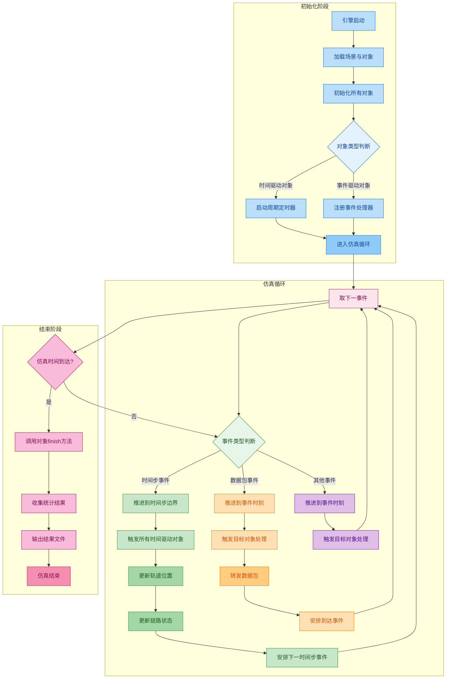

---

**流程说明**：

| 阶段 | 关键步骤 | 说明 |
|------|---------|------|
| **初始化** | 启动定时器 | 时间驱动对象注册周期定时器（如1秒） |
| **时间驱动循环** | 固定步长推进 | 每个时间步触发所有时间驱动对象更新状态 |
| **事件驱动循环** | 精确时刻处理 | 数据包等异步事件在精确时刻触发处理 |
| **同步机制** | 状态一致性 | 时间驱动更新后立即通知相关对象 |

---

**关键设计要点**：

1. **时间步边界作为同步点**：每个1秒时间步，所有卫星同步更新轨道
2. **事件驱动处理异步事件**：数据包到达在精确时刻处理，不受时间步限制
3. **状态一致性**：轨道更新后立即更新可见链路，确保事件驱动使用最新状态
4. **事件优先级**：时间步事件作为特殊事件插入队列，保证同步点不被跳过

---

### 3.3 仿真加速、暂停、减速控制

**目标**：在仿真运行时控制速度，支持加速、减速、暂停、恢复。

**控制接口**：

```cpp
// 用户界面控制命令
class SimulationControl {
public:
    // 速度控制
    void setSpeedFactor(double factor);  // 1.0=实时，2.0=2倍速

    // 暂停/恢复
    void pause();
    void resume();

    // 状态查询
    double getCurrentSpeed();
    bool isPaused();
    SimTime getCurrentTime();
};
```

---

**实现机制**：

```cpp
// 仿真引擎核心循环
void Simulation::run() {
    while (!terminated) {
        // 暂停检查
        if (isPaused) {
            waitForResume();  // 阻塞等待恢复命令
            continue;
        }

        // 取下一事件
        Message *msg = fes.pop();

        // 时间推进（考虑速度因子）
        SimTime targetTime = msg->getArrivalTime();
        if (speedFactor != INFINITE_SPEED) {
            // 有限速度：等待实时时间
            double realDelay = (targetTime - simTime) / speedFactor;
            waitForRealTime(realDelay);
        }

        // 推进仿真时间
        simTime = targetTime;

        // 执行事件
        msg->getDestinationModule()->handleMessage(msg);
    }
}
```

---

**使用示例**：

```
[仿真开始] t=0s
[用户命令] setSpeedFactor(10.0)  # 10倍速运行
[进度] t=3600s (实时用时6分钟)
[用户命令] pause()               # 暂停检查
[状态] 已暂停，当前时间 t=3600s，事件数 1.2M
[用户命令] resume()              # 继续运行
[用户命令] setSpeedFactor(0.1)   # 减速到0.1倍（观察细节）
[进度] t=3610s (实时用时100秒)   # 观察10秒仿真用了100秒实时
[用户命令] setSpeedFactor(INFINITE_SPEED)  # 加速到最大
[进度] 快速推进到 t=86400s
[仿真结束]
```

---

## 第四部分 - 技术架构参考（附录）

> 本部分为内核贡献者提供技术细节参考，作为第二部分的补充。

### 4.1 子系统架构图

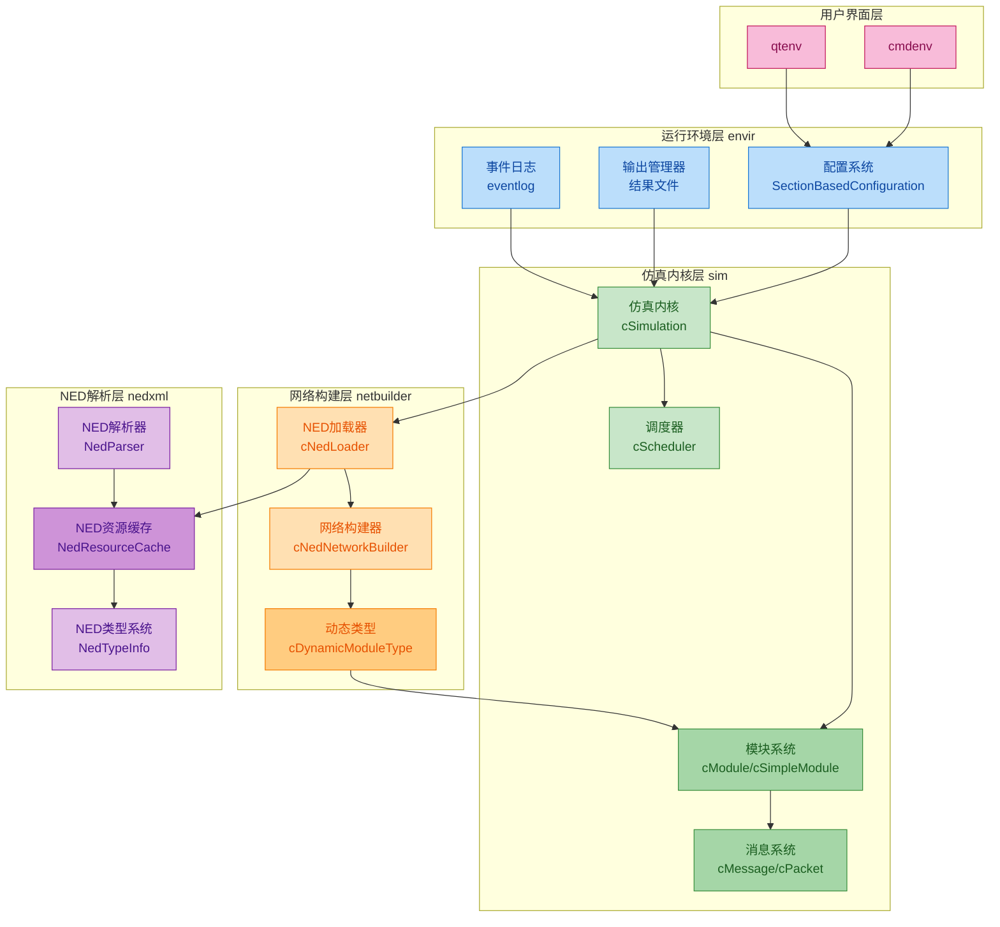

**子系统职责说明**：

| 子系统 | 职责 | 关键组件 |
|--------|------|---------|
| **envir** | 运行环境、配置管理、输出控制 | 配置系统、输出管理器、事件日志 |
| **sim** | 仿真内核、事件循环、模块管理 | 仿真内核、调度器、模块系统 |
| **netbuilder** | NED 类型加载、网络构建 | NED 加载器、网络构建器、动态类型 |
| **nedxml** | NED 解析、类型系统 | NED 解析器、类型信息、资源缓存 |

---

### 4.2 核心类层次结构

#### 模块类型层次

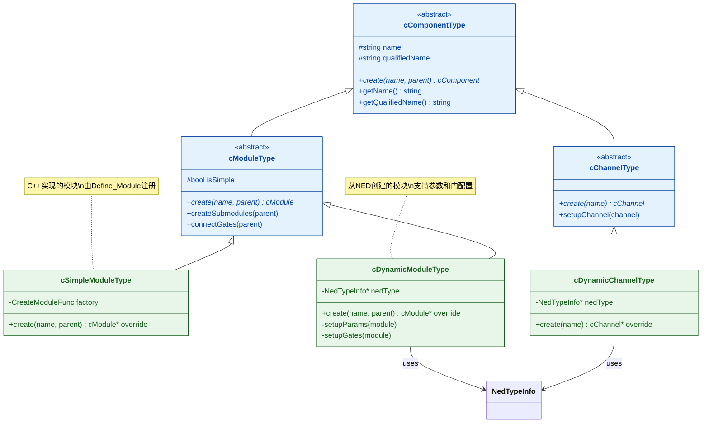

#### 网络构建层类图

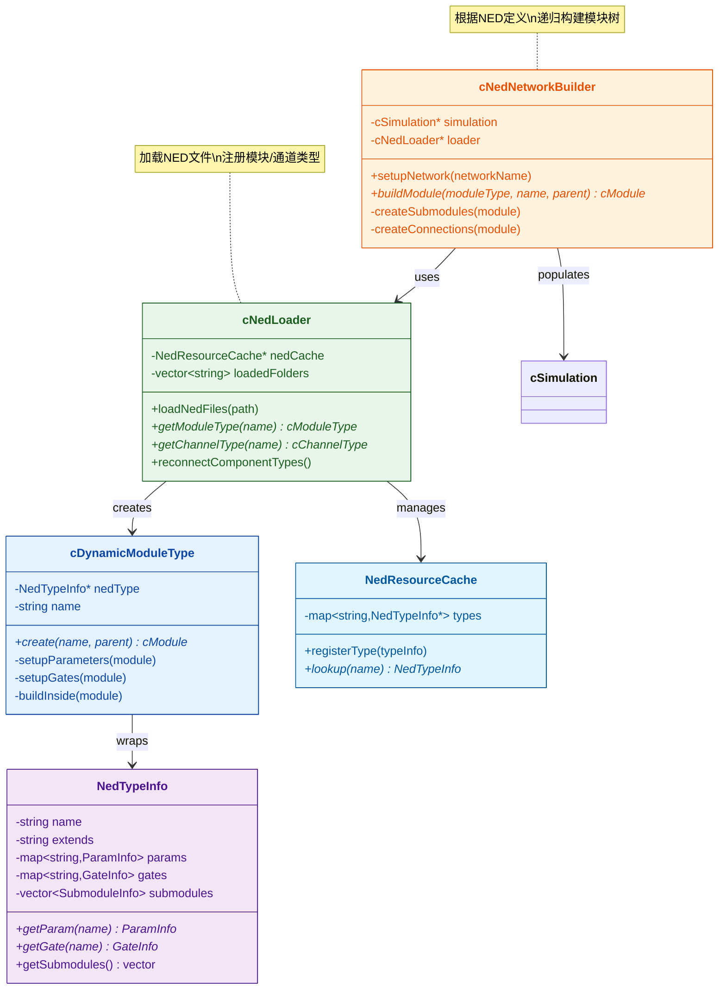

#### 模块实例层次

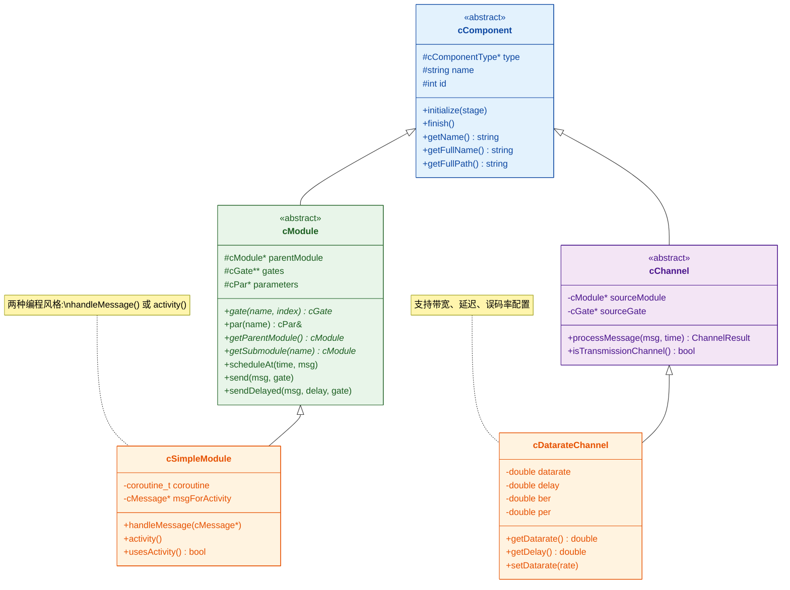

#### 消息层次

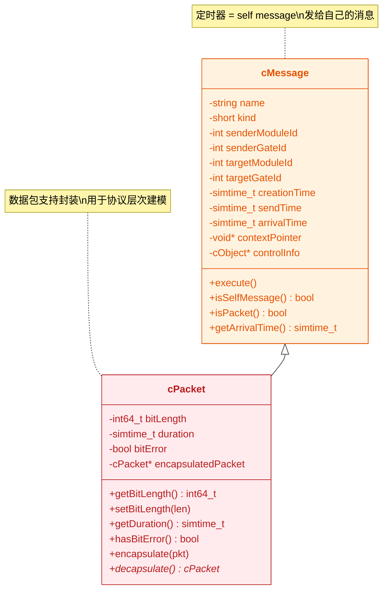

---

### 4.3 API 概览

#### 模块生命周期 API

| 方法 | 用途 | 调用时机 |
|------|------|---------|
| `initialize(stage)` | 模块初始化 | 仿真开始前，多阶段 |
| `handleMessage(msg)` | 处理消息 | 收到消息时 |
| `finish()` | 仿真结束处理 | 仿真结束时 |
| `refreshDisplay()` | 更新显示 | 可视化刷新时 |

#### 消息调度 API

| 方法 | 用途 | 说明 |
|------|------|------|
| `scheduleAt(time, msg)` | 安排自消息 | 用于周期任务 |
| `send(msg, gate)` | 发送消息 | 直接发送到指定 gate |
| `sendDelayed(msg, delay, gate)` | 延迟发送 | 模拟传输延迟 |
| `sendDirect(msg, target)` | 直接发送 | 跨模块直接发送 |

#### 参数访问 API

| 方法 | 用途 | 说明 |
|------|------|------|
| `par(name)` | 获取参数 | 返回参数对象，支持类型转换 |
| `par(name).doubleValue()` | 获取数值参数 | 显式类型转换 |
| `par(name).stringValue()` | 获取字符串参数 | 返回 std::string |

#### 统计记录 API

| 方法 | 用途 | 说明 |
|------|------|------|
| `registerSignal(name)` | 注册信号 | 返回 simsignal_t |
| `emit(signal, value)` | 触发信号 | 发送统计数据 |
| `recordScalar(name, value)` | 记录标量 | 直接记录统计值 |

#### 模块导航 API

| 方法 | 用途 | 说明 |
|------|------|------|
| `getParentModule()` | 获取父模块 | 模块树向上导航 |
| `getSubmodule(name)` | 获取子模块 | 模块树向下导航 |
| `getModuleByPath(path)` | 按路径查找 | 如 "satellite[0].payload" |

---

### 4.4 关键数据结构

#### 未来事件集（FES）

```cpp
// 事件队列结构
struct Event {
    SimTime arrivalTime;    // 到达时间
    cMessage* message;      // 消息内容
    cModule* target;        // 目标模块
    int priority;           // 优先级
};

// FES 按时间排序，支持优先级
```

#### 仿真时间（SimTime）

```cpp
// 高精度时间表示
class SimTime {
    int64_t value;          // 内部值（单位取决于精度设置）

    // 支持运算
    SimTime operator+(SimTime t);
    SimTime operator-(SimTime t);

    // 支持比较
    bool operator<(SimTime t);

    // 转换方法
    double dbl();           // 转换为 double（秒）
    std::string str();      // 字符串表示（如 "1.5s"）
};
```

#### 参数对象

```cpp
// 参数类型和值
class cPar {
    enum Type {
        BOOL, DOUBLE, INT, STRING, OBJECT
    };

    // 类型转换
    double doubleValue();
    int intValue();
    std::string stringValue();

    // 表达式计算
    void parse(const char* text);  // 解析表达式
    void evaluate();               // 计算值
};
```

---

### 4.5 配置系统详解

#### INI 文件结构

```ini
[General]                    # 默认配置 section
network = SatelliteNetwork   # 网络类型
sim-time-limit = 86400s      # 仿真时长

[Config HighTraffic]         # 自定义配置 section
extends = General            # 继承 General
*.userTerminal[*].packetRate = 100pkts/s

[Config LowOrbit]            # 另一个配置
extends = General
*.satellite[*].orbitAltitude = 400km
```

#### 参数覆盖规则

```
优先级（从高到低）：
1. INI 文件中的具体参数（如 *.satellite[0].altitude）
2. INI 文件中的通配参数（如 *.satellite[*].altitude）
3. NED 文件中的默认值
4. 类型定义中的默认值
```

#### 迭代变量

```ini
[Config ParamScan]
extends = General
**.orbitAltitude = ${altitude=400, 500, 550, 600}km  # 迭代4个值
**.packetRate = ${rate=10..100 step 10}pkts/s        # 迭代10个值

# 总共运行 4 × 10 = 40 次
```

---

## 第五部分：子系统详细设计

### 5.1 sim 子系统详细设计

sim 子系统是 GS-S 仿真引擎的核心实现，位于 `src/sim/` 目录。该子系统负责离散事件仿真的核心功能实现。

#### 核心类图

```mermaid
classDiagram
    direction TB

    class cSimulation {
        -cEnvir* envir
        -cScheduler* scheduler
        -cModule* systemModule
        -cFutureEventSet* fes
        -simtime_t simTime
        +executeEvent(cEvent*)
        +run()
        +getModule(id) cModule*
        +setupNetwork(networkType)
    }

    class cComponent {
        <<abstract>>
        inherits cSoftOwner
        #cComponentType* type
        #std::string name
        +initialize(stage)
        +finish()
    }

    class cModule {
        <<abstract>>
        #cModule* parentModule
        #cGate** gates
        #cPar* params
        +gate(name) cGate*
        +par(name) cPar&
        +scheduleAt(time, msg)
        +send(msg, gate)
    }

    class cSimpleModule {
        -coroutine_t coroutine
        +handleMessage(cMessage*)
        +activity()
        +initialize(stage) override
    }

    class cMessage {
        -simtime_t sendTime
        -simtime_t arrivalTime
        -int senderModuleId
        -int targetModuleId
        +execute()
        +getArrivalTime() simtime_t
    }

    class cPacket {
        -int64_t bitLength
        -simtime_t duration
        -bool bitError
        -cPacket* encapsulatedPacket
        +encapsulate(pkt)
        +decapsulate() cPacket*
    }

    class cEvent {
        <<abstract>>
        inherits cOwnedObject
        +execute()
    }

    class cScheduler {
        <<abstract>>
        +startRun()
        +endRun()
        +getNextEvent() cEvent*
    }

    class cFutureEventSet {
        inherits cOwnedObject
        +insert(cEvent*)
        +remove(cEvent*)
        +peek() cEvent*
        +pop() cEvent*
    }

    cSimulation --> cScheduler : uses
    cSimulation --> cFutureEventSet : manages
    cSimulation --> cModule : contains

    cComponent <|-- cModule
    cModule <|-- cSimpleModule

    cEvent <|-- cMessage
    cMessage <|-- cPacket

    cSimulation --> cEvent : executes

    %% 颜色样式 (Material Design)
    class cSimulation:::simStyle
    class cComponent:::abstractStyle
    class cModule:::moduleStyle
    class cSimpleModule:::implStyle
    class cMessage:::msgStyle
    class cPacket:::pktStyle
    class cEvent:::eventStyle
    class cScheduler:::schedStyle
    class cFutureEventSet:::fesStyle

    classDef simStyle fill:#E3F2FD,stroke:#0D47A1,color:#0D47A1
    classDef abstractStyle fill:#E8F5E9,stroke:#1B5E20,color:#1B5E20
    classDef moduleStyle fill:#FFF3E0,stroke:#E65100,color:#E65100
    classDef implStyle fill:#E1F5FE,stroke:#01579B,color:#01579B
    classDef msgStyle fill:#F3E5F5,stroke:#4A148C,color:#4A148C
    classDef pktStyle fill:#FFEBEE,stroke:#B71C1C,color:#B71C1C
    classDef eventStyle fill:#FFF3E0,stroke:#E65100,color:#E65100
    classDef schedStyle fill:#E8F5E9,stroke:#1B5E20,color:#1B5E20
    classDef fesStyle fill:#E1F5FE,stroke:#01579B,color:#01579B
```

#### 事件循环流程

sim 子系统的事件循环是仿真执行的核心驱动力。仿真管理器 `cSimulation` 负责协调事件调度、模块执行和状态推进。

**事件执行流程：**

```cpp
void cSimulation::executeEvent(cEvent *event)
{
    // 1. 增加事件计数
    currentEventNumber++;

    // 2. 推进仿真时间
    currentSimtime = event->getArrivalTime();

    // 3. 通知环境（写入事件日志等）
    EVCB.simulationEvent(event);

    // 4. 执行事件
    event->execute();
}
```

**消息执行流程：**

```cpp
void cMessage::execute()
{
    // 获取目标模块
    cSimpleModule *module = check_and_cast<cSimpleModule *>(
        getSimulation()->getModule(targetModuleId));

    // 调用模块的消息处理
    module->doMessageEvent(this);
}
```

**模块消息处理支持两种编程模型：**

```cpp
void cSimpleModule::doMessageEvent(cMessage *msg)
{
    if (usesActivity()) {
        // activity() 风格：切换到协程
        msgForActivity = msg;
        getSimulation()->transferTo(this);
    } else {
        // handleMessage() 风格：直接调用
        handleMessage(msg);
    }
}
```

#### 模块生命周期

模块从创建到销毁经历多个阶段，每个阶段都有明确的状态转换：

**模块创建序列：**

```cpp
// 1. 创建模块
cModule *mod = moduleType->create("name", parentModule);

// 2. 参数化
mod->finalizeParameters();  // 读取参数，创建门

// 3. 连接门（可选）
mod->gate("out")->connectTo(otherModule->gate("in"));

// 4. 构建内部结构
mod->buildInside();  // 对于复合模块，创建子模块和连接

// 5. 初始化
mod->callInitialize();  // 调用 initialize()
```

**模块删除流程：**

```cpp
void cModule::deleteModule()
{
    // 1. 递归调用 preDelete()
    callPreDelete(this);

    // 2. 删除子模块
    for (auto submodule : submodules)
        submodule->deleteModule();

    // 3. 删除门和连接
    clearGates();

    // 4. 从父模块移除
    if (parentModule)
        parentModule->removeSubmodule(this);

    // 5. 从仿真注销
    simulation->deregisterComponent(this);

    // 6. 删除对象
    delete this;
}
```

#### 消息/事件系统

消息发送是仿真模型中最基本的交互方式。系统支持多种发送模式和消息类型。

**消息类图：**

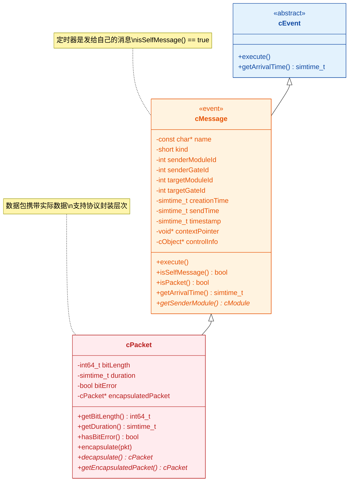

**消息属性结构：**

```cpp
class cMessage {
    // 基本信息
    const char *name;           // 消息名称
    short kind;                 // 消息类型（用户定义）

    // 发送信息
    int senderModuleId;         // 发送模块 ID
    int senderGateId;           // 发送门 ID
    int targetModuleId;         // 目标模块 ID
    int targetGateId;           // 目标门 ID（-1 表示自消息）

    // 时间信息
    simtime_t creationTime;     // 创建时间
    simtime_t sendTime;         // 发送时间
    simtime_t timestamp;        // 用户时间戳

    // 辅助
    void *contextPointer;       // 上下文指针（用于定时器）
    cObject *controlInfo;       // 控制信息（协议层间通信）
};
```

**数据包扩展支持封装：**

```cpp
class cPacket : public cMessage {
    int64_t bitLength;          // 比特长度
    simtime_t duration;         // 传输持续时间
    bool bitError;              // 比特错误标志

    cPacket *encapsulatedPacket; // 封装的数据包

    // 封装/解封装
    void encapsulate(cPacket *pkt);
    cPacket *decapsulate();
};
```
#### cObject 类层次

OMNeT++ 的所有核心类都继承自 `cObject`，形成一个统一的类层次结构。理解这个层次对于理解整个框架至关重要。

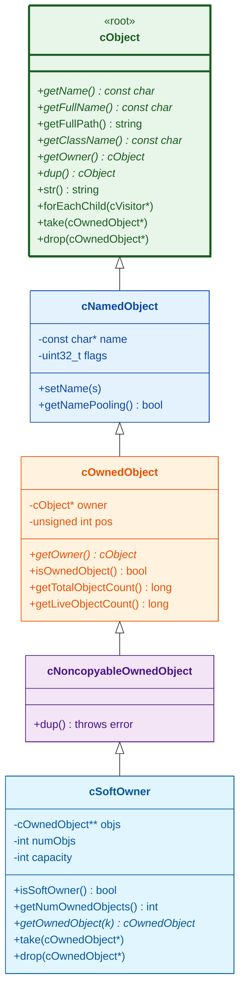

**类层次说明：**

| 类名 | 作用 | 关键特性 |
|------|------|----------|
| `cObject` | 所有类的根基类 | 无数据成员，提供 name、owner、dup 等虚函数 |
| `cNamedObject` | 增加名称字段 | 存储对象名，支持名称池优化 |
| `cOwnedObject` | 增加所有权管理 | 维护 owner 指针，跟踪对象生命周期统计 |
| `cNoncopyableOwnedObject` | 禁止复制 | 禁用 copy constructor 和 assignment |
| `cSoftOwner` | 软所有权容器 | 允许其他对象取走其拥有的对象（模块基类） |

**所有权机制：** `cOwnedObject` 的所有权机制防止对象被多处同时引用，避免内存管理错误。当对象插入容器时，容器成为其 owner；删除时需要 owner 的许可。

#### 统计基础设施

GS-S 仿真系统采用信号机制实现模块化的统计收集。模块通过发射信号来发布统计数据，监听器接收并处理这些数据。

**信号机制工作流程：**

1. NED 文件中声明 `@statistic` 属性
2. `cStatisticBuilder` 解析属性创建过滤器/记录器链
3. 模块调用 `emit(signalID, value)` 发射信号
4. 信号经过过滤器链处理
5. 记录器将结果写入输出文件

**信号机制类图：**

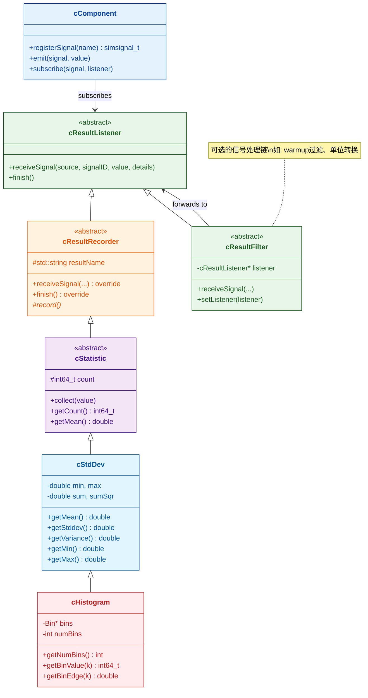

**统计类层次：**

```cpp
// 基础统计
class cStdDev : public cStatistic {
    int64_t count;              // 计数
    double min, max;            // 最小/最大值
    double sum, sumSqr;         // 和/平方和
};

// 直方图
class cHistogram : public cStdDev {
    Bin *bins;                  // 区间数组
    int numBins;                // 区间数量
};

// 结果记录器
class cResultRecorder : public cResultListener {
    virtual void receiveSignal(...) = 0;
    virtual void finish() { record(); }
};
```

#### 随机数生成系统

仿真系统支持可插拔的随机数生成器架构，每个模块可以独立配置使用的 RNG。

**随机变量生成方法：**

```cpp
// 连续分布
double uniform(a, b);
double exponential(mean);
double normal(mean, stddev);
double gamma_d(alpha, theta);
double beta(alpha1, alpha2);
double weibull(a, b);

// 离散分布
int intuniform(a, b);
int bernoulli(p);
int binomial(n, p);
int poisson(lambda);
int geometric(p);
```

**RNG 配置：**

```ini
[General]
# RNG 类
rng-class = "cMersenneTwister"

# RNG 数量
num-rngs = 3

# 种子设置
seed-set = ${runnumber}

# 模块 RNG 映射
**.rng-0 = 0
**.rng-1 = 1
```

#### 所有权机制

GS-S 仿真系统实现了严格的所有权机制来防止常见的编程错误，如重复删除或使用已删除对象。

**所有权规则：**

```cpp
// 规则 1：插入容器时所有权转移
cQueue queue;
queue.insert(msg);  // queue 成为 msg 的所有者

// 规则 2：从容器移除时返回软所有者
cMessage *msg = queue.pop();  // 当前模块成为所有者

// 规则 3：删除前需要正确所有权
delete msg;  // 必须是当前模块的所有物，否则抛出异常

// 规则 4：软所有者允许转移
mod->send(msg, "out");  // 模块（软所有者）允许消息转移
```

#### 设计模式与约定

**命名约定：**

- **类名**：小写 `c` 前缀（`cModule`, `cMessage`）
- **方法名**：camelCase（`handleMessage`, `scheduleAt`）
- **C 函数**：`opp_` 前缀（`opp_isempty`, `opp_streq`）
- **宏**：首字母大写（`Define_Module`, `Register_Class`）

**注册机制：**

```cpp
// 模块注册
Define_Module(MyModule);

// 类注册
Register_Class(MyClass);

// 配置选项注册
Register_PerObjectConfigOption(CFGID_MY_OPTION, ...);

// 信号注册
simsignal_t mySignal = cComponent::registerSignal("mySignal");
```

**多阶段初始化：**

```cpp
class MyModule : public cSimpleModule {
  protected:
    virtual int numInitStages() const override { return 3; }

    virtual void initialize(int stage) override {
        switch (stage) {
            case 0: initPhase1(); break;
            case 1: initPhase2(); break;
            case 2: initPhase3(); break;
        }
    }
};
```

#### 与其他子系统的交互

- **与 envir 交互**：`cEnvir` 提供环境抽象（日志、配置、输出），`cSimulation` 持有 `cEnvir` 实例，事件日志、快照等功能委托给 envir
- **与 nedxml 交互**：SDL 文件加载通过 `cNedLoader`（scenebuilder），`cModuleType`、`cChannelType` 封装 SDL 类型信息
- **与 common 交互**：字符串工具（`opp_isempty`, `opp_streq`）、表达式解析器、文件 I/O 工具

---

### 5.2 envir 子系统详细设计

envir 子系统是 GS-S 仿真框架的运行环境管理层，作为仿真内核与用户界面层之间的桥梁。

#### 核心类图

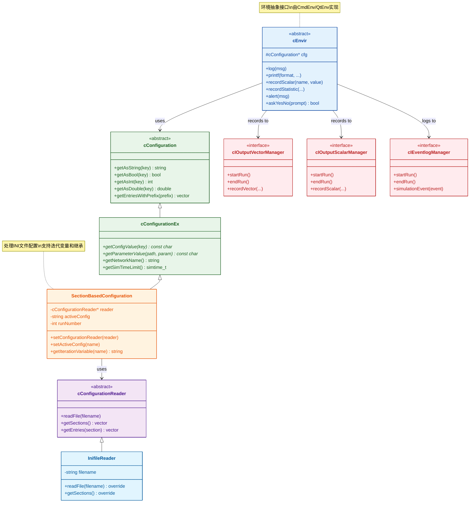

#### 启动流程详解

**程序入口：**

```cpp
int main(int argc, char *argv[]) {
    return omnetpp::envir::evMain(argc, argv);
}
```

**仿真主函数：**

```cpp
int evMain(int argc, char *argv[]) {
    cStaticFlag dummy;  // 静态标志，确保正确初始化/清理顺序
    int exitCode = setupUserInterface(argc, argv);
    return exitCode;
}
```

**用户界面设置核心流程：**

1. **解析参数**：`ArgList::parse(argc, argv, ARGSPEC)`
2. **读取配置**：`InifileReader::readFile()` 加载 `omnetpp.ini`
3. **创建配置对象**：`SectionBasedConfiguration` 包装配置读取器
4. **加载库**：根据 `load-libs` 选项加载动态库
5. **选择 UI**：通过 `cOmnetAppRegistration::chooseBest()` 自动选择
6. **运行**：创建 `cSimulation` 并调用 `app->run()`

#### 输出管理系统

envir 子系统提供了插件化的输出管理器架构，支持多种存储格式。

**输出管理器接口：**

| 接口 | 职责 |
|------|------|
| `cIOutputVectorManager` | 向量数据记录 |
| `cIOutputScalarManager` | 标量数据记录 |
| `cIEventlogManager` | 事件日志记录 |
| `cISnapshotManager` | 仿真快照 |

**输出文件格式选择：**

| 配置选项 | 默认值 | 说明 |
|---------|--------|------|
| `outputvectormanager-class` | `OmnetppOutputVectorManager` | 向量输出管理器类 |
| `outputscalarmanager-class` | `OmnetppOutputScalarManager` | 标量输出管理器类 |
| `output-vector-file` | `${resultdir}/${configname}-${iterationvarsf}#${repetition}.vec` | 向量文件名模板 |
| `output-scalar-file` | `${resultdir}/${configname}-${iterationvarsf}#${repetition}.sca` | 标量文件名模板 |

**SQLite 格式优势：**
- 更高效的存储和查询
- 支持事务操作
- 更好的数据完整性

#### 事件日志管理

**EventlogFileManager 核心功能：**

```cpp
// 记录仿真事件
void simulationEvent(cEvent *event) override;

// 记录消息发送序列
void beginSend(cMessage *msg, const SendOptions& options) override;
void messageSendDirect(cMessage *msg, cGate *toGate, const ChannelResult& result) override;
void messageSendHop(cMessage *msg, cGate *srcGate) override;
void endSend(cMessage *msg) override;

// 暂停/恢复记录
void suspend() override;
void resume() override;
```

**配置选项：**
- `record-eventlog`：启用/禁用事件日志记录
- `eventlog-file`：事件日志文件名
- `eventlog-max-size`：最大文件大小
- `eventlog-snapshot-frequency`：快照频率

#### 插件扩展机制

envir 子系统支持通过配置替换几乎所有核心组件：

| 扩展点 | 基类 | 配置选项 |
|--------|------|----------|
| 配置读取器 | `cConfigurationReader` | `sectionbasedconfig-configreader-class` |
| 配置对象 | `cConfigurationEx` | `configuration-class` |
| 调度器 | `cScheduler` | `scheduler-class` |
| 随机数生成器 | `cRNG` | `rng-class` |
| 向量输出管理器 | `cIOutputVectorManager` | `outputvectormanager-class` |
| 标量输出管理器 | `cIOutputScalarManager` | `outputscalarmanager-class` |
| 事件日志管理器 | `cIEventlogManager` | `eventlogmanager-class` |
| 快照管理器 | `cISnapshotManager` | `snapshotmanager-class` |
| 未来事件集 | `cFutureEventSet` | `futureeventset-class` |

**扩展示例：**

```cpp
// 1. 定义自定义类
class MyOutputScalarManager : public cIOutputScalarManager {
    // 实现接口方法...
};

// 2. 注册类
Register_Class(MyOutputScalarManager);

// 3. 在 omnetpp.ini 中配置
[General]
outputscalarmanager-class = "MyOutputScalarManager"
```

#### 关键配置选项

| 选项 | 类型 | 默认值 | 说明 |
|------|------|--------|------|
| `network` | string | - | 要仿真的网络名称 |
| `sim-time-limit` | time | - | 仿真时间限制 |
| `cpu-time-limit` | time | - | CPU 时间限制 |
| `real-time-limit` | time | - | 实时限制 |
| `warmup-period` | time | 0s | 预热期 |
| `num-rngs` | int | 1 | 随机数生成器数量 |
| `rng-class` | string | `cMersenneTwister` | RNG 类名 |
| `seed-set` | int | `${runnumber}` | 种子集编号 |
| `result-dir` | string | results | 结果目录 |
| `record-eventlog` | bool | false | 记录事件日志 |
| `ned-path` | path | - | NED 文件搜索路径 |
| `load-libs` | filenames | - | 启动时加载的库 |

---

### 5.3 common 子系统详细设计

common 子系统是 GS-S 仿真引擎的基础工具库，位于 `src/common/` 目录，被所有其他子系统依赖。

#### 核心功能模块

**字符串工具（stringutil.h）：**

```cpp
// 字符串判断
bool opp_isempty(const char *s);      // 检查字符串是否为空
bool opp_streq(const char *a, const char *b);  // 字符串比较

// 字符串操作
void opp_strcpy(char *dest, const char *src);
void opp_strjoin(char *dest, const char *s1, const char *s2);
```

**表达式解析器（cexpression.h, expression.y）：**

- 解析运行时表达式
- 支持数学运算、函数调用
- 支持变量替换

**文件工具（fileutil.h）：**

```cpp
// 文件操作
bool opp_direxists(const char *path);
bool opp_fileexists(const char *path);
void opp_mkdir(const char *path);
```

#### 核心类图

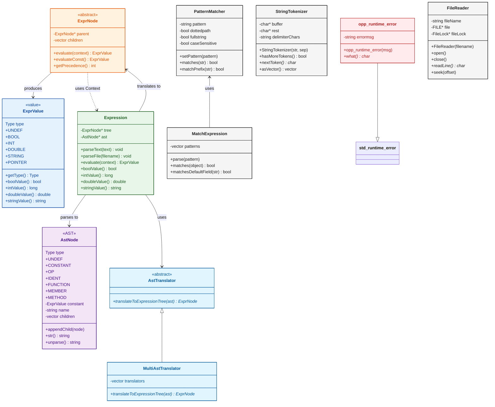

**类图说明：**

1. **表达式系统**（Expression/AstNode/ExprNode/ExprValue）：
   - Expression：表达式解析器主类，将文本解析为 AST，再转换为 ExprNode 树
   - AstNode：AST 中间表示，支持常量、运算符、标识符、函数调用等节点类型
   - ExprNode：表达式求值树节点，由 AstTranslator 从 AST 转换
   - ExprValue：求值过程中的值类型，支持 BOOL、INT、DOUBLE、STRING、POINTER

2. **模式匹配**（PatternMatcher/MatchExpression）：
   - PatternMatcher：glob 风格模式匹配，支持 `*`, `?`, `{a-z}`, `{0..999}` 等语法
   - MatchExpression：高级匹配表达式，支持 `fieldname =~ pattern` 和 AND/OR/NOT 组合

3. **字符串工具**（StringTokenizer）：
   - 支持引用字符串和嵌套括号的字符串分割器

4. **文件工具**（FileReader）：
   - 高效的行式文件读取器，适用于 GB 级大文件（事件日志、向量文件）

5. **异常处理**（opp_runtime_error）：
   - 继承自 std::runtime_error 的便利异常类，支持 printf 风格构造

#### 与其他子系统的关系

common 子系统为所有其他子系统提供基础功能：

- **被依赖**：nedxml、eventlog、sim、envir
- **无依赖**：是最底层的基础设施

---

### 5.4 nedxml 子系统详细设计

nedxml 子系统是 GS-S 仿真系统的 NED/MSG 文件编译器，负责解析、验证和代码生成。

#### 核心类图

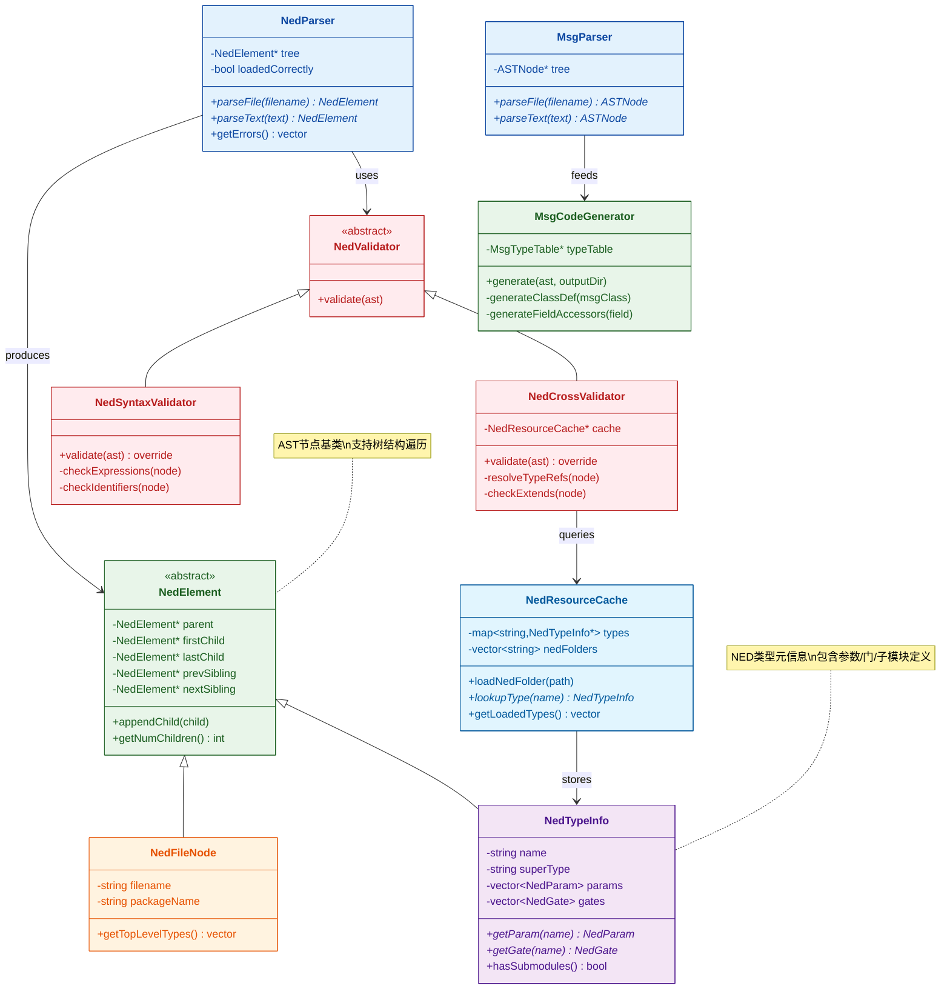

#### 编译器流程

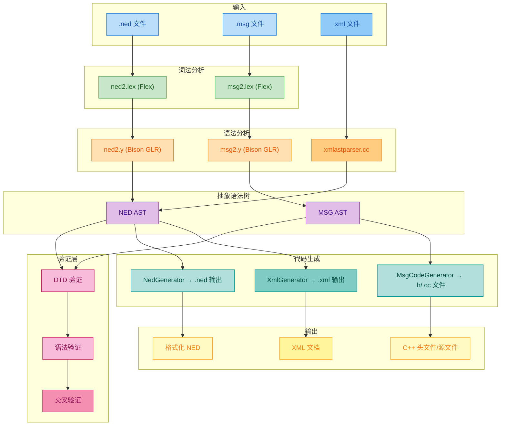

#### 解析器模块

**NED 解析器：**

| 文件 | 职责 |
|------|------|
| `nedparser.cc/h` | NED 解析器前端，提供 `parseNedFile()` / `parseNedText()` API |
| `ned2.y` | Bison GLR 语法文件，定义 NED-2 语法 |
| `ned2.lex` | Flex 词法分析器 |

**MSG 解析器：**

| 文件 | 职责 |
|------|------|
| `msgparser.cc/h` | MSG 解析器前端，提供 `parseMsgFile()` / `parseMsgText()` API |
| `msg2.y` | Bison GLR 语法文件，定义 MSG-2 语法 |
| `msg2.lex` | Flex 词法分析器 |

#### AST 结构

**基类 ASTNode：**

```cpp
class ASTNode {
    // 树结构
    ASTNode *parent, *firstChild, *lastChild;
    ASTNode *prevSibling, *nextSibling;

    // 源码位置
    FileLine srcLoc;           // 文件:行号
    SourceRegion srcRegion;    // 起止行列

    // 泛型属性访问
    virtual const char *getAttribute(const char *name) const;
    virtual void setAttribute(const char *name, const char *value);

    // 节点类型
    virtual const char *getTagName() const = 0;
    virtual int getTagCode() const = 0;
};
```

**NED 元素类型（28 种）：**

| 类别 | 元素类型 |
|------|----------|
| 文件结构 | `FilesElement`, `NedFileElement`, `CommentElement` |
| 包/导入 | `PackageElement`, `ImportElement` |
| 模块定义 | `SimpleModuleElement`, `CompoundModuleElement`, `ModuleInterfaceElement` |
| 信道定义 | `ChannelElement`, `ChannelInterfaceElement` |
| 参数/门 | `ParametersElement`, `ParamElement`, `GatesElement`, `GateElement` |
| 属性 | `PropertyElement`, `PropertyKeyElement`, `PropertyDeclElement` |
| 子模块 | `SubmodulesElement`, `SubmoduleElement` |
| 连接 | `ConnectionsElement`, `ConnectionElement`, `ConnectionGroupElement` |

**MSG 元素类型（21 种）：**

| 类别 | 元素类型 |
|------|----------|
| 文件结构 | `MsgFileElement`, `CommentElement` |
| 命名空间 | `NamespaceElement`, `ImportElement` |
| 前向声明 | `StructDeclElement`, `ClassDeclElement` |
| 类型定义 | `MessageElement`, `PacketElement`, `ClassElement`, `StructElement`, `EnumElement` |
| 成员 | `FieldElement`, `EnumFieldElement` |

#### 验证器模块

验证器采用分层架构：

1. **DTD 验证**：验证 AST 符合 DTD 结构
2. **语法验证**：验证表达式属性、标识符等
3. **交叉验证**：验证跨文件引用解析

#### 代码生成模块

**MSG 编译器：**

| 文件 | 职责 |
|------|------|
| `msgcompiler.cc/h` | MSG 编译器主类 |
| `msganalyzer.cc/h` | AST 分析，提取类/字段信息 |
| `msgtypetable.cc/h` | 类型表，存储已定义的类/枚举信息 |
| `msgcodegenerator.cc/h` | C++ 代码生成器 |

**生成内容：**
- 类/结构体定义
- getter/setter 方法
- 序列化/反序列化方法
- 字段描述符类
- 枚举定义

**代码生成属性系统：**

| 属性 | 用途 |
|------|------|
| `@owned` | 指针字段所有权管理 |
| `@byValue` | 值传递（非引用） |
| `@getter` / `@setter` | 自定义访问器名称 |
| `@enum` | 关联枚举类型 |
| `@descriptor` | 生成字段描述符 |

#### 工具列表

**opp_nedtool：**

| 命令 | 功能 |
|------|------|
| `help` | 显示帮助 |
| `convert` | NED ↔ XML 格式转换 |
| `prettyprint` | 格式化 NED 文件 |
| `validate` | 验证 NED 文件 |
| `generatecpp` | 生成 C++ 代码（实验性） |

**opp_msgtool：**

| 命令 | 功能 |
|------|------|
| `help` | 显示帮助 |
| `convert` | MSG ↔ XML 格式转换 |
| `prettyprint` | 格式化 MSG 文件 |
| `validate` | 验证 MSG 文件 |
| `generatecpp` | 生成 C++ 头文件/源文件 |

#### 文件统计

| 类型 | 数量 |
|------|------|
| C++ 头文件 (.h) | 41 |
| C++ 实现文件 (.cc) | 38 |
| Bison 语法文件 (.y) | 2 |
| 生成的词法文件 (.lex.cc) | 2 |
| **总计** | **93 文件** |

---

### 5.5 eventlog 子系统详细设计

eventlog 子系统负责事件日志记录、解析和回放。

#### 概述

EventLog 子系统提供对仿真过程中产生的事件日志文件的完整管理能力：

- 事件日志文件的解析和内存表示
- 高效的随机访问索引机制
- 消息依赖关系追踪
- 灵活的事件过滤功能

**代码规模**: 16 个 `.cc` 文件，17 个 `.h` 文件

#### 关键类

| 类名 | 文件 | 职责 |
|------|------|------|
| `EventLog` | eventlog.cc/h | 事件日志管理器 |
| `Event` | event.cc/h | 单个事件表示 |
| `EventLogIndex` | eventlogindex.cc/h | 索引机制 |
| `FilteredEventLog` | filteredeventlog.cc/h | 过滤事件日志 |

#### 性能优化

1. **懒加载** — 事件按需解析
2. **缓存机制** — 事件号到事件的映射
3. **三级搜索** — 缓存→二分→线性

#### 依赖关系

- **依赖**：`common/`
- **被依赖**：`envir/`

---

### 5.6 公共 API 详细参考

公共 API 位于 `include/omnetpp/` 目录，共 124 个头文件，定义了仿真模型开发者可使用的公共接口。

#### API 类别分类

##### 1. 基础类 (Fundamentals)

| 类名 | 头文件 | 说明 |
|------|--------|------|
| `cObject` | `cobject.h` | GS-S 类层次结构的根类，提供命名、克隆、所有权管理等基础机制 |
| `cOwnedObject` | `cownedobject.h` | 支持所有权追踪的对象基类 |
| `cNamedObject` | `cnamedobject.h` | 具有名称的对象类 |
| `cCoroutine` | `ccoroutine.h` | 协程类，用于 activity() 方法的实现 |
| `cRuntimeError` | `cexception.h` | 运行时错误异常类 |
| `cClassDescriptor` | `cclassdescriptor.h` | 反射信息提供类 |

##### 2. 模型组件类 (Model Components)

| 类名 | 头文件 | 说明 |
|------|--------|------|
| `cModule` | `cmodule.h` | 模块基类，表示仿真中的模块 |
| `cSimpleModule` | `csimplemodule.h` | 简单模块基类，用户通过继承此类实现仿真逻辑 |
| `cChannel` | `cchannel.h` | 通道基类，表示模块间的连接 |
| `cIdealChannel` | `cchannel.h` | 理想通道（零延迟、无限带宽） |
| `cDatarateChannel` | `cdataratechannel.h` | 数据率通道，支持传输延迟建模 |
| `cDelayChannel` | `cdelaychannel.h` | 固定延迟通道 |
| `cGate` | `cgate.h` | 门类，表示模块的连接点 |
| `cPar` | `cpar.h` | 参数类，表示模块和通道的参数 |
| `cProperties` | `cproperties.h` | 属性集合类 |

##### 3. 消息类 (Simulation Programming)

| 类名 | 头文件 | 说明 |
|------|--------|------|
| `cMessage` | `cmessage.h` | 消息类，表示仿真事件和消息 |
| `cPacket` | `cpacket.h` | 数据包类，继承自 cMessage，增加长度和封装能力 |
| `cEvent` | `cevent.h` | 事件基类 |
| `cQueue` | `cqueue.h` | 队列类，FIFO 或优先级队列 |
| `cPacketQueue` | `cpacketqueue.h` | 数据包专用队列 |
| `cTopology` | `ctopology.h` | 拓扑工具类，用于发现模型拓扑和寻找最短路径 |

##### 4. 仿真核心类 (Simulation Core)

| 类名 | 头文件 | 说明 |
|------|--------|------|
| `cSimulation` | `csimulation.h` | 仿真管理器类，存储网络模型和事件调度 |
| `cFutureEventSet` | `cfutureeventset.h` | 未来事件集合接口 |
| `cEventHeap` | `ceventheap.h` | 基于堆的事件集合实现 |
| `cScheduler` | `cscheduler.h` | 事件调度器接口 |

##### 5. 时间类 (Simulation Time)

| 类型/类名 | 头文件 | 说明 |
|-----------|--------|------|
| `simtime_t` | `simtime_t.h` | 仿真时间类型（SimTime 的别名） |
| `SimTime` | `simtime.h` | 仿真时间类，64位定点表示 |

**仿真时间宏：**
- `SIMTIME_MAX` - 最大可表示的仿真时间
- `SIMTIME_ZERO` - 零仿真时间
- `SIMTIME_STR(t)` - 转换为 C 字符串
- `SIMTIME_DBL(t)` - 转换为 double（有精度损失）

##### 6. 随机数生成类 (Random Numbers)

| 类名 | 头文件 | 说明 |
|------|--------|------|
| `cRNG` | `crng.h` | 随机数生成器接口 |
| `cMersenneTwister` | `cmersennetwister.h` | Mersenne Twister RNG 实现 |
| `cLCG32` | `clcg32.h` | 32位线性同余生成器 |
| `cRandom` | `crandom.h` | 随机变量生成器基类 |
| `cUniform` | `crandom.h` | 均匀分布 |
| `cExponential` | `crandom.h` | 指数分布 |
| `cNormal` | `crandom.h` | 正态分布 |
| `cTruncNormal` | `crandom.h` | 截断正态分布 |
| `cGamma` | `crandom.h` | Gamma 分布 |
| `cBeta` | `crandom.h` | Beta 分布 |
| `cWeibull` | `crandom.h` | Weibull 分布 |
| `cIntUniform` | `crandom.h` | 离散均匀分布 |
| `cBernoulli` | `crandom.h` | 伯努利分布 |
| `cBinomial` | `crandom.h` | 二项分布 |
| `cGeometric` | `crandom.h` | 几何分布 |
| `cPoisson` | `crandom.h` | 泊松分布 |

##### 7. 统计类 (Statistics)

| 类名 | 头文件 | 说明 |
|------|--------|------|
| `cStatistic` | `cstatistic.h` | 统计基类 |
| `cStdDev` | `cstddev.h` | 标准统计（均值、标准差、最小/最大值） |
| `cHistogram` | `chistogram.h` | 直方图类 |
| `cPSquare` | `cpsquare.h` | P² 算法分位数计算 |
| `cOutVector` | `coutvector.h` | 输出向量记录器 |
| `cKSplit` | `cksplit.h` | K-split 直方图 |

##### 8. 信号类 (Signals)

| 类名/类型 | 头文件 | 说明 |
|-----------|--------|------|
| `simsignal_t` | `clistener.h` | 信号句柄类型 |
| `cIListener` | `clistener.h` | 监听器接口 |
| `cListener` | `clistener.h` | 监听器默认实现 |
| `cResultFilter` | `cresultfilter.h` | 结果过滤器基类 |
| `cResultRecorder` | `cresultrecorder.h` | 结果记录器基类 |

##### 9. 表达式类 (Expressions)

| 类名 | 头文件 | 说明 |
|------|--------|------|
| `cExpression` | `cexpression.h` | 表达式基类 |
| `cDynamicExpression` | `cdynamicexpression.h` | 运行时解析的表达式 |
| `cMatchExpression` | `cmatchexpression.h` | 匹配表达式 |
| `cValue` | `cvalue.h` | 变体值类 |
| `cValueMap` | `cvaluemap.h` | 值映射（JSON 对象风格） |
| `cValueArray` | `cvaluearray.h` | 值数组（JSON 数组风格） |
| `cXmlElement` | `cxmlelement.h` | XML 元素 |

##### 10. 画布类 (Canvas)

| 类名 | 头文件 | 说明 |
|------|--------|------|
| `cCanvas` | `ccanvas.h` | 2D 画布 |
| `cFigure` | `ccanvas.h` | 图形基类 |
| `cLineFigure` | `ccanvas.h` | 线段图形 |
| `cRectangleFigure` | `ccanvas.h` | 矩形图形 |
| `cOvalFigure` | `ccanvas.h` | 椭圆图形 |
| `cPolygonFigure` | `ccanvas.h` | 多边形图形 |
| `cTextFigure` | `ccanvas.h` | 文本图形 |
| `cImageFigure` | `ccanvas.h` | 图像图形 |

##### 11. 有限状态机类 (FSM)

| 宏/类 | 头文件 | 说明 |
|-------|--------|------|
| `FSM_Switch()` | `cfsm.h` | FSM 主宏 |
| `cFSM` | `cfsm.h` | 有限状态机类 |

##### 12. 环境与扩展类 (Envir and Extensions)

| 类名 | 头文件 | 说明 |
|------|--------|------|
| `cEnvir` | `cenvir.h` | 仿真环境接口 |
| `cConfiguration` | `cconfiguration.h` | 配置接口 |
| `cNullEnvir` | `cnullenvir.h` | 空环境实现 |
| `cConfigOption` | `cconfigoption.h` | 配置选项类 |

#### 命名约定

**类命名：** GS-S 公共 API 类使用 **c-前缀** 命名约定

```
cObject        - 基础对象类
cModule        - 模块类
cMessage       - 消息类
cSimulation    - 仿真类
cGate          - 门类
cChannel       - 通道类
```

**方法命名：** 方法使用 **camelCase** 驼峰命名法

```cpp
getName()           // 获取名称
getFullName()       // 获取全名
getFullPath()       // 获取完整路径
handleMessage()     // 处理消息
scheduleAt()        // 调度自消息
```

**C 函数命名：** 自由函数使用 **opp_** 前缀

```cpp
opp_isempty(s)      // 检查字符串是否为空
opp_streq(a, b)     // 字符串比较
opp_typename()      // 获取类型名
```

**宏命名：** 宏使用 **大写下划线** 或 **Register_** 前缀

```cpp
SIM_API                // 导出宏
SIMTIME_ZERO           // 仿真时间常量
Register_Class()       // 注册类
Define_Module()        // 定义模块
Register_Enum()        // 注册枚举
```

#### API 导出宏

`SIM_API` 是公共 API 的导出宏，用于控制符号的可见性：

- 在构建仿真库时，`SIM_API` 定义为导出符号
- 在使用仿真库时，`SIM_API` 定义为导入符号
- 所有公共 API 类都使用此宏声明

**示例：**
```cpp
class SIM_API cObject { ... };
class SIM_API cModule : public cComponent { ... };
```

**统计：** 113 个文件中使用 `SIM_API`，共 379 处。

#### 关键公共接口详解

**cObject - 对象基类：**

`cObject` 是 GS-S 类层次结构的根类：

**名称管理：**
- `getName()` - 获取对象名称
- `getFullName()` - 获取完整名称（含索引）
- `getFullPath()` - 获取完整路径

**对象操作：**
- `dup()` - 克隆对象
- `str()` - 获取对象描述字符串
- `forEachChild()` - 遍历子对象

**所有权管理：**
- `getOwner()` - 获取所有者
- `take()` - 获取对象所有权
- `drop()` - 释放对象所有权

**cModule - 模块基类：**

**模块信息：**
- `getParentModule()` - 获取父模块
- `getModuleType()` - 获取模块类型
- `getIndex()` - 获取模块向量索引
- `getVectorSize()` - 获取模块向量大小

**子模块管理：**
- `hasSubmodules()` - 检查是否有子模块
- `getSubmodule()` - 获取子模块
- `addSubmodule()` - 添加子模块

**门管理：**
- `gate()` - 获取门
- `addGate()` - 添加门
- `addGateVector()` - 添加门向量

**cSimpleModule - 简单模块：**

`cSimpleModule` 是用户实现仿真逻辑的核心类：

**生命周期方法（用户重写）：**
- `initialize()` - 初始化
- `handleMessage(cMessage*)` - 消息处理
- `activity()` - 活动方法（不推荐）
- `finish()` - 结束处理

**消息发送：**
- `send(cMessage*, cGate*)` - 发送消息
- `sendDirect(cMessage*, cModule*, ...)` - 直接发送
- `scheduleAt(simtime_t, cMessage*)` - 调度自消息
- `cancelEvent(cMessage*)` - 取消事件

**cMessage - 消息类：**

**消息属性：**
- `getKind()` / `setKind()` - 消息类型
- `getTimestamp()` / `setTimestamp()` - 时间戳
- `getContextPointer()` / `setContextPointer()` - 上下文指针
- `getControlInfo()` / `setControlInfo()` - 控制信息

**发送/到达信息：**
- `isSelfMessage()` - 是否为自消息
- `getSenderModule()` - 获取发送模块
- `getArrivalModule()` - 获取到达模块
- `getSendingTime()` - 获取发送时间
- `getArrivalTime()` - 获取到达时间

**cPacket - 数据包类：**

继承自 `cMessage`，增加：

**数据包属性：**
- `getBitLength()` / `setBitLength()` - 长度（位）
- `getByteLength()` / `setByteLength()` - 长度（字节）
- `hasBitError()` / `setBitError()` - 比特错误标志

**封装支持：**
- `encapsulate(cPacket*)` - 封装数据包
- `decapsulate()` - 解封装数据包
- `getEncapsulatedPacket()` - 获取封装的数据包

**cSimulation - 仿真管理类：**

**仿真信息：**
- `getSimTime()` - 获取当前仿真时间
- `getEventNumber()` - 获取事件序号
- `getWarmupPeriod()` - 获取预热期

**模块访问：**
- `getModule(id)` - 按 ID 获取模块
- `getModuleByPath(path)` - 按路径获取模块
- `getSystemModule()` - 获取系统模块

**全局函数：**
- `simTime()` - 获取当前仿真时间
- `getSimulation()` - 获取当前仿真对象
- `getEnvir()` - 获取环境对象

#### 注册宏

**模块注册：**

```cpp
Define_Module(MyModule);  // 注册简单模块类
```

**通道注册：**

```cpp
Define_Channel(MyChannel);  // 注册通道类
```

**类注册：**

```cpp
Register_Class(MyClass);  // 注册类（支持按名称创建实例）
```

**枚举注册：**

```cpp
enum State { IDLE, BUSY, SLEEPING };
Register_Enum(State, (IDLE, BUSY, SLEEPING));
```

**函数注册：**

```cpp
Define_NED_Function(myFunc, "double myFunc(double x)");
Define_NED_Math_Function(sin, 1);
```

#### 头文件完整列表

公共 API 头文件（`include/omnetpp/*.h`）共 124 个，包括：

**核心头文件：**
- `index.h` - API 索引和分组定义
- `simkerneldefs.h` - 内核定义
- `cobject.h`, `cownedobject.h`, `cnamedobject.h` - 基础类
- `cmodule.h`, `csimplemodule.h` - 模块类
- `cmessage.h`, `cpacket.h` - 消息类
- `csimulation.h` - 仿真类
- `simtime.h`, `simtime_t.h` - 时间类
- `cgate.h`, `cchannel.h` - 连接类
- `cpar.h` - 参数类

**工具头文件：**
- `cqueue.h`, `cpacketqueue.h` - 队列
- `ctopology.h` - 拓扑
- `carray.h` - 数组
- `cstringtokenizer.h` - 字符串分词
- `cpatternmatcher.h` - 模式匹配

**统计头文件：**
- `cstatistic.h`, `cstddev.h`, `chistogram.h` - 统计类
- `coutvector.h` - 输出向量
- `resultfilters.h`, `resultrecorders.h` - 结果处理

**随机数头文件：**
- `crng.h`, `crandom.h` - RNG 基类
- `distrib.h` - 分布函数

**信号头文件：**
- `clistener.h` - 监听器
- `cresultfilter.h`, `cresultrecorder.h` - 结果过滤器/记录器

**其他头文件：**
- `regmacros.h` - 注册宏
- `cwatch.h` - 监视宏
- `clog.h` - 日志
- `ccanvas.h`, `cosgcanvas.h` - 画布
- `cfsm.h` - 有限状态机
- `cexception.h` - 异常

#### 内部类排除说明

标记为 `@ingroup Internals` 的类属于内部实现，不在公共 API 文档范围内。这些类：
- 用于仿真内核内部
- 可能频繁变更
- 不保证向后兼容性

---