# 星座数字孪生平台 软件设计说明书

## 目录

- [1. 范围](#1-范围)
  - [1.1 标识](#11-标识)
  - [1.2 系统概述](#12-系统概述)
  - [1.3 文档概述](#13-文档概述)
- [2. 引用文档](#2-引用文档)
- [3. CSCI级设计决策](#3-csci级设计决策)
  - [3.1 系统能力的设计决策](#31-系统能力的设计决策)
  - [3.2 与外部接口有关的设计决策](#32-与外部接口有关的设计决策)
  - [3.3 系统状态表](#33-系统状态表)
  - [3.4 与软件部件有关的设计决策](#34-与软件部件有关的设计决策)
- [4. CSCI体系结构设计](#4-csci体系结构设计)
  - [4.1 CSCI部件](#41-csci部件)
  - [4.2 执行方案](#42-执行方案)
  - [4.3 接口设计](#43-接口设计)
- [5. CSCI详细设计](#5-csci详细设计)
  - [5.1 通用基础库（CSU-COMM）](#51-通用基础库csu-comm)
  - [5.2 仿真内核（CSU-SIM）](#52-仿真内核csu-sim)
  - [5.3 建模语言编译子系统（CSU-NEDC）](#53-建模语言编译子系统csu-nedc)
  - [5.4 仿真运行环境抽象层（CSU-ENVA）](#54-仿真运行环境抽象层csu-enva)
  - [5.5 命令行仿真运行器（CSU-CMDR）](#55-命令行仿真运行器csu-cmdr)
  - [5.6 事件日志记录与回放子系统（CSU-EVLG）](#56-事件日志记录与回放子系统csu-evlg)
  - [5.7 仿真结果记录与分析子系统（CSU-RSAN）](#57-仿真结果记录与分析子系统csu-rsan)
  - [5.8 分布式并行仿真子系统（CSU-PSIM）](#58-分布式并行仿真子系统csu-psim)
  - [5.9 混合调度子系统（CSU-HSCH）](#59-混合调度子系统csu-hsch)
- [6. 需求可追溯性](#6-需求可追溯性)
- [7. 注释](#7-注释)
  - [7.1 术语与缩略语表](#71-术语与缩略语表)

## 1. 范围

### 1.1 标识

本文档适用的软件配置项（CSCI）标识如下：

| 项目 | 内容 |
|------|------|
| CSCI 名称 | 星座数字孪生平台 |
| CSCI 唯一标识符 | SAT-DT-SIM-CSCI-V1.0 |
| 版本号 | V1.0 |
| 所属系统 | 星座数字孪生平台 |
| 文档编号 | SAT-DT-SIM-SDD-V1.0 |

### 1.2 系统概述

星座数字孪生平台（以下简称"本平台"）是面向大规模卫星星座任务规划与效能评估的专用混合仿真软件系统，支持离散事件仿真、连续时间动力学仿真及两者协同的混合仿真模式。本平台以数字孪生理念为核心，通过对真实卫星星座的轨道动力学、星间链路通信、地面站接入管理及任务调度过程进行高保真建模与仿真，为星座系统的设计验证、运控策略优化和任务效能评估提供技术支撑。

**星座规模与仿真目标**

本平台支持对包含 32 颗卫星的低轨/中轨/高轨混合星座进行全系统级仿真。主要仿真目标包括：

1. **轨道动力学仿真**：基于轨道根数（半长轴、偏心率、轨道倾角、升交点赤经、近地点幅角、真近点角）对卫星轨道进行连续时间推进，支持 J2 摄动修正，实现卫星位置与速度的高精度预报。
2. **星间链路（ISL）通信仿真**：对星座内卫星间的激光/微波链路建立与断开过程进行离散事件建模，仿真链路时延、误码率、带宽占用及路由切换行为。
3. **地面站接入仿真**：对卫星过境地面站的可见弧段、接入时序、上下行链路质量及多星竞争接入进行精确仿真。
4. **任务调度仿真**：对星上任务队列管理、地面指令注入、数传窗口分配及星座协同任务执行过程进行端到端仿真。
5. **大规模并行仿真**：支持将星座模型分区部署到多个计算节点，通过分布式并行仿真技术（消息传递接口 MPI 或命名管道通信）实现超大规模星座的加速仿真。

**与外部系统的关系**

本平台作为独立的仿真计算引擎，与以下外部系统存在接口关系：

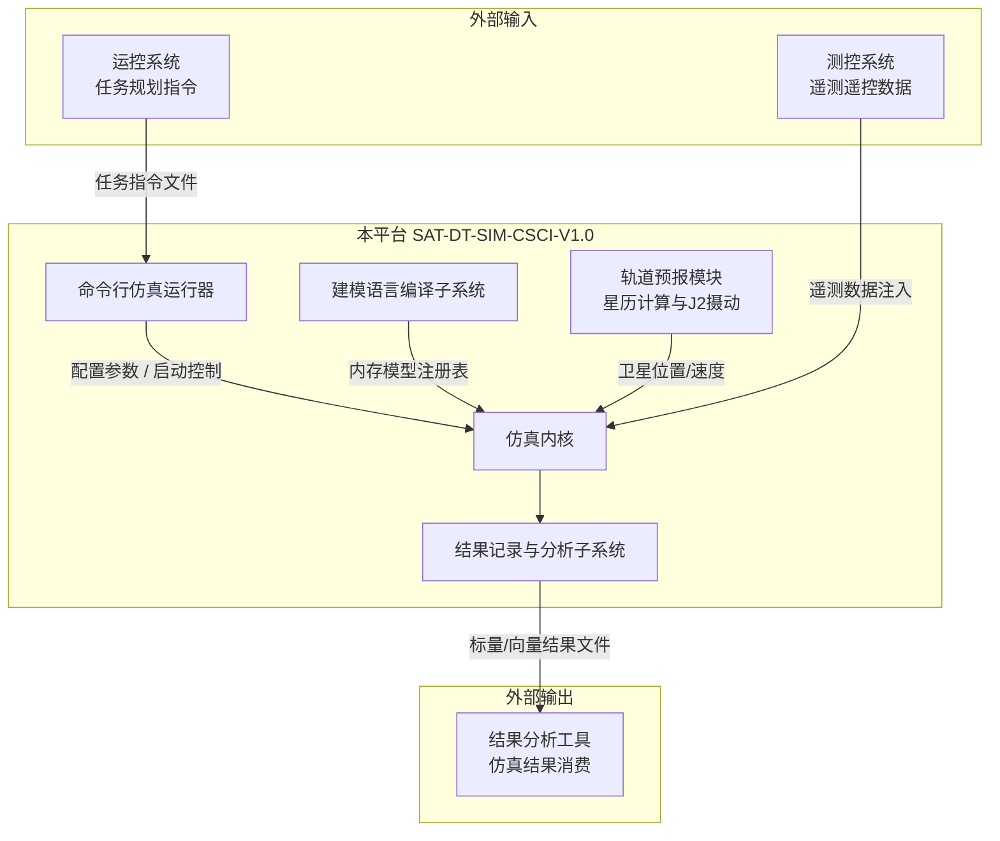

本平台通过命令行接口接收仿真配置与模型参数，通过标准结果文件格式（标量文件、向量文件、SQLite 数据库）向外部分析工具输出仿真结果，不依赖任何特定的图形化前端。

**开发与运行历史**

本平台基于成熟的混合仿真技术体系自主研发，V1.0 版本为首次正式发布版本，覆盖核心仿真引擎、建模语言编译、命令行运行、结果记录分析、分布式并行仿真及连续-离散混合调度等全部核心功能模块。

### 1.3 文档概述

**文档用途**

本文档为《星座数字孪生平台 软件设计说明书》，依据 GJB438B-2009《武器系统软件开发文档》标准编制，描述本平台软件配置项（CSCI）的概要设计与详细设计。本文档可作为：

- 软件设计评审的基础文件
- 软件编码实现的设计依据
- 软件测试与验证的设计基准
- 软件维护与演进的参考文档

**读者范围**

本文档的预期读者包括：系统架构师、软件设计人员、软件开发人员、软件测试人员、软件质量保证人员及项目管理人员。
## 2. 引用文档

本文档引用以下规范、标准及相关文档：

| 编号 | 文档标识 | 文档名称 | 版本/日期 | 来源 |
|------|----------|----------|-----------|------|
| [1] | SAT-DT-SIM-SRS-V1.0 | 星座数字孪生平台 软件需求规格说明 | V1.0（占位） | 本项目 |
| [2] | SAT-DT-SIM-IDD-V1.0 | 星座数字孪生平台 接口控制文件 | V1.0（占位） | 本项目 |
| [3] | SAT-DT-SIM-DBDD-V1.0 | 星座数字孪生平台 数据库设计说明 | V1.0（占位） | 本项目 |
| [4] | MPI-3.1 | 消息传递接口规范 | 2015年 | MPI Forum |

## 3. CSCI级设计决策

### 3.1 系统能力的设计决策

#### 3.1.1 输入响应设计决策

本平台采用**事件驱动**与**实时调度**双模输入响应机制：

- **离散事件模式**：仿真时钟由事件队列驱动，每次取出时间戳最小的事件执行，适用于纯离散通信协议仿真（星间链路建立/断开、数据包收发、任务指令执行）。
- **实时同步模式**：仿真时钟与墙钟时间按可配置缩放因子同步推进，适用于硬件在环（HIL）测试场景，支持外部传感器数据实时注入。
- **混合调度模式**：离散事件与连续时间状态推进（轨道动力学积分）交错执行，通过定步长自消息周期触发连续状态更新，实现轨道动力学与通信事件的协同仿真。

#### 3.1.2 可用性设计决策

- 仿真运行过程中发生可恢复错误时，平台记录错误上下文并继续执行后续事件，不中断整批仿真任务。
- 支持仿真检查点（Checkpoint）机制，可在指定仿真时刻保存完整仿真状态，支持断点续仿。
- 分布式并行仿真模式下，单节点故障不影响其他节点的独立运行，支持故障节点重启后重新加入。

#### 3.1.3 安全性设计决策

- 仿真配置文件采用基于角色的访问控制，区分只读用户（查看结果）与读写用户（修改配置）。
- 所有仿真运行操作记录审计日志，包含操作时间、操作类型、配置参数摘要及运行结果状态。
- 结果文件采用文件级完整性校验（SHA-256 哈希），防止结果数据被篡改。

#### 3.1.4 扩展性设计决策

- **插件化仿真对象**：仿真对象（如模块、信道、协议等）通过组件类型注册表机制实现动态工厂加载，支持以独立的动态链接库形式灵活接入自定义仿真模型实体。
- **插件化仿真运行器**：仿真运行环境抽象层通过应用注册中心与具体运行器解耦，支持插件化扩展不同的仿真运行器（如本平台标配的命令行仿真运行器，以及未来可能扩展的其他图形界面运行器）。
- **插件化调度器**：调度器通过抽象基类（可插拔调度器抽象）与仿真内核解耦，用户可通过配置文件指定调度器类型（默认事件队列调度器、实时调度器、外部时间源调度器），无需修改内核代码。
- **插件化通信后端**：分布式并行仿真的通信层通过抽象接口与上层解耦，目前支持 MPI、命名管道、共享文件等通信后端的运行时切换，未来可无缝扩展支持数据分发服务（DDS）等工业级实时通信中间件。
- **插件化结果记录器**：结果记录层通过信号-监听器机制与仿真内核解耦，支持标量文件、向量文件、SQLite 数据库、CSV 等多种输出格式的同时启用。
- **可扩展的建模语言解析器**：仿真内核的拓扑构建层依赖标准化的抽象语法树（AST）内存模型，建模语言解析器作为独立的子系统（当前为 CSU-NEDC）接入。此设计支持未来扩展其他系统工程建模语言（如 SysML）的解析器，将其语法树适配到统一的组件类型注册表中。
- **可扩展的消息序列化机制**：消息描述系统生成的序列化/反序列化代码与底层的通信缓冲区抽象接口完全解耦。这为将来引入 Protocol Buffers (Protobuf) 等工业级跨平台、高性能数据序列化协议预留了无缝接入的扩展口。

### 3.2 与外部接口有关的设计决策

外部接口设计决策详见接口控制文件（SAT-DT-SIM-IDD-V1.0）。为支撑本平台与系统级外部实体的交互，主要决策如下：

- **面向“运控系统”的输入决策**：命令行接口（CSI-CLI）为本平台唯一的外部控制入口，接收运控系统下发的任务规划指令文件及启动参数，不提供图形化交互。
- **面向“测控系统”的输入决策**：混合调度时间源接口（CSI-TIME）对外部时间进行抽象，并提供线程安全的外部事件注入队列。测控系统或硬件在环（HIL）设备可通过该接口，将现实时间到达的遥测遥控数据同步转化为仿真事件，注入到仿真内核中。
- **面向“结果分析工具”的输出决策**：结果文件接口（CSI-RES）采用开放数据格式（标量文件、向量文件、SQLite 数据库），确保生成的仿真结果可被独立的第三方结果分析工具直接消费，实现平台输出与特定分析工具的完全解耦。
- **面向底层计算环境的通信决策**：分布式并行通信接口（CSI-PCOM）对底层的多节点通信网络（MPI/共享内存等）进行抽象封装，确保上层仿真逻辑不感知具体的并行物理拓扑或通信协议。

### 3.3 系统状态表

本平台在运行生命周期内经历以下状态：

| 序号 | 状态名称 | 触发事件 | 进入条件 | 退出条件 | 说明 |
|------|----------|----------|----------|----------|------|
| 1 | 初始化 | 程序启动 | 进程创建成功 | 配置加载完成 | 加载共享库、解析命令行参数 |
| 2 | 配置加载 | 初始化完成 | 配置文件路径有效 | 模型实例化完成 | 解析 INI 配置、编译 NED 模型、构建模块拓扑 |
| 3 | 运行中 | 配置加载完成 | 事件队列非空或调度器就绪 | 仿真结束条件满足或用户中断 | 事件循环持续执行，结果持续写入 |
| 4 | 暂停 | 用户发送暂停信号 | 处于运行中状态 | 用户发送继续信号 | 事件循环挂起，状态保持 |
| 5 | 正常结束 | 仿真时间达到上限或终止条件触发 | 处于运行中状态 | 进程退出（退出码 0） | 调用 finish()，写入最终统计结果 |
| 6 | 异常退出 | 运行错误或配置错误 | 任意状态 | 进程退出（退出码 2/3） | 记录错误上下文，输出诊断信息 |
| 7 | 用户中断 | 用户发送中断信号（Ctrl+C） | 处于运行中或暂停状态 | 进程退出（退出码 1） | 尽力保存已记录结果后退出 |

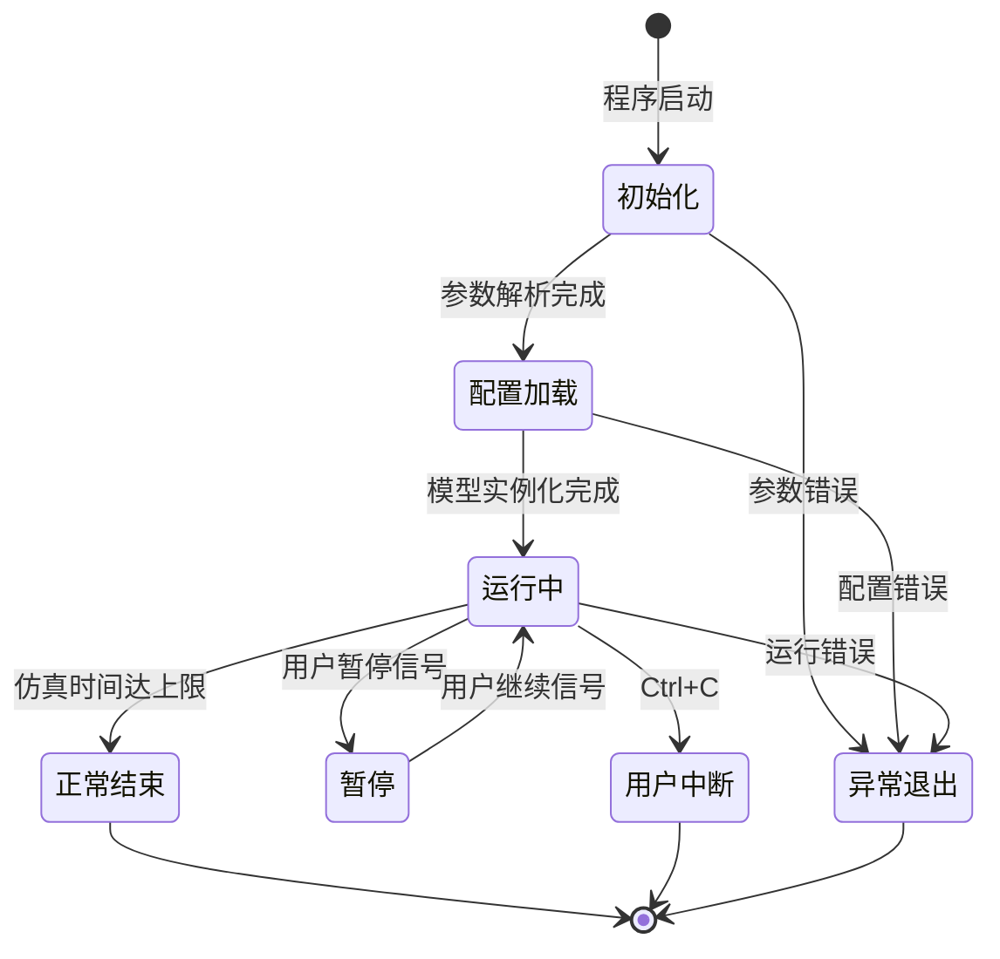

### 3.4 与软件部件有关的设计决策

本平台各软件部件（CSU）的划分与组织遵循以下架构级决策：

1. **依赖单向化与分层解耦**：采用严格的分层架构，基础引擎部件（CSU-SIM、CSU-NEDC）仅依赖最底层的通用基础库（CSU-COMM）。控制层部件（如命令行运行器 CSU-CMDR、事件日志 CSU-EVLG）仅通过运行环境抽象层（CSU-ENVA）与内核交互，消除部件间的循环依赖，确保各单元可独立测试。
2. **核心业务与运行环境分离**：将系统明确划分为“仿真计算逻辑层”与“运行控制环境层”。模型在内核部件中的计算逻辑绝对不感知它是在单机还是在外部触发的控制循环中被执行的，实现计算与调度的组件级分离。
3. **运行模式的部件级互斥**：受限于全局时钟同步与连续状态推进在数学机制上的耦合复杂性，部件级强制约束：分布式并行仿真（CSU-PSIM）与连续-离散混合调度（CSU-HSCH）在同一运行生命周期内互斥，平台加载时会进行强制检查拦截。
4. **仿真框架与模型实体隔离**：所有的仿真业务模型（如具体卫星平台模型、星间路由协议等）均作为独立的外部组件被动态加载。CSCI 部件内部仅包含纯粹的、非领域特定的计算机制与抽象引擎，确保框架本身的通用性。

## 4. CSCI体系结构设计

### 4.1 CSCI部件

本 CSCI 由以下 9 个软件单元（CSU）组成：

| 单元标识 | 单元名称 | 实现库 | 分配需求 |
|----------|----------|--------|----------|
| CSU-COMM | 通用基础库 | `libsimcommon.a` | SRS-001～006 |
| CSU-SIM | 仿真内核 | `libsimcore.a` | SRS-010～015 |
| CSU-NEDC | 建模语言编译子系统 | `libnedcore.a` | SRS-020～023 |
| CSU-ENVA | 仿真运行环境抽象层 | `libsimenvir.a` | SRS-030～033 |
| CSU-CMDR | 命令行仿真运行器 | `libsimcmdenv.a` | SRS-040～042 |
| CSU-EVLG | 事件日志记录与回放子系统 | `libsimeventlog.a` | SRS-050～052 |
| CSU-RSAN | 仿真结果记录与分析子系统 | `libsimscave.a` | SRS-060～063 |
| CSU-PSIM | 分布式并行仿真子系统 | `libsimparallel.a` | SRS-070～075 |
| CSU-HSCH | 混合调度子系统 | `libsimhybridsched.a` | SRS-080～084 |

**软件单元静态依赖关系：**

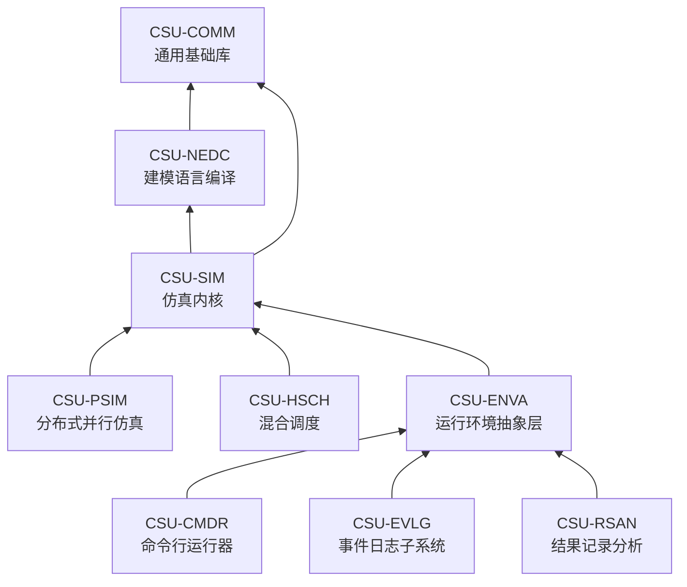

**各软件单元计算机硬件资源估算：**

| 单元标识 | CPU 占用（典型） | 内存占用（典型） | 磁盘（结果文件） | 特殊依赖 |
|----------|----------------|----------------|-----------------|----------|
| CSU-COMM | < 5% | < 50 MB | — | — |
| CSU-SIM | 60%～80% | 200 MB～2 GB（按模型规模） | — | — |
| CSU-NEDC | < 10%（编译期） | < 100 MB | < 10 MB（msg代码产物） | — |
| CSU-ENVA | < 5% | < 50 MB | — | — |
| CSU-CMDR | < 2% | < 20 MB | — | — |
| CSU-EVLG | < 5% | < 100 MB | 1 GB～100 GB（按事件量） | 高速磁盘 I/O |
| CSU-RSAN | < 5% | < 200 MB | 100 MB～10 GB（按采样量） | — |
| CSU-PSIM | < 5%（通信开销） | < 100 MB（通信缓冲） | — | MPI 运行库 / 高速网络 |
| CSU-HSCH | < 2% | < 20 MB | — | 硬件在环设备（可选） |

### 4.2 执行方案

**正常执行控制流（单机模式）：**

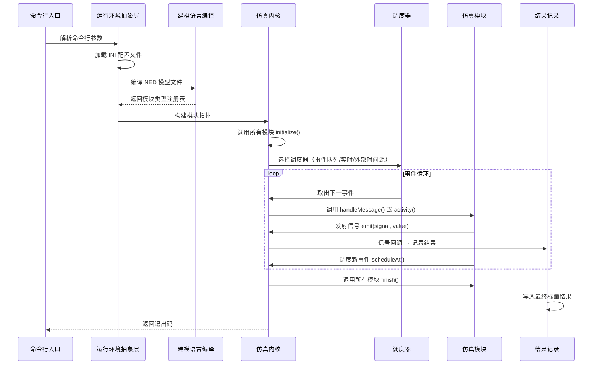

**分布式并行执行模式（多节点）：**

在分布式并行仿真模式下，仿真模型被分区部署到多个逻辑进程（LP）。每个逻辑进程独立持有事件队列和仿真时钟，通过同步协议（空消息协议或理想同步协议）协调各 LP 的时间推进。跨分区消息通过代理门序列化后经通信后端（MPI/命名管道/共享文件）传递到目标 LP。

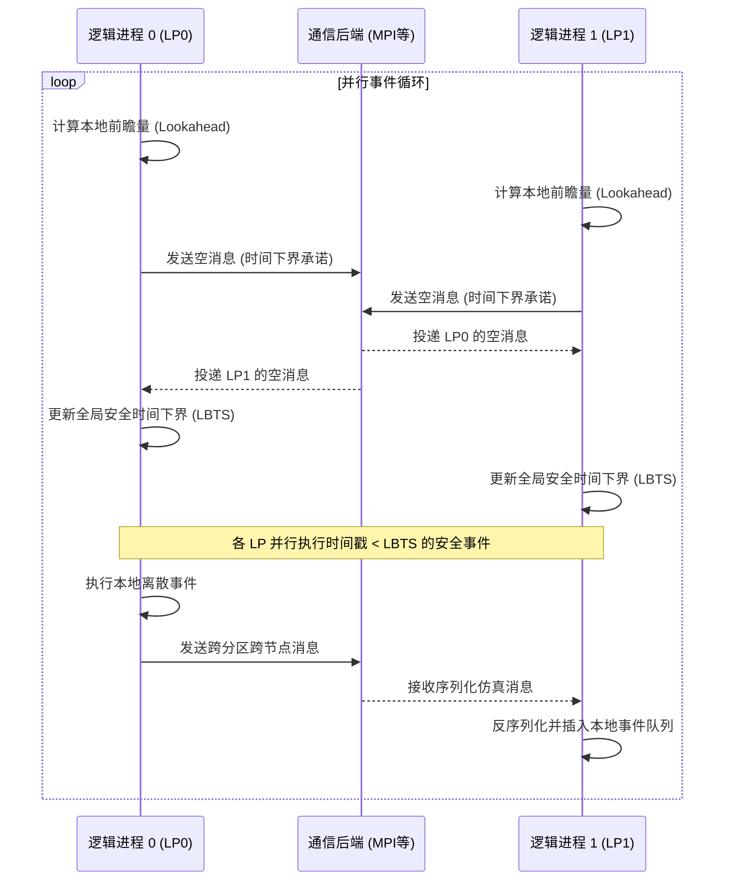

**混合调度执行模式（连续时间推进）：**

在混合调度模式下，混合调度子系统（CSU-HSCH）替换默认事件队列调度器，在每个离散事件执行间隙插入连续时间状态推进步骤（定步长积分采样器通过自消息周期触发），实现轨道动力学连续推进与通信事件离散触发的协同仿真。在此过程中，系统利用“零交叉（Zero-crossing）”检测机制，监测连续状态变量是否跨越预设的临界阈值（如卫星仰角越过地平线），一旦跨越则中断连续推进，将其转化为瞬时发生的离散事件注入调度队列，从而实现连续物理过程向离散逻辑事件的精确映射。

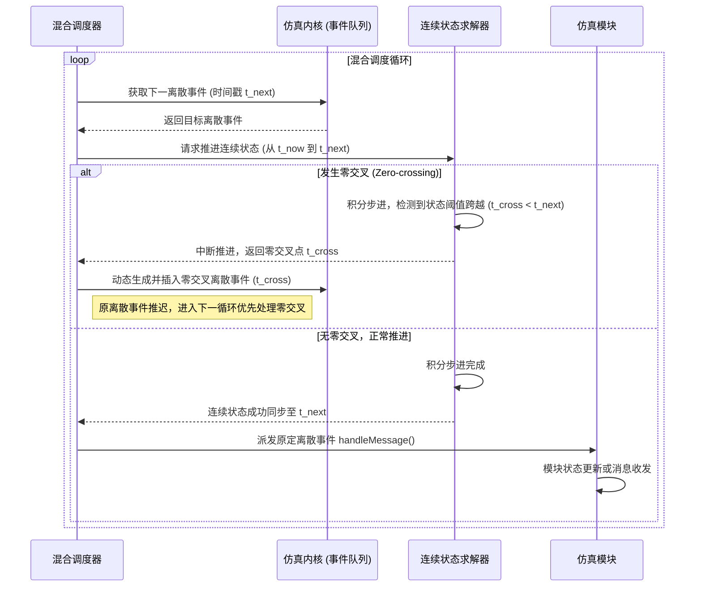

**异常处理：**

- 运行错误（如模型逻辑错误）：抛出运行错误异常，中止当次运行，记录错误上下文，退出码 2。
- 仿真终止条件满足：抛出终止异常，正常结束，调用 finish()，退出码 0。
- 用户中断（Ctrl+C）：捕获中断信号，尽力保存已记录结果，退出码 1。

### 4.3 接口设计

#### 4.3.1 命令行接口（CSI-CLI）

**接口标识**：`CSI-CLI`
**接口实体**：命令行仿真运行器（CSU-CMDR）↔ 外部用户/脚本

主要参数：

| 参数 | 含义 | 示例 |
|------|------|------|
| `-u <环境名>` | 指定运行环境（命令行模式） | `-u Cmdenv` |
| `-c <配置名>` | 指定 INI 配置节名称 | `-c SatConstellation` |
| `-r <运行序号>` | 指定参数研究运行编号 | `-r 0` |
| `-l <模型库>` | 加载模型共享库 | `-l libsatmodel` |
| `-n <NED路径>` | 指定 NED 文件搜索路径 | `-n ./models:./lib` |
| `-p <分区数>` | 分布式并行仿真分区数 | `-p 4` |
| `--scheduler <类型>` | 调度器类型（event/realtime/external） | `--scheduler realtime` |
| `--rt-scaling <因子>` | 实时缩放因子（仿真时间/墙钟时间） | `--rt-scaling 10.0` |

#### 4.3.2 NED 模型库接口（CSI-NED）

**接口标识**：`CSI-NED`
**接口实体**：建模语言编译子系统（CSU-NEDC）↔ 模型开发者

NED 文件描述仿真网络拓扑，包含模块参数、端口与连接关系。仿真内核（通过其下属的 `cNedLoader` 类）在运行环境初始化阶段调用 CSU-NEDC，直接动态解析 NED 源文件并构建为内存 AST（抽象语法树），随后注入到组件类型注册表中，无需生成中间文件。

#### 4.3.3 消息描述接口（CSI-MSG）

**接口标识**：`CSI-MSG`
**接口实体**：建模语言编译子系统（CSU-NEDC）↔ 模型开发者

msg 文件描述消息类型，编译后生成 C++ 类，支持跨进程序列化（分布式并行仿真场景下消息需序列化为通信缓冲区）。该接口在底层设计上与具体序列化实现解耦，具备向 Protocol Buffers (Protobuf) 等工业级序列化方案演进的扩展能力。

#### 4.3.4 结果文件接口（CSI-RES）

**接口标识**：`CSI-RES`
**接口实体**：仿真结果记录与分析子系统（CSU-RSAN）↔ 外部分析工具

支持格式：标量文件（`.sca`）、向量文件（`.vec`）、SQLite 数据库（`.sca.db`/`.vec.db`）、CSV 导出。分布式并行仿真时按分区编号分文件，离线合并后统一分析。

#### 4.3.5 分布式并行通信接口（CSI-PCOM）

**接口标识**：`CSI-PCOM`
**接口实体**：分布式并行仿真子系统（CSU-PSIM）↔ 通信后端（MPI/命名管道/共享文件）

抽象通信原语：发送消息（目标LP编号, 消息缓冲区）、接收消息（源LP编号）→ 消息缓冲区、广播（消息缓冲区）、屏障同步（）。底层适配三种通信后端，通过配置文件运行时选择。

#### 4.3.6 混合调度时间源接口（CSI-TIME）

**接口标识**：`CSI-TIME`
**接口实体**：混合调度子系统（CSU-HSCH）↔ 仿真内核（CSU-SIM）/ 外部时间源设备

可插拔调度器抽象：取下一事件（）→ 事件、预览下一事件（）→ 事件、回退事件（事件）。墙钟时间映射：仿真时间 ⇄ 墙钟时间双向换算，支持缩放因子配置。外部事件源注入：异步事件入队（事件）、阻塞等待外部唤醒（超时时间）→ 是否有新事件。


## 5. CSCI详细设计

### 5.1 通用基础库（CSU-COMM）

#### 5.1.1 单元标识与概述

**单元标识**：`CSU-COMM-001`
**单元名称**：通用基础库
**实现库**：`libsimcommon.a`

通用基础库是本平台所有其他子系统的基础依赖，提供跨子系统共享的非领域特定基础设施。该库不依赖任何上层（仿真内核以上）模块，可独立编译为静态库。

#### 5.1.2 设计约束与限定

- 不依赖仿真内核（CSU-SIM）或任何上层子系统
- 所有工具类均为无状态或线程安全设计
- 不引入第三方重量级依赖（仅允许标准 C++ 库、SQLite、libxml2/yxml）

#### 5.1.3 字符串与文本工具

提供字符串处理、模式匹配、分词等基础文本操作能力：

- **字符串工具**：判空、去空白、大小写转换、前缀/后缀匹配、格式化输出
- **分词器**：按分隔符分词、行分词、文件名列表分词
- **模式匹配器**：支持通配符（`*`、`?`）和正则表达式的字符串模式匹配
- **枚举字符串转换**：枚举值与字符串的双向映射

#### 5.1.4 文件与路径工具

提供文件读写、路径操作、文件锁等文件系统操作能力：

- **文件读取器**：支持大文件的分块读取与行迭代
- **路径工具**：路径拼接、目录创建、文件存在性检查、扩展名提取
- **文件通配符展开器**：将含通配符的路径模式展开为文件列表
- **文件锁**：跨进程文件锁，用于分布式并行仿真的结果文件互斥写入

#### 5.1.5 表达式求值与单位换算

提供仿真参数表达式的编译与求值能力：

- **表达式编译器**：将字符串形式的数学表达式编译为 AST
- **表达式求值器**：在给定变量环境下对 AST 求值，支持数值、布尔、字符串类型
- **单位换算器**：支持时间（s/ms/us/ns）、数据量（bit/byte/KB/MB）、频率（Hz/kHz/MHz）等单位的自动换算
- **大精度十进制数**：用于仿真时间的高精度表示，避免浮点误差累积

#### 5.1.6 随机数引擎

提供可重现的伪随机数生成能力：

- **线性同余随机数生成器**：快速、轻量，适用于大量随机参数初始化
- **梅森旋转随机数生成器**（通过仿真内核层提供）：高质量随机数，适用于蒙特卡洛仿真

#### 5.1.7 数据结构与统计

- **字符串池**：对重复字符串进行去重存储，减少内存占用
- **统计量收集器**：在线计算均值、方差、最小值、最大值
- **直方图**：支持等宽分箱和自适应分箱的频率直方图

#### 5.1.8 XML/JSON 解析

- **SAX 解析器**：基于事件驱动的 XML 解析，支持三种后端（内置轻量解析器、libxml2、yxml）
- **JSON 写入器**：将仿真元数据序列化为 JSON 格式

#### 5.1.9 结构化结果输出辅助

提供底层结果文件写入能力（由 CSU-RSAN 调用）：

- **标量结果文件写入器**：写入 `.sca` 格式标量结果
- **向量结果文件写入器**：写入 `.vec` 格式时间序列结果
- **SQLite 标量写入器**：写入 SQLite 数据库格式标量结果
- **SQLite 向量写入器**：写入 SQLite 数据库格式向量结果
- **CSV 写入器**：将结果导出为 CSV 格式

#### 5.1.10 接口设计

**接口一览表：**

| 接口标识 | 接口类别 | 关键操作签名（伪代码） | 数据传递方向 | 调用方 | 稳定性 |
|----------|----------|----------------------|-------------|--------|--------|
| COMM-IF-01 | 字符串工具接口 | `判空(s)→bool`；`分词(s, sep)→list`；`模式匹配(pattern, s)→bool` | 输入字符串→结果 | 所有上层子系统 | 稳定接口 |
| COMM-IF-02 | 文件与路径接口 | `读取整个文件(path)→bytes`；`路径拼接(parts...)→path`；`展开通配符(pattern)→file_list` | 文件系统→内存 | CSU-ENVA、CSU-NEDC | 稳定接口 |
| COMM-IF-03 | 表达式求值接口 | `编译(expr_str)→AST`；`求值(AST, env)→Value`；`换算单位(value, from, to)→Value` | 字符串→求值结果 | CSU-ENVA、CSU-SIM | 稳定接口 |
| COMM-IF-04 | 随机数引擎接口 | `初始化(seed)`；`下一整数(min, max)→int`；`下一双精度()→double` | 种子→随机数序列 | CSU-SIM | 稳定接口 |
| COMM-IF-05 | 统计数据结构接口 | `字符串池.插入(s)→handle`；`统计量.收集(x)`；`直方图.收集(x)` | 样本→统计结果 | CSU-SIM、CSU-RSAN | 稳定接口 |
| COMM-IF-06 | 结构化输出接口 | `标量写入器.写入(run_id, name, value, attrs)`；`向量写入器.写入(vec_id, t, v)` | 内存→文件 | CSU-RSAN | 稳定接口 |
| COMM-IF-07 | XML 解析接口 | `创建解析器(后端类型)→Parser`；`解析(parser, xml_str, handler)` | XML 文本→事件回调 | CSU-NEDC、CSU-ENVA | 演进接口 |

**接口约束：**
- COMM-IF-01～06 为稳定接口，语义不可变，仅允许向后兼容扩展
- COMM-IF-07 为演进接口，允许新增解析后端但不允许破坏现有后端行为
- 所有接口调用前置条件：库已完成静态初始化（程序启动时自动完成）
- 错误处理策略：参数错误抛出参数异常；文件不存在抛出文件异常；表达式语法错误抛出解析异常

### 5.2 仿真内核（CSU-SIM）

#### 5.2.1 单元标识与概述

**单元标识**：`CSU-SIM-001`
**单元名称**：仿真内核
**实现库**：`libsimcore.a`

仿真内核是本平台的核心计算引擎，实现离散事件调度、连续时间状态推进及混合仿真的基础机制：事件驱动调度循环、复合模块层次拓扑、消息传递与信道建模、信号-监听器统计收集、协程式过程化建模，以及可插拔调度器抽象（供混合调度子系统 CSU-HSCH 扩展，实现连续-离散协同推进）。

#### 5.2.2 设计约束与限定

- 单线程事件循环：模块仅在自己的事件回调（`handleMessage` 或 `activity`）内修改自身状态，不支持多线程并发访问仿真状态
- 调度器可插拔：调度器通过抽象基类与内核解耦，默认实现为事件队列调度器（按时间戳最小堆排序）
- 模块状态封装：模块内部状态不可被其他模块直接访问，只能通过消息传递或信号机制交互

#### 5.2.3 对象层次结构

仿真内核的类层次结构按职责分为以下层次：

**基类层**：所有仿真对象的根基类，提供对象命名、所有权管理、序列化支持：
- 仿真对象基类（提供名称、全路径、类型信息）
- 命名对象基类（添加名称管理）
- 拥有对象基类（添加所有权树管理，实现垃圾回收与内存泄漏防范）
- 软所有者基类（弱所有权。与严格负责对象生命周期销毁的“强所有者”不同，软所有权允许对象在容器间自由转移而无需强制接管销毁责任，常用于消息队列、事件缓存等数据结构）
- 组件基类（模块与信道的公共基类，提供参数访问与信号发射）

**拓扑层**：描述仿真网络结构：
- 仿真模块（复合模块，包含子模块与连接）
- 简单模块基类（用户继承的叶节点模块，实现 `handleMessage` 或 `activity`）
- 信道基类（连接两个模块端口的通信信道）
- 时延信道（固定传播时延信道）
- 数据率信道（带宽限制信道，支持数据率与误码率建模）
- 模块端口（模块间连接的端点，分输入/输出/双向）
- 组件类型注册表（模块与信道类型的工厂注册）

**事件层**：仿真事件的数据载体：
- 事件基类（携带时间戳与优先级）
- 仿真消息（通用消息，携带发送方/接收方/时间戳）
- 数据包（继承自仿真消息，添加比特长度与封装/解封装）
- 消息打印器（可扩展的消息内容格式化输出）

**调度层**：事件队列管理与调度策略：
- 仿真上下文（持有当前运行的全局状态：当前时间、当前模块、事件计数）
- **可插拔调度器抽象基类**（`取下一事件()→Event`、`预览下一事件()→Event`，**CSU-HSCH 的扩展点**）
- 未来事件集合（优先队列接口）
- 事件堆（基于二叉堆的未来事件集合实现）

**参数层**：模块参数的类型化存储与访问：
- 参数容器（统一参数访问接口，支持隐式类型转换）
- 布尔/整数/双精度/字符串/对象参数实现

**统计与信号层**：观测量的收集与传递：
- 信号监听器基类（订阅信号的回调接口）
- 结果监听器（将信号值传递给结果过滤器链）
- 结果过滤器（对信号值进行变换：均值、方差、计数等）
- 结果记录器（将过滤后的值写入结果文件，**CSU-RSAN 的扩展点**）
- 统计量（在线统计：均值、方差、最小值、最大值）
- 直方图（频率分布统计）

**协程层**：支持 `activity()` 风格的过程化建模：
- 协程（轻量级协程，用于挂起/恢复模块执行流）
- 上下文切换器（协程间的执行权转移）

**生命周期层**：仿真运行的异常控制流：
- 生命周期监听器（监听仿真启动/结束/重置事件）
- 运行错误异常（模型逻辑错误，中止当次运行）
- 终止异常（仿真正常结束条件满足）

**持久化辅助层**（供 CSU-PSIM 使用）：
- 通信缓冲区抽象（序列化/反序列化接口，**CSU-PSIM 的扩展点**）
- 内存通信缓冲区（基于内存的实现）
- 文件通信缓冲区（基于文件的实现）

#### 5.2.4 事件循环逻辑

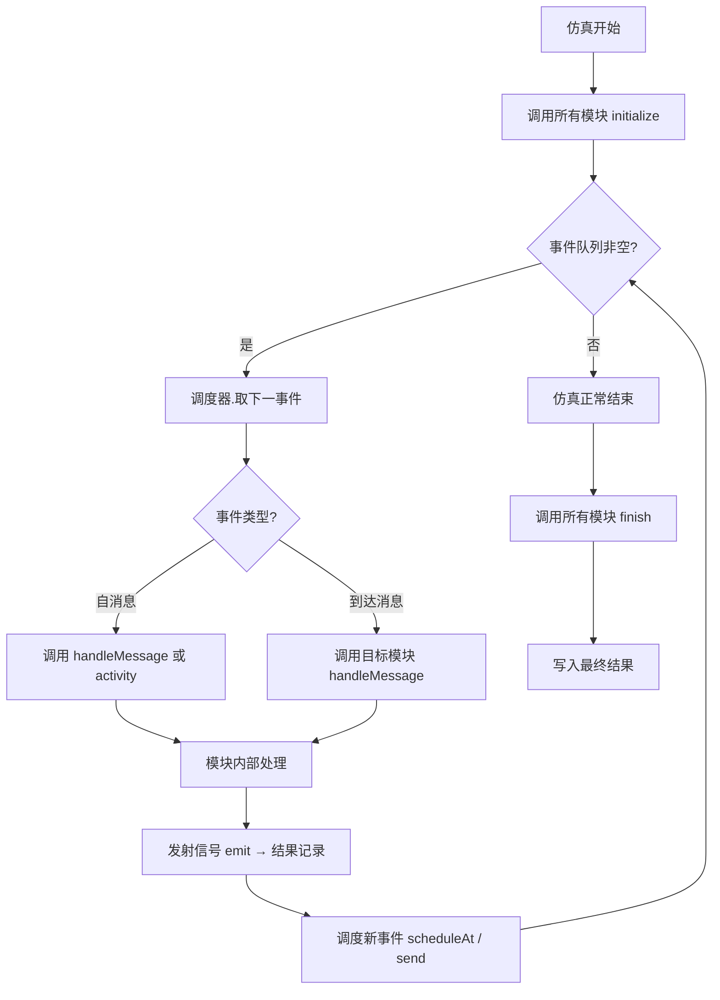

**关键设计点**：`可插拔调度器抽象基类.取下一事件()` 是整个事件循环的唯一扩展点。默认实现从事件堆取出时间戳最小的事件；混合调度子系统（5.9 节）通过派生该基类，在取事件前插入墙钟时间等待或连续状态推进步骤。

#### 5.2.5 接口设计

**接口一览表：**

| 接口标识 | 接口类别 | 关键操作签名（伪代码） | 数据传递方向 | 调用方 | 稳定性 |
|----------|----------|----------------------|-------------|--------|--------|
| SIM-IF-01 | 模块生命周期接口 | `初始化(阶段号)`；`处理消息(msg)`；`结束运行()` | 内核→模块 | 仿真内核（回调） | 稳定接口（模型契约） |
| SIM-IF-02 | 消息调度接口 | `调度自消息(at_time, msg)`；`取消事件(msg)`；`发送(msg, gate)` | 模块→内核 | 模型代码 | 稳定接口 |
| SIM-IF-03 | 参数访问接口 | `读取参数(name)→Value`；`参数变更通知(name, old_val)` | 配置→模块 | 模型代码 | 稳定接口 |
| SIM-IF-04 | 信号发射接口 | `发射信号(signal_id, value)`；`订阅信号(signal_id, listener)` | 模块→监听器 | 模型代码 / CSU-RSAN | 稳定接口 |
| SIM-IF-05 | 调度器扩展点接口 | `取下一事件()→Event`；`预览下一事件()→Event`；`回退事件(event)` | 内核↔调度器 | CSU-HSCH（派生实现） | 扩展点接口 |
| SIM-IF-06 | 持久化接口 | `打包到通信缓冲区(buf)`；`从通信缓冲区解包(buf)` | 内存↔缓冲区 | CSU-PSIM | 扩展点接口 |
| SIM-IF-07 | 拓扑查询接口 | `获取指定模块的子模块(name)→Module`；`获取端口(name)→Gate`；`获取全路径()→string` | 内核→调用方 | 模型代码 | 稳定接口 |

**接口约束：**
- SIM-IF-01～04、SIM-IF-07 为稳定接口，是与模型代码的契约，不可破坏
- SIM-IF-05 为扩展点接口，CSU-HSCH 通过派生可插拔调度器抽象基类实现，不可重入
- SIM-IF-06 为扩展点接口，CSU-PSIM 通过实现通信缓冲区抽象接入，要求序列化/反序列化互逆
- 错误处理：模型代码错误抛出运行错误异常；仿真结束条件满足抛出终止异常

### 5.3 建模语言编译子系统（CSU-NEDC）

#### 5.3.1 单元标识与概述

**单元标识**：`CSU-NEDC-001`
**单元名称**：建模语言编译子系统
**实现库**：`libnedcore.a`

建模语言编译子系统负责将网络拓扑描述语言（NED）和消息定义语言（msg）编译为仿真内核可加载的内部表示。NED 文件描述仿真网络的模块类型、参数、端口及连接拓扑；msg 文件描述仿真消息的数据结构，编译后生成 C++ 类供模型代码使用。

#### 5.3.2 设计约束与限定

- 不出现具体工具名称（网络描述编译工具、消息描述编译工具为对外名称）
- 编译过程分为词法分析、语法分析、AST 构建、语义校验、代码生成五个阶段，各阶段独立可测
- 跨文件交叉引用校验需在所有文件的 AST 构建完成后统一执行

#### 5.3.3 词法与语法分析层

- **NED 词法器**：将 NED 源文件分解为词法单元（关键字、标识符、字面量、运算符）
- **NED 语法分析器**：基于上下文无关文法将词法单元序列解析为 NED AST
- **msg 词法器**：将 msg 源文件分解为词法单元
- **msg 语法分析器**：将 msg 词法单元序列解析为 msg AST
- 错误定位：所有词法/语法错误携带精确的文件名、行号、列号信息

#### 5.3.4 AST 构建与内存管理层

- **AST 节点定义**：覆盖 NED 语言全部语法结构（网络声明、模块声明、参数声明、端口声明、子模块声明、连接声明等）
- **AST 构建器**：在语法分析过程中同步构建 AST，支持增量构建
- **内存 AST 缓存**：在内存中集中持有所有已解析的 NED 语法树，供仿真内核在启动时查询并构建最终的模块拓扑

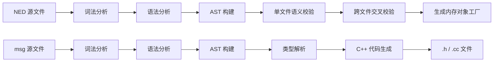

#### 5.3.5 语义校验层

- **单文件校验**：检查参数类型一致性、端口方向匹配、子模块引用有效性
- **跨文件交叉引用校验**：检查跨文件的模块类型引用、参数继承关系、接口实现完整性
- **类型一致性校验**：检查连接两端端口的数据类型兼容性

#### 5.3.6 代码生成层

- **msg 代码生成器**：将 msg AST 转换为 C++ 类定义（`.h`）和实现（`.cc`），生成序列化/反序列化方法
- **类型解析器**：解析 msg 文件中的类型引用，支持跨文件类型依赖

**编译产物清单：**

| 产物类型 | 文件扩展名 | 说明 |
|----------|-----------|------|
| 消息类头文件 | `_m.h` | msg 编译产物，模型代码包含此头文件 |
| 消息类实现文件 | `_m.cc` | msg 编译产物，与模型代码一同编译 |
| 依赖关系文件 | `.d` | 记录编译依赖，供构建系统增量编译使用 |

#### 5.3.7 接口设计

**接口一览表：**

| 接口标识 | 接口类别 | 关键操作签名（伪代码） | 数据传递方向 | 调用方 | 稳定性 |
|----------|----------|----------------------|-------------|--------|--------|
| NEDC-IF-01 | 网络描述解析接口 | `加载NED源码目录(folder, excluded_packages)→Count`；`加载NED文本(name, text)→void` | 文件/文本→内存AST | 运行环境抽象层(CSU-ENVA) | 稳定接口 |
| NEDC-IF-02 | 消息描述编译命令行接口 | `编译消息描述(输入.msg文件, 输出.h路径, 输出.cc路径)` | 文件→文件 | 构建系统 | 稳定接口 |
| NEDC-IF-03 | AST 查询接口 | `获取模块声明(name)→AstNode`；`遍历所有声明()→NodeList` | 名称→AST节点 | 仿真内核 | 演进接口 |
| NEDC-IF-04 | 语义校验接口 | `单文件校验(ast)→issue_list`；`跨文件交叉校验(ast_list)→issue_list` | AST→诊断列表 | 编译工具内部 | 演进接口 |
| NEDC-IF-05 | 类型解析接口 | `解析类型引用(name, scope)→TypeRef`；`注册类型(name, ast_node)` | 名称→类型引用 | 代码生成器 | 演进接口 |
| NEDC-IF-06 | 错误诊断接口 | `获取错误定位(issue)→file:line:col`；`格式化诊断(issue, color_mode)→string` | 诊断对象→字符串 | 编译工具 / 构建系统 | 稳定接口 |

**接口约束：**
- NEDC-IF-01、NEDC-IF-02、NEDC-IF-06 为稳定接口，保证后向兼容性
- 产物文件命名约定：msg 文件 `bar.msg` → `bar_m.h` + `bar_m.cc`
- 错误处理：词法/语法错误收集后批量报告，不在第一个错误处中止；语义错误同样批量报告

### 5.4 仿真运行环境抽象层（CSU-ENVA）

#### 5.4.1 单元标识与概述

**单元标识**：`CSU-ENVA-001`
**单元名称**：仿真运行环境抽象层
**实现库**：`libsimenvir.a`

仿真运行环境抽象层为仿真内核与外部世界（配置文件、命令行、日志、结果输出）之间提供解耦抽象。该层负责配置文件解析、参数研究场景迭代、结果输出管理、XML 文档缓存，以及仿真应用程序的注册与启动。

#### 5.4.2 设计约束与限定

- 不依赖具体运行器（命令行运行器 CSU-CMDR 通过注册机制接入）
- 结果输出管理通过信号-监听器机制与仿真内核解耦，不直接调用文件写入接口
- 配置文件格式为 INI 分节格式

#### 5.4.3 配置管理层

- **INI 配置文件读取器**：解析分节 INI 格式配置文件，支持多文件包含（`include` 指令）
- **分节配置管理器**：管理多个配置节（`[General]`、`[Config <名称>]`），支持配置节继承
- **参数研究场景迭代器**：将配置节中的参数值列表（如 `**.delay = ${1, 2, 5}ms`）展开为独立运行场景
- **值迭代器**：对单个参数的值序列进行迭代（等差序列、等比序列、枚举列表）

**参数研究展开机制：**

参数研究展开是指运行环境读取 INI 配置中的 `${...}` 参数取值列表或范围表达式，将其展开为一组独立仿真运行场景。每个运行场景对应一组确定的参数取值、运行编号和结果输出上下文，用于批量实验、灵敏度分析和性能对比。例如 `**.numSatellites = ${numSatellites=100, 200, 500}` 表示分别以 100、200、500 颗卫星生成三个参数组合；若同一配置节中还有其他 `${...}` 参数或 `repeat` 重复次数，则运行环境按迭代规则组合生成多次仿真运行。

**与 NED 场景描述的职责边界：**

NED 文件负责声明网络拓扑、模块类型、子模块向量、连接关系、门以及模块参数的类型和默认值；INI 配置负责在运行时为这些参数赋值，并通过通配符、模块路径和参数研究语法批量覆盖运行配置。二者在“模块参数取值”层面存在交叉，但职责不同：NED 中固定赋值的参数视为模型结构或模型内约束，运行配置不应覆盖；NED 中仅声明或给出 `default(...)` 的参数可由 INI 在不同运行场景中赋值或展开。

**配置项分级：**

| 配置级别 | 说明 | 示例 |
|----------|------|------|
| 全局配置 | 适用于所有运行的配置项 | `sim-time-limit = 1000s` |
| 每运行配置 | 仅适用于特定运行编号的配置项 | `**.numSatellites = ${100, 200, 500}` |
| 每对象配置 | 适用于特定模块路径的配置项 | `**.satellite[*].txPower = 10W` |
| 每对象每运行配置 | 特定模块路径与特定运行的组合 | `**.satellite[0].orbit = LEO` |

#### 5.4.4 结果输出管理层

- **标量结果文件管理器**：管理 `.sca` 格式标量结果文件的创建、写入与关闭
- **向量结果文件管理器**：管理 `.vec` 格式向量结果文件，支持缓冲写入与刷新
- **SQLite 标量结果管理器**：将标量结果写入 SQLite 数据库
- **SQLite 向量结果管理器**：将向量结果写入 SQLite 数据库，支持批量插入优化
- **事件日志文件管理器**：管理事件日志文件的写入（**CSU-EVLG 的扩展点**）

**支持的输出格式：**

| 格式 | 文件扩展名 | 适用场景 |
|------|-----------|----------|
| 标量文件 | `.sca` | 运行结束后的统计量最终值 |
| 向量文件 | `.vec` | 运行过程中的时间序列样本 |
| SQLite 标量 | `.sca.db` | 需要 SQL 查询的标量分析 |
| SQLite 向量 | `.vec.db` | 需要 SQL 查询的向量分析 |
| 事件日志 | `.elog` | 逐事件结构化记录（调试与回放） |
| CSV | `.csv` | 与外部工具（Excel、Python）交互 |

#### 5.4.5 XML 文档缓存

- **XML 文档缓存**：对已加载的 XML 文档进行缓存，避免重复解析
- **XPath 查询**：支持对缓存 XML 文档执行 XPath 查询，供模型代码读取配置数据

#### 5.4.6 应用程序注册与启动

- **仿真运行环境注册中心**：管理已注册的仿真运行环境（命令行模式等），通过 `-u` 参数选择
- **启动入口**：解析命令行参数，选择运行环境，初始化仿真上下文，启动仿真循环

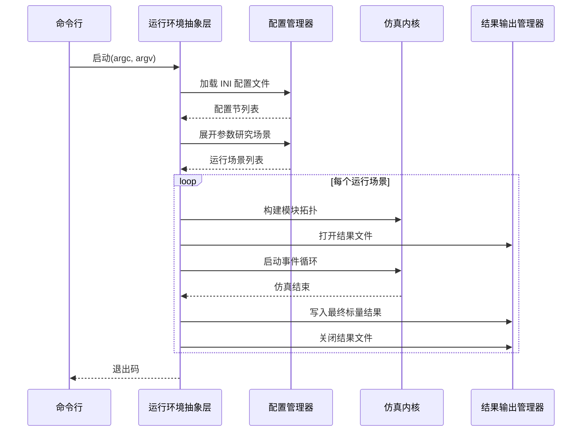

#### 5.4.7 接口设计

**接口一览表：**

| 接口标识 | 接口类别 | 关键操作签名（伪代码） | 数据传递方向 | 调用方 | 稳定性 |
|----------|----------|----------------------|-------------|--------|--------|
| ENVA-IF-01 | 配置查询接口 | `读取配置项(name, run_idx)→Value`；`读取每对象配置(obj_path, key)→Value`；`枚举运行场景(config_name)→ScenarioList` | 配置文件→内存 | CSU-SIM、CSU-CMDR | 稳定接口 |
| ENVA-IF-02 | 结果输出注册接口 | `注册标量(component, name, value, attrs)`；`注册向量(component, name)→vec_id`；`记录向量样本(vec_id, t, value)` | 内存→文件 | CSU-SIM（信号回调） | 稳定接口 |
| ENVA-IF-03 | XML 文档加载接口 | `加载XML(path)→DocHandle`；`查询节点(handle, xpath)→NodeList` | 文件→内存 | 模型代码 | 稳定接口 |
| ENVA-IF-04 | 信号统计接口 | `订阅(component, signal_id, listener)`；`记录直方图(component, name, samples)` | 信号→统计量 | CSU-RSAN | 稳定接口 |
| ENVA-IF-05 | 应用程序入口注册接口 | `注册应用(name, factory_fn)`；`启动应用(argc, argv)→exit_code` | 注册表→执行 | CSU-CMDR | 演进接口 |
| ENVA-IF-06 | 事件日志挂接接口 | `安装日志写入器(writer)`；`日志记录事件(event_kind, fields)` | 内核事件→日志文件 | CSU-EVLG（扩展点） | 扩展点接口 |

**接口约束：**
- ENVA-IF-01～04 为稳定接口，是与仿真内核和模型代码的契约
- ENVA-IF-06 为扩展点接口，CSU-EVLG 通过安装日志写入器接入，不可重入
- 错误处理：配置文件不存在抛出配置异常；XML 解析错误抛出解析异常；结果文件写入失败记录警告并继续

### 5.5 命令行仿真运行器（CSU-CMDR）

#### 5.5.1 单元标识与概述

**单元标识**：`CSU-CMDR-001`
**单元名称**：命令行仿真运行器
**实现库**：`libsimcmdenv.a`

命令行仿真运行器提供面向脚本与批处理的非图形化仿真执行入口，支持单次运行、批量参数扫描、回归测试场景。该运行器通过运行环境抽象层（CSU-ENVA）的注册机制接入，不依赖任何图形化组件。

#### 5.5.2 设计约束与限定

- 不依赖任何图形化库或显示设备
- 进度反馈仅通过标准输出（stdout）的行打印实现
- 退出码约定为强稳定接口，脚本与构建系统依赖此约定

#### 5.5.3 命令行参数解析

支持以下标准化命令行参数：

| 参数 | 含义 | 默认值 |
|------|------|--------|
| `-u <环境名>` | 指定运行环境（固定为 `Cmdenv`） | `Cmdenv` |
| `-c <配置名>` | 指定 INI 配置节名称 | `General` |
| `-r <运行序号>` | 指定参数研究运行编号（支持范围如 `0-9`） | `0` |
| `-l <模型库>` | 加载模型共享库（可多次指定） | — |
| `-n <NED路径>` | 指定 NED 文件搜索路径（冒号分隔） | `.` |
| `-p <分区数>` | 分布式并行仿真分区数 | `1`（单机） |
| `--scheduler <类型>` | 调度器类型（`event`/`realtime`/`external`） | `event` |
| `--rt-scaling <因子>` | 实时缩放因子（仿真时间/墙钟时间） | `1.0` |
| `--ini-file <路径>` | 指定 INI 配置文件路径 | `simulation.ini` |

#### 5.5.4 运行控制

- **单运行模式**：执行指定配置节的单次仿真运行
- **批量参数扫描模式**：按参数研究场景迭代器展开的所有运行场景依次执行
- **Express 高速模式**：禁用进度打印，最大化仿真吞吐量
- **Normal 标准模式**：启用进度打印，每隔固定仿真时间或事件数打印一次状态

#### 5.5.5 进度反馈

每次进度打印输出以下信息（行格式）：

```
** 事件 #<事件计数>  t=<仿真时间>  速度: <事件/秒>  剩余: <估计剩余时间>
```

运行结束时输出统计摘要：

```
仿真结束，总事件数: <N>，仿真时间: <T>，墙钟时间: <W>，平均速度: <V> 事件/秒
```

#### 5.5.6 退出码约定

| 退出码 | 含义 |
|--------|------|
| 0 | 仿真正常结束（所有运行场景完成） |
| 1 | 用户中断（Ctrl+C） |
| 2 | 运行错误（模型逻辑错误） |
| 3 | 配置错误（配置文件解析失败、参数无效） |

#### 5.5.7 接口设计

**接口一览表：**

| 接口标识 | 接口类别 | 关键操作签名（伪代码） | 数据传递方向 | 调用方 | 稳定性 |
|----------|----------|----------------------|-------------|--------|--------|
| CMDR-IF-01 | 命令行参数解析接口 | `解析参数(argc, argv)→Options`；`验证参数(options)→issue_list` | 命令行→选项对象 | 启动入口 | 稳定接口 |
| CMDR-IF-02 | 运行模式控制接口 | `选择运行模式(Express/Normal)`；`设置参数研究迭代器()→RunIterator` | 选项→运行控制 | 内部 | 演进接口 |
| CMDR-IF-03 | 进度反馈接口 | `打印进度(t_sim, t_wall, evt_count)`；`打印事件状态(evt_kind, fields)` | 内部状态→stdout | 事件循环 | 稳定接口 |
| CMDR-IF-04 | 退出码契约接口 | `规约退出码(0=正常/1=用户中断/2=运行错误/3=配置错误)` | 内部状态→进程退出码 | 操作系统/脚本 | 强稳定接口 |
| CMDR-IF-05 | 批量执行入口接口 | `批量运行(config_name, run_filter)→ResultSummary` | 配置→结果摘要 | 回归测试框架 | 稳定接口 |
| CMDR-IF-06 | 调度器选择接口 | `安装调度器(scheduler_class_name)`；`获取当前调度器()→Scheduler` | 配置→调度器实例 | CSU-HSCH（扩展点） | 扩展点接口 |

### 5.6 事件日志记录与回放子系统（CSU-EVLG）

#### 5.6.1 单元标识与概述

**单元标识**：`CSU-EVLG-001`
**单元名称**：事件日志记录与回放子系统
**实现库**：`libsimevlog.a`

事件日志记录与回放子系统负责将仿真运行过程中的每一个事件（消息发送、消息接收、模块初始化、模块结束等）以结构化格式写入日志文件，并支持对已记录日志的离线回放与分析。该子系统通过 CSU-ENVA 提供的事件日志挂接接口（ENVA-IF-06）接入仿真内核，不侵入内核代码。

#### 5.6.2 设计约束与限定

- 日志写入为异步缓冲写入，不阻塞仿真事件循环
- 日志文件格式为自描述二进制格式（`.elog`），支持随机访问
- 回放功能为只读操作，不修改原始日志文件

#### 5.6.3 事件日志记录层

- **事件日志写入器**：实现 ENVA-IF-06 的日志写入器接口，接收内核事件回调并写入日志缓冲区
- **日志缓冲区**：内存缓冲区，积累一定量事件后批量刷新到磁盘，减少 I/O 次数
- **日志文件格式化器**：将事件对象序列化为二进制格式，包含事件类型、时间戳、模块路径、消息内容摘要
- **日志文件索引构建器**：在写入过程中同步构建事件索引（按时间戳、按模块路径），写入日志文件尾部

**记录的事件类型：**

| 事件类型标识 | 含义 |
|-------------|------|
| `E_SEND` | 消息发送（含发送方、接收方、时间戳、消息摘要） |
| `E_RECV` | 消息接收（含接收模块、事件序号） |
| `E_SCHED` | 自消息调度（含调度时间、取消标志） |
| `E_INIT` | 模块初始化（含模块路径、初始化阶段） |
| `E_FINISH` | 模块结束（含模块路径） |
| `E_LOG` | 模型代码日志输出（含日志级别、文本内容） |
| `E_CUSTOM` | 用户自定义事件（含扩展字段） |

#### 5.6.4 事件日志回放层

- **日志文件读取器**：按顺序或随机访问读取 `.elog` 文件中的事件记录
- **事件过滤器**：按时间范围、模块路径、事件类型过滤事件流
- **事件序列重建器**：从日志中重建消息传递因果链（发送→传播→接收）
- **回放控制器**：支持正向回放、逆向回放、跳转到指定时间点

#### 5.6.5 日志分析工具接口

- **统计摘要生成器**：从日志文件生成事件统计摘要（各类型事件计数、时间分布）
- **因果图导出器**：将消息传递因果链导出为 DOT 格式，供可视化工具渲染

#### 5.6.6 接口设计

**接口一览表：**

| 接口标识 | 接口类别 | 关键操作签名（伪代码） | 数据传递方向 | 调用方 | 稳定性 |
|----------|----------|----------------------|-------------|--------|--------|
| EVLG-IF-01 | 日志写入器安装接口 | `创建日志写入器(log_path, buffer_size)→Writer`；`安装到运行环境(writer)` | 配置→写入器实例 | CSU-ENVA（ENVA-IF-06） | 稳定接口 |
| EVLG-IF-02 | 事件记录回调接口 | `记录事件(event_kind, fields_map)`；`刷新缓冲区()`；`关闭日志文件()` | 内核事件→日志文件 | CSU-ENVA（回调） | 稳定接口 |
| EVLG-IF-03 | 日志文件读取接口 | `打开日志(path)→LogHandle`；`读取下一事件(handle)→EventRecord`；`跳转到时间(handle, t)` | 文件→内存 | 回放工具 / 分析工具 | 稳定接口 |
| EVLG-IF-04 | 事件过滤接口 | `设置时间范围(t_start, t_end)`；`设置模块过滤(path_pattern)`；`设置类型过滤(event_kinds)` | 过滤条件→过滤器 | 回放工具 | 演进接口 |
| EVLG-IF-05 | 因果链重建接口 | `重建因果链(log_handle, msg_id)→CausalChain`；`导出DOT(chain, out_stream)` | 日志→因果图 | 分析工具 | 演进接口 |
| EVLG-IF-06 | 统计摘要接口 | `生成摘要(log_handle)→Summary`；`按模块统计(log_handle)→ModuleStats` | 日志→统计结果 | 分析工具 | 演进接口 |

### 5.7 仿真结果记录与分析子系统（CSU-RSAN）

#### 5.7.1 单元标识与概述

**单元标识**：`CSU-RSAN-001`
**单元名称**：仿真结果记录与分析子系统
**实现库**：`libsimscave.a`

仿真结果记录与分析子系统负责将仿真运行过程中产生的统计量（标量、向量、直方图）持久化到结果文件，并提供离线分析、过滤、聚合与导出能力。该子系统通过 CSU-SIM 的信号发射接口（SIM-IF-04）和 CSU-ENVA 的结果输出注册接口（ENVA-IF-02）接入，不侵入模型代码。

#### 5.7.2 设计约束与限定

- 结果记录为在线（运行时）操作，要求低延迟，不阻塞事件循环
- 结果分析为离线操作，可读取多个运行的结果文件进行跨运行聚合
- 支持多种输出格式（见 CSU-ENVA 5.4.4 节），格式选择通过配置文件指定

#### 5.7.3 在线结果记录层

- **结果记录器基类**：实现 SIM-IF-04 的信号监听器接口，接收信号值并写入结果文件
- **标量结果记录器**：在模块 `finish()` 阶段将统计量最终值写入标量结果文件
- **向量结果记录器**：在运行过程中将时间序列样本写入向量结果文件，支持采样间隔控制
- **直方图结果记录器**：在模块 `finish()` 阶段将直方图分箱数据写入标量结果文件
- **结果过滤器链**：在信号值到达记录器前，经过一系列过滤器变换（均值、方差、计数、时间窗口聚合等）

**结果记录配置示例（INI 格式）：**

```
**.satellite[*].txDelay.result-recording-modes = mean, vector
**.groundStation.rxCount.result-recording-modes = count, last
```

#### 5.7.4 离线结果分析层

- **结果文件读取器**：读取 `.sca`、`.vec`、`.sca.db`、`.vec.db` 格式结果文件
- **运行元数据解析器**：解析结果文件头部的运行元数据（运行编号、配置名称、参数值、时间戳）
- **结果过滤器**：按模块路径、统计量名称、运行编号过滤结果集
- **跨运行聚合器**：对多个运行的同名统计量进行聚合（均值、方差、置信区间）
- **置信区间计算器**：基于 t 分布或正态分布计算统计量的置信区间
- **结果导出器**：将分析结果导出为 CSV 格式，供外部工具（Python、MATLAB）使用

#### 5.7.5 结果查询接口

- **SQL 查询接口**（仅 SQLite 格式）：支持对 `.sca.db`/`.vec.db` 执行 SQL 查询
- **Python 绑定接口**：通过 Python 绑定（CSU-RSAN 的 Python 层）提供 Pandas DataFrame 形式的结果访问

#### 5.7.6 接口设计

**接口一览表：**

| 接口标识 | 接口类别 | 关键操作签名（伪代码） | 数据传递方向 | 调用方 | 稳定性 |
|----------|----------|----------------------|-------------|--------|--------|
| RSAN-IF-01 | 结果记录器注册接口 | `注册标量记录器(component, signal_id, name, attrs)`；`注册向量记录器(component, signal_id, name)→vec_id` | 配置→记录器实例 | CSU-ENVA（ENVA-IF-02） | 稳定接口 |
| RSAN-IF-02 | 在线样本写入接口 | `写入向量样本(vec_id, t, value)`；`写入标量(run_id, name, value)` | 内存→文件 | 结果记录器（内部） | 稳定接口 |
| RSAN-IF-03 | 结果文件读取接口 | `打开结果文件(path)→ResultSet`；`枚举运行(result_set)→RunList`；`读取标量(run, name)→Value` | 文件→内存 | 分析工具 / Python 绑定 | 稳定接口 |
| RSAN-IF-04 | 结果过滤与聚合接口 | `过滤(result_set, filter_expr)→ResultSet`；`聚合(result_set, agg_fn)→AggResult` | 结果集→聚合结果 | 分析工具 | 演进接口 |
| RSAN-IF-05 | 置信区间计算接口 | `计算置信区间(samples, confidence)→Interval`；`计算样本量(target_relerr, confidence)→n` | 样本→置信区间 | 分析工具 | 演进接口 |
| RSAN-IF-06 | 结果导出接口 | `导出CSV(result_set, out_path, columns)`；`导出JSON(result_set, out_stream)` | 结果集→文件 | 分析工具 / 外部系统 | 稳定接口 |

### 5.8 分布式并行仿真子系统（CSU-PSIM）

#### 5.8.1 单元标识与概述

**单元标识**：`CSU-PSIM-001`
**单元名称**：分布式并行仿真子系统
**实现库**：`libsimparallel.a`

分布式并行仿真子系统实现基于保守时间推进协议（PDES-保守算法）的多进程并行离散事件仿真。仿真网络被划分为若干逻辑进程（LP），每个 LP 在独立进程中运行，LP 之间通过消息传递接口（MPI）交换仿真消息，并通过空消息协议（Null Message Protocol）维护全局时间一致性。

#### 5.8.2 设计约束与限定

- 仅支持保守时间推进（不支持乐观时间推进/回滚机制）
- 分区方案在仿真启动前静态确定，运行期间不支持动态重分区
- 通信后端默认为 MPI-3.1，可通过通信后端抽象接口替换为共享内存后端（单机多进程场景）

#### 5.8.3 逻辑进程划分

- **静态分区器**：根据配置文件中的分区声明，将仿真模块分配到各 LP
- **分区配置解析器**：解析 `[Partitioning]` 配置节，支持按模块路径模式指定分区编号
- **占位模块生成器**：在每个 LP 中为属于其他 LP 的模块生成占位模块（Placeholder Module），维护拓扑完整性
- **代理门生成器**：为跨 LP 的连接生成代理门（Proxy Gate），将跨 LP 消息路由到通信层

#### 5.8.4 空消息协议实现

空消息协议（Null Message Protocol）是保守并行仿真的核心机制，用于在不发送实际消息时通知其他 LP 本 LP 的时间推进下界（前瞻量）：

- **前瞻量计算器**：根据信道传播时延计算每条跨 LP 连接的前瞻量（lookahead）
- **空消息发送器**：在本 LP 时间推进时，向所有输出连接的目标 LP 发送空消息，携带本 LP 的安全时间戳
- **空消息接收处理器**：接收其他 LP 的空消息，更新本 LP 对各输入连接的安全时间戳估计
- **全局最小时间戳计算器**：综合所有输入连接的安全时间戳，计算本 LP 可安全推进到的时间下界

#### 5.8.5 通信后端抽象

- **通信后端抽象基类**：定义发送/接收/广播/屏障同步等原语接口
- **MPI 通信后端**：基于 MPI-3.1 的通信后端实现，支持点对点通信与集合通信
- **共享内存通信后端**：基于 POSIX 共享内存的通信后端实现，适用于单机多进程场景，延迟更低

#### 5.8.6 并行仿真运行控制

- **并行仿真协调器**：协调各 LP 的启动、同步、结束，确保全局一致性
- **结果合并器**：仿真结束后，将各 LP 的结果文件合并为统一结果集

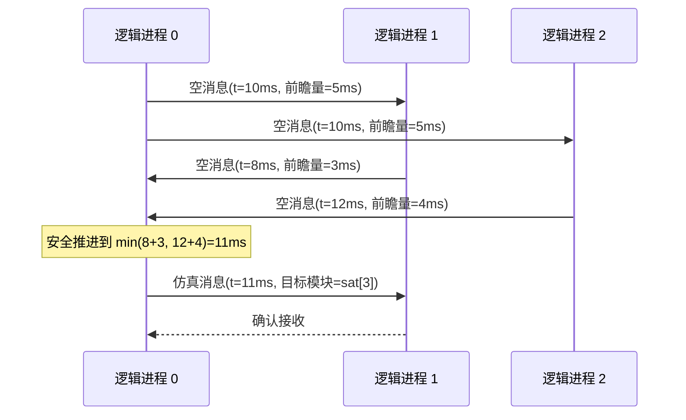

#### 5.8.7 接口设计

**接口一览表：**

| 接口标识 | 接口类别 | 关键操作签名（伪代码） | 数据传递方向 | 调用方 | 稳定性 |
|----------|----------|----------------------|-------------|--------|--------|
| PSIM-IF-01 | 分区配置接口 | `解析分区配置(ini_cfg)→PartitionMap`；`验证分区完整性(partition_map, topology)→issue_list` | 配置→分区映射 | CSU-ENVA | 稳定接口 |
| PSIM-IF-02 | 占位模块与代理门接口 | `创建占位模块(remote_module_path, lp_id)→Module`；`创建代理门(local_gate, remote_lp_id)→Gate` | 拓扑→占位对象 | CSU-SIM（拓扑构建） | 稳定接口 |
| PSIM-IF-03 | 空消息协议接口 | `计算前瞻量(channel)→timedelta`；`发送空消息(target_lp, safe_time)`；`接收空消息()→SafeTimeUpdate` | LP间→时间推进 | 并行仿真协调器 | 稳定接口 |
| PSIM-IF-04 | 通信后端接口 | `发送(dest_lp, buf)`；`接收(src_lp)→buf`；`广播(buf)`；`屏障同步()` | LP间→消息传递 | 并行仿真协调器 | 扩展点接口 |
| PSIM-IF-05 | 并行运行控制接口 | `初始化并行环境(argc, argv)`；`启动并行仿真()`；`等待所有LP结束()` | 进程→协调 | CSU-CMDR | 稳定接口 |
| PSIM-IF-06 | 结果合并接口 | `合并结果文件(lp_result_paths, merged_path)`；`验证合并完整性(merged_path)→bool` | 多文件→单文件 | 仿真结束后处理 | 演进接口 |

### 5.9 混合调度子系统（CSU-HSCH）

#### 5.9.1 单元标识与概述

**单元标识**：`CSU-HSCH-001`
**单元名称**：混合调度子系统
**实现库**：`libsimhybrid.a`

混合调度子系统通过派生 CSU-SIM 提供的可插拔调度器抽象基类（SIM-IF-05），实现三种非标准调度模式：实时同步调度（仿真时间与墙钟时间对齐）、外部事件驱动调度（接受来自外部系统的事件注入）、以及连续-离散混合调度（在离散事件步之间插入连续状态推进步骤）。

#### 5.9.2 设计约束与限定

- 所有调度器均通过 SIM-IF-05 的可插拔调度器抽象基类接入，不修改仿真内核代码
- 实时调度器的时间精度受操作系统定时器精度限制（通常为 1ms）
- 连续-离散混合调度器的 ODE 求解器为可插拔设计，默认提供四阶龙格-库塔实现

#### 5.9.3 实时同步调度器

实时同步调度器在取下一事件前，检查该事件的仿真时间戳是否已到达（按实时缩放因子换算后的墙钟时间），若未到达则挂起等待：

- **实时时钟接口**：获取当前墙钟时间（纳秒精度）
- **实时等待器**：在事件时间戳到达前挂起当前线程（使用高精度定时器）
- **实时缩放因子**：配置仿真时间与墙钟时间的比例（`--rt-scaling` 参数）
- **超时检测器**：检测仿真是否落后于实时时钟，并发出警告

**应用场景**：硬件在环（HIL）仿真，仿真时间需与外部硬件设备的时钟同步。

#### 5.9.4 外部事件驱动调度器

外部事件驱动调度器在标准事件队列之外，维护一个外部事件注入队列，允许外部系统（如测控系统、运控系统）在仿真运行期间注入事件：

- **外部事件注入队列**：线程安全的事件队列，外部线程可向其写入事件
- **外部事件适配器**：将外部系统的事件格式转换为仿真消息格式
- **混合队列调度器**：在取下一事件时，比较内部事件队列与外部注入队列的最小时间戳，取较小者

**应用场景**：与运控系统或测控系统的联合仿真，外部系统可实时注入轨道机动指令或测控数据。

#### 5.9.5 连续-离散混合调度器

连续-离散混合调度器在离散事件步之间插入连续状态推进步骤，用于对卫星轨道动力学等连续过程进行建模：

- **ODE 求解器抽象基类**：定义 `推进(t_start, t_end, state)→new_state` 接口
- **四阶龙格-库塔求解器**：默认 ODE 求解器实现，适用于轨道动力学方程
- **连续状态容器**：存储各模块的连续状态变量（位置、速度、姿态等）
- **状态更新触发器**：在每个离散事件处理前，将连续状态推进到该事件的时间戳
- **零交叉检测器**：检测连续状态变量的零交叉点（如卫星过顶时刻），并在该时刻插入离散事件

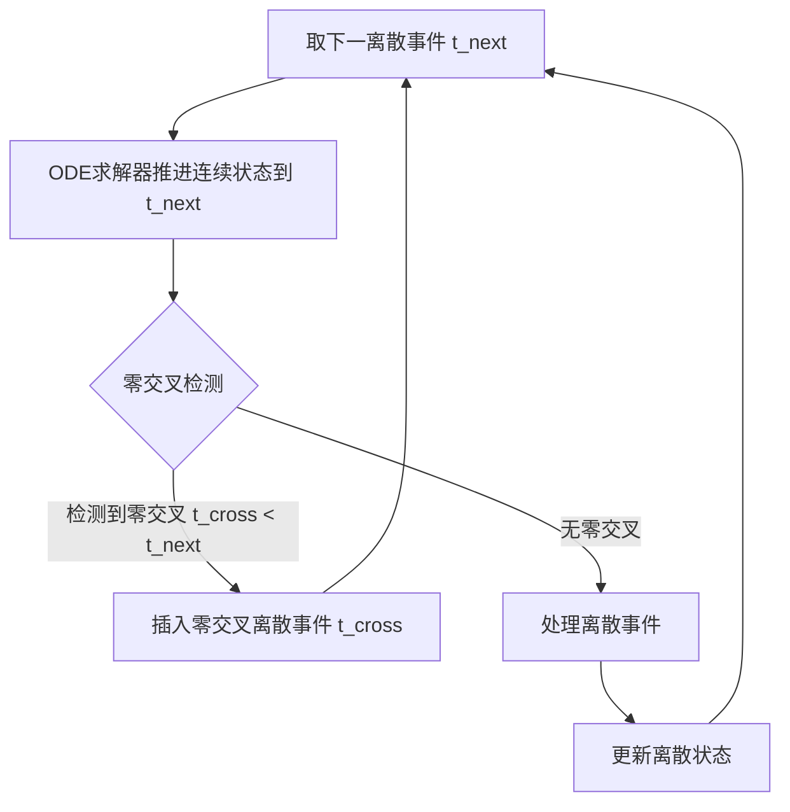

#### 5.9.6 接口设计

**接口一览表：**

| 接口标识 | 接口类别 | 关键操作签名（伪代码） | 数据传递方向 | 调用方 | 稳定性 |
|----------|----------|----------------------|-------------|--------|--------|
| HSCH-IF-01 | 调度器注册接口 | `注册调度器类型(name, factory_fn)`；`创建调度器(name, options)→Scheduler` | 注册表→调度器实例 | CSU-CMDR（CMDR-IF-06） | 稳定接口 |
| HSCH-IF-02 | 实时调度器配置接口 | `设置实时缩放因子(factor)`；`设置超时阈值(max_lag_ms)`；`获取当前实时延迟()→ms` | 配置→调度器 | CSU-CMDR | 稳定接口 |
| HSCH-IF-03 | 外部事件注入接口 | `注入外部事件(t_sim, target_module, payload)`；`清空注入队列()` | 外部系统→仿真 | 外部系统适配器 | 稳定接口 |
| HSCH-IF-04 | ODE 求解器扩展接口 | `注册ODE求解器(name, solver_fn)`；`设置步长(dt)`；`推进状态(t_start, t_end, state)→new_state` | 配置→求解器 | 模型代码 / 扩展点 | 扩展点接口 |
| HSCH-IF-05 | 连续状态访问接口 | `读取连续状态(module, var_name)→Value`；`写入连续状态(module, var_name, value)` | 模块↔状态容器 | 模型代码 | 稳定接口 |
| HSCH-IF-06 | 零交叉检测接口 | `注册零交叉条件(module, condition_fn, event_factory_fn)`；`取消注册(handle)` | 模型代码→检测器 | 模型代码 | 演进接口 |

## 6. 需求可追溯性

本章提供从软件需求规格说明（SAT-DT-SIM-SRS-V1.0）中各功能需求到本文档软件单元的双向可追溯性。

| 需求标识 | 需求描述摘要 | 模块名称 | 模块标识 | 本文档章节号 |
|----------|-------------|----------|----------|-------------|
| SRS-001 | 字符串处理与文本工具 | 通用基础库 | CSU-COMM | 5.1 |
| SRS-002 | 单位换算与表达式求值 | 通用基础库 | CSU-COMM | 5.1 |
| SRS-003 | 伪随机数生成（线性同余/梅森旋转） | 通用基础库 | CSU-COMM | 5.1 |
| SRS-004 | 文件读写与路径管理 | 通用基础库 | CSU-COMM | 5.1 |
| SRS-005 | XML/JSON 解析与序列化 | 通用基础库 | CSU-COMM | 5.1 |
| SRS-006 | 结构化结果输出（标量/向量/SQLite/CSV） | 通用基础库 | CSU-COMM | 5.1 |
| SRS-010 | 离散事件调度循环 | 仿真内核 | CSU-SIM | 5.2 |
| SRS-011 | 复合模块拓扑构建与层次管理 | 仿真内核 | CSU-SIM | 5.2 |
| SRS-012 | 消息传递与信道时延建模 | 仿真内核 | CSU-SIM | 5.2 |
| SRS-013 | 信号-监听器统计收集机制 | 仿真内核 | CSU-SIM | 5.2 |
| SRS-014 | 协程式过程化建模（活动模式） | 仿真内核 | CSU-SIM | 5.2 |
| SRS-015 | 可插拔调度器抽象基类 | 仿真内核 | CSU-SIM | 5.2 |
| SRS-020 | 网络拓扑描述语言（NED）解析与校验 | 建模语言编译子系统 | CSU-NEDC | 5.3 |
| SRS-021 | 消息定义语言（msg）编译与代码生成 | 建模语言编译子系统 | CSU-NEDC | 5.3 |
| SRS-022 | 抽象语法树（AST）内存构建与查询 | 建模语言编译子系统 | CSU-NEDC | 5.3 |
| SRS-023 | 跨文件交叉引用校验 | 建模语言编译子系统 | CSU-NEDC | 5.3 |
| SRS-030 | 分节配置文件解析（INI 格式） | 仿真运行环境抽象层 | CSU-ENVA | 5.4 |
| SRS-031 | 参数研究场景迭代展开 | 仿真运行环境抽象层 | CSU-ENVA | 5.4 |
| SRS-032 | 结果输出管理（多格式并发写入） | 仿真运行环境抽象层 | CSU-ENVA | 5.4 |
| SRS-033 | XML 文档缓存与查询 | 仿真运行环境抽象层 | CSU-ENVA | 5.4 |
| SRS-040 | 命令行参数解析与运行控制 | 命令行仿真运行器 | CSU-CMDR | 5.5 |
| SRS-041 | 批量参数扫描与进度反馈 | 命令行仿真运行器 | CSU-CMDR | 5.5 |
| SRS-042 | 退出码约定与回归测试支撑 | 命令行仿真运行器 | CSU-CMDR | 5.5 |
| SRS-050 | 事件日志记录（逐事件结构化记录） | 事件日志记录与回放子系统 | CSU-EVLG | 5.6 |
| SRS-051 | 事件日志过滤与回放 | 事件日志记录与回放子系统 | CSU-EVLG | 5.6 |
| SRS-052 | 事件日志索引与随机访问 | 事件日志记录与回放子系统 | CSU-EVLG | 5.6 |
| SRS-060 | 标量与向量仿真结果记录 | 仿真结果记录与分析子系统 | CSU-RSAN | 5.7 |
| SRS-061 | 直方图与统计量收集 | 仿真结果记录与分析子系统 | CSU-RSAN | 5.7 |
| SRS-062 | 命令行结果导出与格式转换工具 | 仿真结果记录与分析子系统 | CSU-RSAN | 5.7 |
| SRS-063 | 结果文件合并（多分区结果聚合） | 仿真结果记录与分析子系统 | CSU-RSAN | 5.7 |
| SRS-070 | 通信抽象层（MPI/命名管道/共享文件） | 分布式并行仿真子系统 | CSU-PSIM | 5.8 |
| SRS-071 | 保守同步协议（空消息协议） | 分布式并行仿真子系统 | CSU-PSIM | 5.8 |
| SRS-072 | 理想同步协议（用于性能评测基准） | 分布式并行仿真子系统 | CSU-PSIM | 5.8 |
| SRS-073 | 无同步协议（独立分区并行执行） | 分布式并行仿真子系统 | CSU-PSIM | 5.8 |
| SRS-074 | 模型分区与占位模块、代理门机制 | 分布式并行仿真子系统 | CSU-PSIM | 5.8 |
| SRS-075 | 前瞻量计算与链路时延查询 | 分布式并行仿真子系统 | CSU-PSIM | 5.8 |
| SRS-080 | 可插拔调度器抽象（离散事件+外部时间源） | 混合调度子系统 | CSU-HSCH | 5.9 |
| SRS-081 | 实时同步调度（仿真时间-墙钟时间映射与缩放） | 混合调度子系统 | CSU-HSCH | 5.9 |
| SRS-082 | 连续时间状态推进（定步长积分采样器） | 混合调度子系统 | CSU-HSCH | 5.9 |
| SRS-083 | 外部事件源接入（硬件在环/外部传感器时间戳注入） | 混合调度子系统 | CSU-HSCH | 5.9 |
| SRS-084 | 协程式过程化建模（连续过程活动模式） | 混合调度子系统 | CSU-HSCH | 5.9 |

*表 3 需求可追溯性*

> **注**：上表中需求标识对应软件需求规格说明（SAT-DT-SIM-SRS-V1.0）中的功能需求条目。本文档正式发布时，需求标识应与 SRS 最终版本保持一致。

## 7. 注释

### 7.1 术语与缩略语表

本章列出本文档中使用的专业术语与缩略语，按字母顺序排列。

| 术语/缩略语 | 英文全称 | 中文定义 |
|-------------|----------|----------|
| AST | Abstract Syntax Tree | 抽象语法树。编译器前端将源代码解析后生成的树形中间表示，用于后续语义分析与代码生成。 |
| CMB | Conservative Message-Based | 保守消息驱动同步协议。分布式并行仿真中一种基于空消息传递的保守同步算法，确保各逻辑进程按因果顺序处理事件。 |
| CSCI | Computer Software Configuration Item | 计算机软件配置项。满足最终用户功能需求的软件集合，是软件配置管理的基本单元。 |
| CSU | Computer Software Unit | 计算机软件单元。CSCI 内部的设计分解单元，对应本文档中的各子系统。 |
| FES | Future Event Set | 未来事件集合。离散事件仿真中存储待处理事件的优先队列，按事件时间戳排序。 |
| HIL | Hardware-in-the-Loop | 硬件在环。将真实硬件设备接入仿真回路，实现仿真系统与真实硬件的实时交互测试。 |
| INI | Initialization File | 初始化配置文件。本平台使用的分节文本格式配置文件，支持参数研究场景定义。 |
| ISL | Inter-Satellite Link | 星间链路。卫星星座中卫星之间建立的通信链路，包括激光链路和微波链路。 |
| LP | Logical Process | 逻辑进程。分布式并行仿真中的基本执行单元，每个逻辑进程持有独立的事件队列和仿真时钟。 |
| MPI | Message Passing Interface | 消息传递接口。分布式并行计算的标准通信规范，本平台分布式并行仿真子系统支持 MPI 作为通信后端。 |
| NED | Network Description | 网络描述语言。本平台使用的专用建模语言，用于描述仿真网络的拓扑结构、模块参数和连接关系。 |
| ODE | Ordinary Differential Equation | 常微分方程。描述连续时间动态系统（如卫星轨道动力学）的数学模型，本平台混合调度子系统支持定步长数值积分求解。 |
| PDES | Parallel Discrete Event Simulation | 并行离散事件仿真。将离散事件仿真任务分解到多个处理器并行执行的技术，本平台分布式并行仿真子系统实现此功能。 |
| RT | Real-Time | 实时。本平台混合调度子系统支持实时同步模式，将仿真时钟与墙钟时间按缩放因子同步推进。 |
| SCA | Scalar Result File | 标量结果文件。存储仿真运行结束后各统计量最终值的结果文件格式（`.sca` 扩展名）。 |
| SDD | Software Design Description | 软件设计说明。本文档类型，依据 GJB438B-2009 标准编制。 |
| SRS | Software Requirements Specification | 软件需求规格说明。描述软件功能需求、性能需求和约束的文档。 |
| VEC | Vector Result File | 向量结果文件。存储仿真运行过程中各时间序列观测量样本的结果文件格式（`.vec` 扩展名）。 |
| 活动模式 | Activity Mode | 协程式过程化建模模式。模块通过 `活动()` 方法以顺序代码描述复杂行为，底层由协程机制实现挂起与恢复。 |
| 代理门 | Proxy Gate | 分布式并行仿真中跨分区连接的本地代理端口，负责将跨分区消息序列化后通过通信后端转发到目标逻辑进程。 |
| 调度器 | Scheduler | 仿真内核中负责决定下一个待执行事件的组件，通过可插拔抽象基类支持多种调度策略。 |
| 前瞻量 | Lookahead | 分布式并行仿真中逻辑进程能够保证在当前仿真时间之后一定时间内不会产生更早事件的时间量，用于空消息协议的时间推进。 |
| 空消息 | Null Message | 分布式并行仿真保守同步协议中用于传递时间推进许可的控制消息，不携带仿真业务数据。 |
| 占位模块 | Placeholder Module | 分布式并行仿真中在本地逻辑进程中代表远端分区模块的虚拟模块，用于维护跨分区的拓扑连接关系。 |

